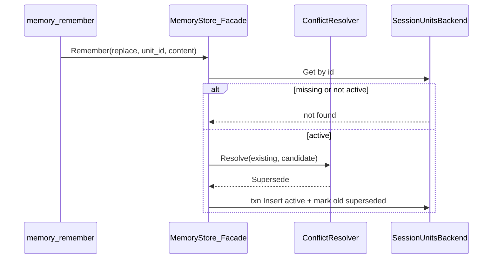

# MemoryStore P2-D1：结构化 supersede + ConflictResolver 接口

> 状态：实现中  

> 日期：2026-07-25  
> 回链：[门面 §8.3](./2026-07-25-memory-store-facade-design.md)、[P2-A user scope](./2026-07-25-memory-store-user-scope-design.md)、[P2-C turn extract](./2026-07-25-memory-store-turn-extract-design.md)  
> 前置：P2-A（user units）；表已含 `status=superseded` 与 `supersedes_id`（迁移 `009`）  
> 切片：**D1 only** — 结构化 supersede；**不含** LLM 语义冲突（→ P2-D2）

---

## 0. 目标与非目标

### 目标

1. units 后端（**session + user**，含内存与 MySQL）将 `Remember(replace)` 改为 **supersede 链**：新建 `active` 行，旧行 `status=superseded`，`supersedes_id` 指向旧 id。  
2. 引入 `ConflictResolver` 接口；本迭代实现 `StructuralReplaceResolver`（replace → 恒 `Supersede`）。  
3. `remove`：对目标 unit **及其经 `supersedes_id` 相连的历史链** 级联软删为 `deleted`。  
4. Recall/List 默认仅 `active`；Get(by id) 可读 `superseded`（审计）。  
5. 工具 API 形状不变；文档明确 **replace 后 unit id 会变**。

### 非目标

| 项 | 归属 |
|----|------|
| LLM 语义冲突判断（矛盾事实 ignore/supersede/并存） | **P2-D2** |
| agent 文件记忆的 supersede | 仍原地编辑 |
| 向量 / Neo4j / Prefetch 配额 | E / F |
| 新 DB 列 | 不需要（`009` 已具备） |
| 改变 `add` / Turn 提取的 `content_hash` 去重 | 保持 P2-C |

---

## 1. 背景

一期（门面 §3.4）写死：

- `replace`：原地 UPDATE content（不写 `supersedes_id`）  
- `remove`：软删单行  
- `supersedes_id` 列保留但应用层不写  

P2-C 提取仅做 hash 精确去重。审计与「事实演进」需要可追溯链，而不引入 LLM。

---

## 2. 架构



### 2.1 `ConflictResolver`

```go
type ConflictDecision int

const (
    ConflictIgnore ConflictDecision = iota // 不写（预留 D2）
    ConflictSupersede                        // 建链替换
    ConflictKeepBoth                         // 并存（预留 D2；D1 的 replace 路径不得使用）
)

type ConflictResolver interface {
    Resolve(ctx context.Context, existing MemoryHit, candidate RememberInput) (ConflictDecision, error)
}

// StructuralReplaceResolver：D1 默认实现。
// 约定由 Facade 仅在 ActionReplace 且已确认 existing 为 active 时调用；恒返回 ConflictSupersede。
type StructuralReplaceResolver struct{}
```

### 2.2 Facade 挂载

`FacadeConfig` 增加可选 `Conflicts ConflictResolver`。

- `nil` → 使用 `StructuralReplaceResolver{}`（禁止静默回退到原地 UPDATE）。  
- session/user 的 `Remember`：  
  - `add` / `remove`：不调用 Resolver（remove 直接级联软删）。  
  - `replace`：Get → 非 active 则 not found → `Resolve` →  
    - `Supersede` → backend supersede 写  
    - `Ignore` → `(MemoryHit{}, nil)` 且不写（D2）  
    - `KeepBoth` → **错误**（D1 fail closed；避免与 replace 语义冲突）  
- `Facade.Delete` 与 `Remember(remove)` 均委托同一 backend 级联软删路径（见 §2.3）。  
- agent 路径不变，不经 ConflictResolver。

### 2.3 Units 写语义

| Action | 行为 |
|--------|------|
| `add` | INSERT `active`（不变） |
| `replace` | 要求 `UnitID`；旧行必须 `active`；**同一事务**：INSERT 新行（`supersedes_id=旧id`，`status=active`）+ UPDATE 旧行 `status=superseded`；返回**新** hit。新行其余字段（`content_hash`、`metadata`、`user_id`/`agent_id`、`source_session_id` 等）与同 scope 的 `add` 规则一致 |
| `remove` | 从目标出发，沿 `supersedes_id` 收集整条链（见 §2.4），全部 `status=deleted` |
| `Delete(ref)` | **必须与 `Remember(remove)` 共用同一套链收集 + 软删实现**（门面 §3.4：Delete ≡ remove）；禁止只删单行 |

禁止对 `superseded` / `deleted` 行再 `replace`（not found），避免分叉链。  
对不存在或已 `deleted` 的 id 执行 `remove` / `Delete` → not found（与 Get(deleted) 对齐）。

### 2.4 级联 remove 的链定义

边方向：新行.`supersedes_id` → 被替代的旧行 id。

从 `target` 出发：

1. 将 `target` 加入集合。  
2. **向祖先**：反复取当前行的 `supersedes_id` 直至空。  
3. **向子孙**：查找同 scope 下 `supersedes_id = 当前id` 的行（通常 0 或 1；若有多条则全部纳入，防御脏数据）。  
4. 对集合内所有行软删。

实现可用有界 BFS；单测覆盖 A←B←C（C 最新）remove(C) ⇒ A/B/C 皆 deleted。

### 2.5 读语义

| API | 默认 |
|-----|------|
| Recall / List | 仅 `status=active` |
| Get(id) | `active` 或 `superseded` 可读；`deleted` → not found |

Hit metadata 建议带：`status`、`supersedes_id`（若有），便于工具/调试。

---

## 3. 工具与兼容

- `memory_remember`：参数不变；`action=replace` 成功时返回**新** `id`（**breaking**：缓存旧 id 的客户端需更新）。  
- Description / `docs/memory-integration.md`：写明 replace 更换 id、历史行 Get 仍可读。  
- `memory_get`：按 id 可取 superseded；不新增参数。  
- Turn 提取：仍只 `add` + hash 去重；不调用 replace。

---

## 4. 实现落点（文件级）

| 位置 | 变更 |
|------|------|
| `framework/memory/conflict.go`（新建） | `ConflictDecision`、`ConflictResolver`、`StructuralReplaceResolver` |
| `framework/memory/facade.go` | 挂载 Resolver；replace 编排 |
| `framework/memory/session_memory.go` | supersede 写 + 级联 remove + Get 允许 superseded |
| `portal/internal/data/memory_units_backend.go` | 同上（事务） |
| `framework/tool/memory/store_tools.go` | Description 文案 |
| `portal/docs/memory-integration.md` | 迁移说明 |
| 测试 | facade / session_memory / mysql backend / 工具契约 |

无需新 SQL 迁移。

---

## 5. 测试与验收

1. replace（**session 与 user 各至少一条**）：两行；旧 superseded + supersedes_id；新 active；Recall 只见新内容。  
2. 对 superseded id 再 replace → not found。  
3. remove **与 Delete** 级联：链上全部 deleted；Recall 空；对已 deleted id 再删 → not found。  
4. Get(superseded id) 成功；Get(deleted) not found。  
5. Facade `Conflicts=nil` 与显式 Structural 行为一致。  
6. agent replace 回归（文件原地）仍绿。  
7. P2-C 提取 hash 去重回归仍绿。

---

## 6. 后续：P2-D2（规格预留，本迭代不实现）

- `LLMConflictResolver`：在 `add`（含 Turn 提取）时对同 scope active units 做语义矛盾检测。  
- 决策映射：Ignore / Supersede / KeepBoth。  
- 需独立规格：提示词、费用、fail-open、与 hash 去重的优先级。

---

## 7. 门面清单回链

门面 §8.3「冲突消解」→ 本规格 **P2-D1**；语义 LLM → **P2-D2**。
