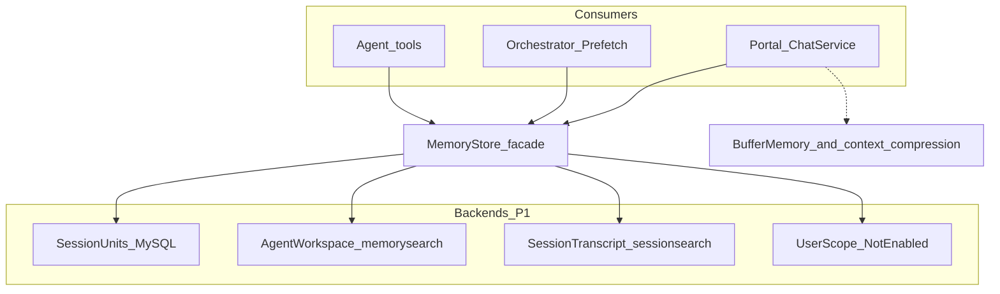

# MemoryStore 门面重构 — 设计规格

**日期**: 2026-07-25  
**状态**: 已确认（spec review approved；implementation plan: `docs/superpowers/plans/2026-07-25-memory-store-facade.md`）  
**方案**: 门面优先 + 后端适配（头脑风暴方案 2）  
**关联**:
- [多层记忆管理（2026-05-26）](../../../framework/docs/superpowers/specs/2026-05-26-multi-layer-memory-design.md) — 方向参照；本规格定义**一期裁剪后的对外叙事与落地边界**
- [会话上下文压缩](../../../framework/docs/superpowers/specs/2026-05-26-session-context-compression-design.md) — 工作记忆 / L0–L2 压缩，**不并入**本门面
- [Portal 记忆使用指南](../../../portal/docs/memory-integration.md) — 现网说明；实现后需改写为门面叙事
- [Hermes 工具映射](../../../framework/docs/toolsets-hermes-mapping.md) — 工具更名后需同步

---

## 0. 已确认决策

| 项 | 选择 |
|----|------|
| 重构动机 | 治概念/包乱：统一门面与分层命名（非先补齐全部产品能力） |
| 兼容策略 | **允许破坏性变更**（工具名、配置、路径可换；必须提供迁移说明） |
| 心智模型 | `scope=user \| session \| agent`；**禁止**用记忆层 L0/L1/L2 命名（避免与上下文压缩撞名） |
| 落地手法 | **门面优先 + 后端适配**；旧包先变内部实现，再删除 |
| 一期能力 | 骨架 + **手动/工具写入**；Session + Agent 真实可用 |
| User 层一期 | **接口预留，不接真实数据**（不建 `users`、不写 user units） |
| 一期不做 | Turn 后 LLM 提取、冲突消解、Qdrant/Neo4j、生产 embedding 接线 |
| 二期必记 | 正式 `user_id`、自动提取、冲突消解、向量/图、Prefetch 增强、清理 `memory.Manager`、（更后）Go MCP |

与 2026-05-26 多层规格的关系：保留 `MemoryStore` + 三 scope 方向；**一期裁剪更狠**（无 User 数据、无 `AddFromTurn` 提取管线）。本规格**取代**「对外多套工具叙事」（`memory` / `memory_search` / `session_search` 并行）。多层规格中未裁剪部分（提取、向量、图、users）归入本文 §8 二期清单。

---

## 1. 目标与非目标

### 1.1 目标（一期可验收）

1. **G1 — 单一门面**：Framework 暴露 `memory.MemoryStore`（`Remember` / `Recall` / `Get` / `List` / `Delete`）；Portal、Prefetch、Agent 工具只经此门面。  
2. **G2 — 三 scope 叙事**：文档与 API 只讲 `user` / `session` / `agent`；`user` 一期返回稳定 `ErrScopeNotEnabled`。  
3. **G3 — Session 结构化记忆**：MySQL `memory_units`（仅 `scope_type=session` 可写）支持工具读写与 Prefetch 召回。  
4. **G4 — Agent 文件后端**：现有工作区 Markdown + `memorysearch` 作为 `scope=agent` 适配器，不再作为 Portal 对外主叙事。  
5. **G5 — 工具收敛**：破坏性替换为 `memory_remember` / `memory_recall` / `memory_get`；`session_search` 能力并入 `memory_recall(scope=session, source=transcript)`。  
6. **G6 — Prefetch 经门面**：`Orchestrator` 通过 `MemoryStore.Recall` 组装围栏；fail-open 行为不变。  
7. **G7 — 二期可续**：规格单列二期清单，门面扩展点不阻塞后续 User/提取/向量。

### 1.2 非目标（一期不做）

| 项 | 说明 |
|----|------|
| `users` 表 / `chat_sessions.user_id` | 二期；一期无 User 数据 |
| `AddFromTurn` / LLM 提取 / ConflictResolver | 二期 |
| Qdrant / Neo4j / 生产 Embedder 接线 | 二期；本地 FTS 可继续服务 agent/transcript |
| 物理删除 `memorysearch` / `sessionsearch` 包 | 一期藏到门面后；二期再评估删除 |
| 删除 `memory.Manager` | 一期 deprecate + Portal 禁止接线；二期删除或改 Backend |
| 把 `BufferMemory` / 上下文压缩并入 MemoryStore | 工作记忆与长期记忆分离 |
| 强制把现有 `MEMORY.md` 导入 `memory_units` | 文件仍属 agent 层；无需迁移导入 |
| 兼容旧工具名别名 | 破坏性更名；靠迁移说明，不做长期 dual-register |

---

## 2. 现状问题（动机）

现网存在多套并行叙事：

| 机制 | 位置 | 问题 |
|------|------|------|
| `BufferMemory` + 压缩 | `framework/memory` + `model` | 合理，但易与「长期记忆」混淆 |
| `memory.Manager` | `framework/memory/manager.go` | 库能力；Portal **未统一接入** |
| `memorysearch` + Prefetch | `framework/memorysearch` + Orchestrator | 现网主力长期记忆，但与 Manager/多层规格脱节 |
| `session_search` | `framework/sessionsearch` | 另一套 FTS，工具名独立 |
| 多层 `memory_units` | 仅规格 | 未落地，文档与实现双轨 |

结果：开发者与 Agent 需同时理解「文件记忆 / 会话 FTS / 未用 Manager / 未来 units」，心智成本高。

---

## 3. 架构

### 3.1 组件图



### 3.2 职责边界

| 组件 | 职责 | 禁止 |
|------|------|------|
| `MemoryStore` | 长期记忆唯一业务 API；按 scope 路由 | 实现 FTS/切块细节；做上下文压缩 |
| Session units backend | MySQL `memory_units` CRUD + 关键词/简单检索 | 写 agent 文件；接 user |
| Agent workspace backend | 适配 `memorysearch`（文件读写 + 索引检索） | 暴露为 Portal 顶层依赖 |
| Session transcript backend | 适配 `sessionsearch`（跨会话消息 FTS） | 改写 MEMORY.md |
| User stub | `Remember`/`Recall`/`Get`/`List`/`Delete` 对 `scope=user` 返回 `ErrScopeNotEnabled` | 静默空成功（避免误以为已写入） |
| `Orchestrator` | Prefetch 超时、围栏、fail-open | 直接调 `memorysearch` |
| `BufferMemory` + 压缩 | 当前 Run / 窗口连续性 | 冒充跨会话长期记忆 |

### 3.3 包结构（一期）

```text
framework/memory/
  store.go                 # MemoryStore 接口、Scope、错误、公共类型
  facade.go                # 组合各 Backend 的默认实现
  orchestrator.go          # 已有；Prefetch 改为经 MemoryStore
  search_prefetch_backend.go  # 删除或改为 StorePrefetchBackend 薄封装
  buffer.go / manager.go / …  # Buffer 保留；Manager 加 Deprecated 注释
  backends.go              # SessionUnitsBackend / AgentWorkspaceBackend / TranscriptBackend 接口（同包，避免 cycle）
  facade.go                # NewFacade
  session_memory.go        # 内存 SessionUnits
  agent_workspace.go       # 包装 memorysearch
  session_transcript.go    # 包装 sessionsearch
  fileedit.go              # MEMORY.md / USER.md 编辑

framework/memorysearch/    # 内部实现，文档标注 internal-facing
framework/sessionsearch/   # 同上
framework/tool/memory/     # 注册 memory_remember / memory_recall / memory_get

portal/
  migrations/…_memory_units.sql
  internal/data/memory_units_*.go   # MySQL SessionUnitsBackend 实现
  internal/chat/memory_wiring.go    # 只组装 MemoryStore + 新工具
  internal/chat/memory_prefetch_bootstrap.go
  docs/memory-integration.md        # 改写
```

**依赖方向**：`tool/memory` → `memory.MemoryStore`；Portal data 实现 `SessionUnitsBackend` 并注入 facade。Framework **不** import Portal；**禁止** `memory/backend` 子包再引用 `memory` 类型（接口一律放在 `package memory`）。

### 3.4 Go 接口（一期）

```go
package memory

type Scope string

const (
    ScopeUser    Scope = "user"
    ScopeSession Scope = "session"
    ScopeAgent   Scope = "agent"
)

var ErrScopeNotEnabled = errors.New("memory: scope not enabled")

type RememberAction string

const (
    ActionAdd     RememberAction = "add"
    ActionReplace RememberAction = "replace"
    ActionRemove  RememberAction = "remove"
)

type RememberInput struct {
    Scope     Scope
    ScopeID   string // scope=session 时必须 = session_id；scope=agent 时忽略（以 AgentID 为准）
    AgentID   string // scope=agent 时必须；scope=session 时可选（写入 agent_id 列便于过滤）
    WorkspaceRoot string // scope=agent 文件后端必需
    Action    RememberAction
    Content   string
    OldText   string // 仅 scope=agent 的 replace/remove（按正文唯一定位）
    UnitID    string // 仅 scope=session 的 replace/remove（按 id）
    Target    string // 仅 scope=agent：memory → MEMORY.md；user_file → USER.md
    Metadata  map[string]any
}

// 一期 session 持久化语义（写死，二期再引入 supersede 链）：
// - add: INSERT status=active；content_hash = SHA-256(utf8 content) 小写 hex
// - replace: 要求 UnitID；UPDATE 同行 content/content_hash/updated_at（不新建行，不写 supersedes_id）
// - remove: 要求 UnitID；软删 UPDATE status=deleted（不硬删行）
// supersedes_id 列一期保留但应用层不写入；二期 ConflictResolver 再启用。

type RecallSource string

const (
    SourceUnits      RecallSource = "units"      // session 默认
    SourceTranscript RecallSource = "transcript" // 原 session_search
    SourceFiles      RecallSource = "files"      // agent 默认
)

type RecallQuery struct {
    Query       string
    Scope       Scope
    ScopeID     string
    AgentID     string
    SessionID   string // transcript 排除当前会话等
    Source      RecallSource
    Limit       int
    MinScore    float64
    WorkspaceRoot string // agent 文件后端
}

type MemoryHit struct {
    Scope   Scope
    Source  RecallSource
    ID      string // unit id or synthetic
    Path    string // agent file path if any
    Content string
    Score   float64
    Metadata map[string]any
}

type ListFilter struct {
    Scope   Scope
    ScopeID string // session_id when ScopeSession
    AgentID string
    Status  string // 默认 "active"；空表示默认
    Limit   int
    Offset  int
}

type MemoryStore interface {
    Remember(ctx context.Context, in RememberInput) (MemoryHit, error)
    Recall(ctx context.Context, q RecallQuery) ([]MemoryHit, error)
    Get(ctx context.Context, ref GetRef) (MemoryHit, error)
    List(ctx context.Context, filter ListFilter) ([]MemoryHit, error)
    Delete(ctx context.Context, ref GetRef) error
}

type GetRef struct {
    Scope   Scope
    ID      string // session unit id
    Path    string // agent relative path
    AgentID string
    ScopeID string
    WorkspaceRoot string
}
```

一期 `AddFromTurn` **不**出现在接口上（二期再加，避免空方法）。

**`List` / `Delete` 调用方（一期）**：

| 方法 | 谁调用 | 行为 |
|------|--------|------|
| `List` | Portal/管理或测试；**不**注册为 Agent 工具 | session：列 active units；agent：**固定**返回 `ErrNotSupported`；user：`ErrScopeNotEnabled` |
| `Delete` | session：与 `Remember(action=remove)` 共用软删；工具层只暴露 `memory_remember` remove | session：按 `GetRef.ID` 软删；agent：**固定** `ErrNotSupported`（`GetRef` 无 `OldText`，不能伪等价）；user：`ErrScopeNotEnabled` |

实现计划不得另开「Agent List / Delete 工具」范围。

---

## 4. 数据模型（一期）

### 4.1 `memory_units`（Portal MySQL）

一期**不**建 `users` 表，因此表结构相对 2026-05-26 规格精简：`user_id` 列可省略或可空预留（推荐**省略**，二期迁移再加，避免假 FK）。

```sql
CREATE TABLE memory_units (
    id                VARCHAR(36)  NOT NULL PRIMARY KEY,
    scope_type        ENUM('user','session','agent') NOT NULL,
    scope_id          VARCHAR(36)  NOT NULL,
    agent_id          VARCHAR(36)  NULL,
    content           TEXT         NOT NULL,
    content_hash      CHAR(64)     NOT NULL,
    status            ENUM('active','superseded','deleted') NOT NULL DEFAULT 'active',
    supersedes_id     VARCHAR(36)  NULL,
    source_session_id VARCHAR(36)  NULL,
    metadata          JSON         NULL,
    created_at        DATETIME(3)  NOT NULL DEFAULT CURRENT_TIMESTAMP(3),
    updated_at        DATETIME(3)  NOT NULL DEFAULT CURRENT_TIMESTAMP(3) ON UPDATE CURRENT_TIMESTAMP(3),
    INDEX idx_mu_scope (scope_type, scope_id, status),
    INDEX idx_mu_hash (content_hash),
    INDEX idx_mu_session (source_session_id)
) ENGINE=InnoDB DEFAULT CHARSET=utf8mb4 COLLATE=utf8mb4_unicode_ci;
```

**写入约束（应用层强制）**：

- 一期仅允许 `scope_type='session'` 且 `scope_id = session_id`。  
- `scope_type='user'`：门面直接 `ErrScopeNotEnabled`，不落库。  
- `scope_type='agent'`：**不**写入本表；走工作区文件后端。  
- `content_hash`：`SHA-256`（UTF-8 正文）小写 hex。  
- `replace` / `remove`：见 §3.4「一期 session 持久化语义」（原地 UPDATE / 软删；不用 supersede 链）。  
- `source_session_id`：一期写入时**恒等于** `scope_id`（即当前 session_id）。  
- `Recall(scope=session, source=units)` 一期检索：对 `status=active` 行做 MySQL `content LIKE %query%`（大小写不敏感按库 collation）；无独立分词器。空 query 返回该 session 最近 N 条 active（按 `updated_at` desc，N=`Limit` 默认 5）。

### 4.2 Agent 工作区文件（不变为权威形态）

| 路径 | 含义 |
|------|------|
| `MEMORY.md` | Agent 笔记（原 `target=memory`） |
| `USER.md` | 工作区级「用户偏好」文件（**不是** scope=user；命名历史包袱，文档需写清） |
| `memory/**/*.md` | 额外笔记，只读索引 |

说明：工作区 `USER.md` 与 scope `user` **不是同一概念**。一期 scope=user 未启用；`USER.md` 仍属 **agent** 文件后端（`memory_remember(scope=agent, target=user_file)` 或等价参数）。实现时工具参数用 `target=memory|user_file`，避免与 `scope=user` 混淆。

### 4.3 索引旁路（实现细节）

- `.memory_index.db`（memorysearch）与 per-agent session FTS DB：**保留**，不写进对外 API 主路径。  
- 会话原文权威仍为 MySQL `chat_messages`。

---

## 5. 工具与 Prefetch

### 5.1 新工具（破坏性替换）

| 新工具 | 取代 | 行为摘要 |
|--------|------|----------|
| `memory_remember` | `memory` | 见下 |
| `memory_recall` | `memory_search` + `session_search` | 见下 |
| `memory_get` | `memory_get`（语义收紧） | 见下 |

#### `memory_remember`

| 参数 | 说明 |
|------|------|
| `scope` | `session` \| `agent` \| `user` |
| `action` | `add` \| `replace` \| `remove` |
| `content` / `old_text` / `unit_id` | agent：`old_text` 定位；session：`unit_id` 定位 replace/remove（见 §3.4） |
| `target` | **仅 scope=agent**：`memory` → `MEMORY.md`；`user_file` → `USER.md` |

- `scope=session`：写 MySQL units；**默认启用**（无需旧 `MemoryWriteEnabled`）。  
- `scope=agent`：写文件；保留 **opt-in**（环境变量 / Agent `runtime_tools` / 进程 flags，迁移自 `SATH_MEMORY_WRITE_ENABLED`）。  
- `scope=user`：返回错误对象 `scope_not_enabled`（工具层勿 panic）。

#### `memory_recall`

| 参数 | 说明 |
|------|------|
| `scope` | `session` \| `agent` \| `user` |
| `query` | 检索词；transcript 空 query 仍拒绝（沿用 session_search 防误用） |
| `source` | session：`units`（默认）\| `transcript`；agent：`files`（默认） |
| `limit` / `min_score` | 可选 |

#### `memory_get`

- `scope=session` + `id` → unit  
- `scope=agent` + `path` → 工作区 `.md`（路径限制为记忆相关路径 + 配置 `extra_paths`，**收紧**现网「任意 workspace md」行为）  
- `scope=user` → `scope_not_enabled`

### 5.2 Prefetch

每 turn（配置启用时）：

1. `Recall(scope=session, source=units, query=userMessage)`  
2. `Recall(scope=agent, source=files, query=userMessage)`  
3. 合并为现有 `<sixath-memory-context id="…">` 围栏 system 消息（`OriginMemoryFence`）  
4. **不**调用 user；失败/超时 **fail-open**（保留 `PrefetchSkipReason`）

实现：新增 `StorePrefetchBackend`（实现现有 `memory.Backend`），内部只调 `MemoryStore`；删除 Portal 对 `SearchPrefetchBackend` 的直接依赖。

### 5.3 配置收敛

对外配置块建议：

```yaml
memory_store:
  enabled: true
  prefetch:
    enabled: true
    timeout_ms: 800
    scopes: [session, agent]   # 一期禁止含 user
  session_units:
    enabled: true
  agent_workspace:
    # 复用原 DefaultMemoryConfig / memorysearch 字段
    enabled: true
    write_enabled: false       # 原 MemoryWriteEnabled
  session_transcript:
    enabled: true              # recall source=transcript
```

Portal `DefaultMemoryConfig` 与 Hermes flags **迁移映射**到上述块；旧键一期可读并告警，二期删除。

---

## 6. Portal 接线变更

| 现文件 | 变更 |
|--------|------|
| `portal/internal/chat/memory_wiring.go` | 组装 `MemoryStore`；注册三新工具；去掉对旧工具的直接注册 |
| `portal/internal/chat/memory_prefetch_bootstrap.go` | `StorePrefetchBackend` + Orchestrator |
| `portal/internal/chat/runtime_tools.go` | 工具列表切换；write flag 仅控 agent 文件写 |
| `portal/internal/chat/session_search.go` | 逻辑迁入 transcript backend；本文件可删或变薄包装 |
| `portal/internal/service/chat.go` | `NotifyMemorySessionDirty` 可保留（索引维护），但文档标明属 agent/transcript 后端内部 |
| `portal/docs/memory-integration.md` | 按本规格重写 |

**纪律**：Portal 业务代码 **禁止** import `memorysearch` / `sessionsearch` 用于工具或 Prefetch（组装 Store 的 wiring 包除外）。

---

## 7. 迁移说明

### 7.1 工具映射

| 旧 | 新 |
|----|-----|
| `memory` | `memory_remember(scope=agent, …)` |
| `memory_search` | `memory_recall(scope=agent, source=files)` |
| `memory_get` | `memory_get(scope=agent, path=…)` |
| `session_search` | `memory_recall(scope=session, source=transcript)` |
| （无） | `memory_remember(scope=session)` / `memory_recall(scope=session, source=units)` |

### 7.2 数据与配置

- 现有 `MEMORY.md` / `USER.md`：**无需**导入 units。  
- 会话消息：仍在 MySQL；transcript 索引可按现逻辑重建。  
- Agent prompt / Skills：更新工具名与 scope 说明。  
- `SATH_MEMORY_WRITE_ENABLED`：映射为 `agent_workspace.write_enabled`。

### 7.3 错误码（工具 JSON）

| code | 含义 |
|------|------|
| `scope_not_enabled` | 一期 user，或配置关闭的 backend |
| `workspace_root_missing` | agent 路径缺少 context |
| `invalid_action` / `not_found` / `ambiguous_old_text` | 沿用现网写文件语义 |
| `empty_query_rejected` | transcript 空 query |

---

## 8. 二期清单（必须保留，避免遗忘）

按依赖顺序：

1. **正式 User 主体**：`users` 表 + `chat_sessions.user_id`；`scope=user` 读写启用。  
   → **P2-A**：[2026-07-25-memory-store-user-scope-design.md](./2026-07-25-memory-store-user-scope-design.md)（已交付）。  
2. **Turn 后提取管线**：`AddFromTurn` + LLM Extractor（Go-only）。  
   → **P2-C**：[2026-07-25-memory-store-turn-extract-design.md](./2026-07-25-memory-store-turn-extract-design.md)（`feat/memory-store-p2b-p2c` 已实现，默认关闭）。  
3. **冲突消解**：`ConflictResolver`；`supersede` 语义完善。  
4. **向量 Sidecar**：`VectorIndex`（sqlite 开发 / qdrant 生产）；Portal Embedder 接线。  
5. **可选图记忆**：Neo4j provider。  
6. **Prefetch 策略增强**：配额、去重（user 优先车道已在 P2-A）。  
7. **清理**：~~删除 `memory.Manager` / `SearchPrefetchBackend` / `SummaryMemory`~~ → **P2-B**（`feat/memory-store-p2b-p2c` 交付；Prefetch 仅 `StorePrefetchBackend`）；评估合并冗余 FTS；去掉旧配置键（`SATH_MEMORY_WRITE_ENABLED` 重命名仍后续）。  

8. **（更后）Go MCP Server**：暴露同一 `MemoryStore`。

P2-A/B/C 之外的项另开迭代规格；并回链 2026-05-26 中未裁剪章节。

---

## 9. 测试与验收

### 9.1 Framework

- `MemoryStore` facade：session fake + agent fake + user stub 的表驱动测试。  
- User scope 所有写/读方法 → `ErrScopeNotEnabled`。  
- `StorePrefetchBackend`：合并两路 Recall、fail-open、空结果 skip reason。  
- 新工具 schema / 参数校验单测（可 table-test Execute）。

### 9.2 Portal

- `memory_units` 迁移 + data 层 CRUD 测试。  
- wiring：注册工具名集合断言（无旧名）。  
- 集成：remember session → recall units；agent 文件写（flag on）→ recall files。

### 9.3 验收标准（对齐计划）

1. Portal / Agent 文档只描述一套：`MemoryStore` + 三 scope + 三工具。  
2. Portal 业务路径不绕过门面直接使用 `memorysearch`/`sessionsearch`（wiring 除外）。  
3. `scope=session` 读写可测；`scope=agent` 文件读写+召回可测；`scope=user` 稳定未启用。  
4. Prefetch 仅经门面，失败 fail-open。  
5. 本规格含完整二期清单，并写明与 2026-05-26 的裁剪关系。

---

## 10. 实现切片（PR 建议）

| PR | 内容 | 可独立验证 |
|----|------|------------|
| PR1 | `MemoryStore` 接口 + facade + user stub + 内存 session backend + 单测 | `go test ./memory/...` |
| PR2 | Portal `memory_units` 迁移 + MySQL backend + data 测试 | portal data tests |
| PR3 | agent_workspace / session_transcript 适配器 | framework tests |
| PR4 | 新三工具注册；删除旧工具注册；文档/映射更新 | tool + wiring tests |
| PR5 | Prefetch 切 Store；Portal 禁止旁路；`memory-integration.md` 重写 | 手工/集成冒烟 |

每 PR 保持可回滚；PR4 为破坏性对外变更点，需 release note。

---

## 11. 开放问题（已关闭）

| 问题 | 结论 |
|------|------|
| 是否一期上 User 数据？ | 否，仅 stub |
| 是否保留旧工具别名？ | 否 |
| `USER.md` vs `scope=user`？ | 不同；文件属 agent，参数名 `user_file` |
| Manager 是否一期删除？ | 否，deprecate；Portal 禁用 |
| Session units 是否默认可写？ | 是；agent 文件写仍 opt-in |
