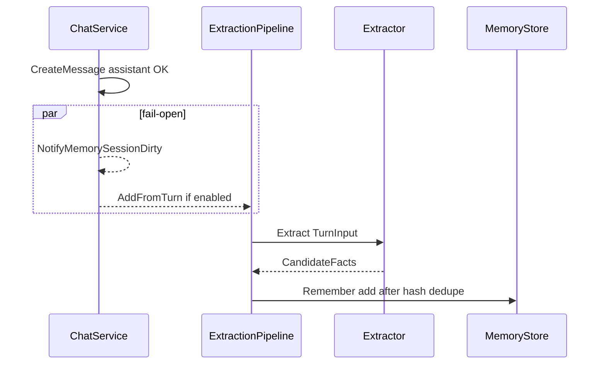

# MemoryStore P2-C：Turn 后 LLM 提取（AddFromTurn）

> 状态：实现中（P2-C）  
> 日期：2026-07-25  
> 回链：[门面 §8.2](./2026-07-25-memory-store-facade-design.md)、[2026-05-26 §5](../../../framework/docs/superpowers/specs/2026-05-26-multi-layer-memory-design.md)（裁剪）  
> 前置：P2-A `scope=user`（已交付）；P2-B 删除 `memory.Manager` / `SearchPrefetchBackend`（本分支 `feat/memory-store-p2b-p2c` 先完成）

---

## 0. 目标与非目标

### 目标

1. Turn 完成后（assistant 落库后）可选调用 `AddFromTurn`：LLM 提取结构化事实 → 写入 `MemoryStore` units。
2. 仅写 **`session`** 与 **`user`**；禁止自动写 agent / `MEMORY.md`。
3. 冲突：**仅** `content_hash` 精确去重（ignore）；无 LLM ConflictResolver / supersede。
4. 默认 **`memory_extraction.enabled=false`**；开启后 async + fail-open，不阻塞对话。

### 非目标

| 项 | 归属 |
|----|------|
| LLM ConflictResolver / supersede | D |
| 向量 / Neo4j | E |
| Prefetch 配额 | F |
| 重命名 `MemoryWriteEnabled` | 后续清理 |

---

## 1. 流程



---

## 2. Framework API

### 2.1 类型

```go
type TurnInput struct {
    UserID, SessionID, AgentID string
    UserMessage, AssistantMessage string
}

type CandidateFact struct {
    Content string
    Scope   Scope // user | session only
}

type Extractor interface {
    Extract(ctx context.Context, in TurnInput) ([]CandidateFact, error)
}

type Pipeline struct {
    Store     MemoryStore
    Extractor Extractor
    Enabled   bool
    MaxFacts  int // default 5
}
```

### 2.2 `AddFromTurn`

1. `!Enabled` 或双方消息皆空 → no-op  
2. `Extract`；drop 非法 scope / 空 content / 超长（>2KB）  
3. `scope=user` 且 `UserID==""` → drop  
4. 对每条：`Recall`/`List` 同 scope+ScopeID 下若已有相同 `ContentHash` 的 active unit → skip  
5. 否则 `Remember(ActionAdd)`；`session` 的 ScopeID=SessionID；`user` 的 ScopeID=UserID；Metadata 可含 `source=turn_extract`、`source_session_id`

错误向上返回供日志；调用方 fail-open。

### 2.3 LLMExtractor

- 输入：user/assistant 文本（可截断）  
- 输出 JSON：`{"facts":[{"content":"...","scope":"user|session"}]}`  
- `max_facts` 截断；解析失败 → 空列表 + error（fail-open）

---

## 3. Portal

### 3.1 配置

```yaml
memory_extraction:
  enabled: false
  max_facts_per_turn: 5
  # optional auxiliary model; else use agent chat model when wiring
  # auxiliary:
  #   provider: openai
  #   model: ...
  #   api_key: ...
  #   base_url: ...
```

可用 `agent_extra.yaml` / 环境变量镜像；缺省关闭。

### 3.2 钩点

- `SendMessage`：assistant `CreateMessage` 成功后  
- Stream：`SaveAssistantMessage` 成功后  

与 `NotifyMemorySessionDirty` 并列 `go`；传入 `ResolveMemoryUserID`、session/agent id、本轮 user+assistant 文本。

### 3.3 模型

优先 auxiliary；未配置则用当前 Agent `BuildModel`（提取 goroutine 内构造，失败则 skip）。

---

## 4. 验收

1. `enabled=false`：零新 units（相对基线）。  
2. `enabled=true`：一轮对话后出现 `scope_type=session` 和/或 `user` 行（有 user_id 时）。  
3. 重复同内容 turn：不因 hash 重复插入。  
4. 工具 `memory_remember` 路径不变。

---

## 5. 与工具并存

模型仍可主动 `memory_remember`；提取是补充路径，prompt 约束不写入大段代码。
