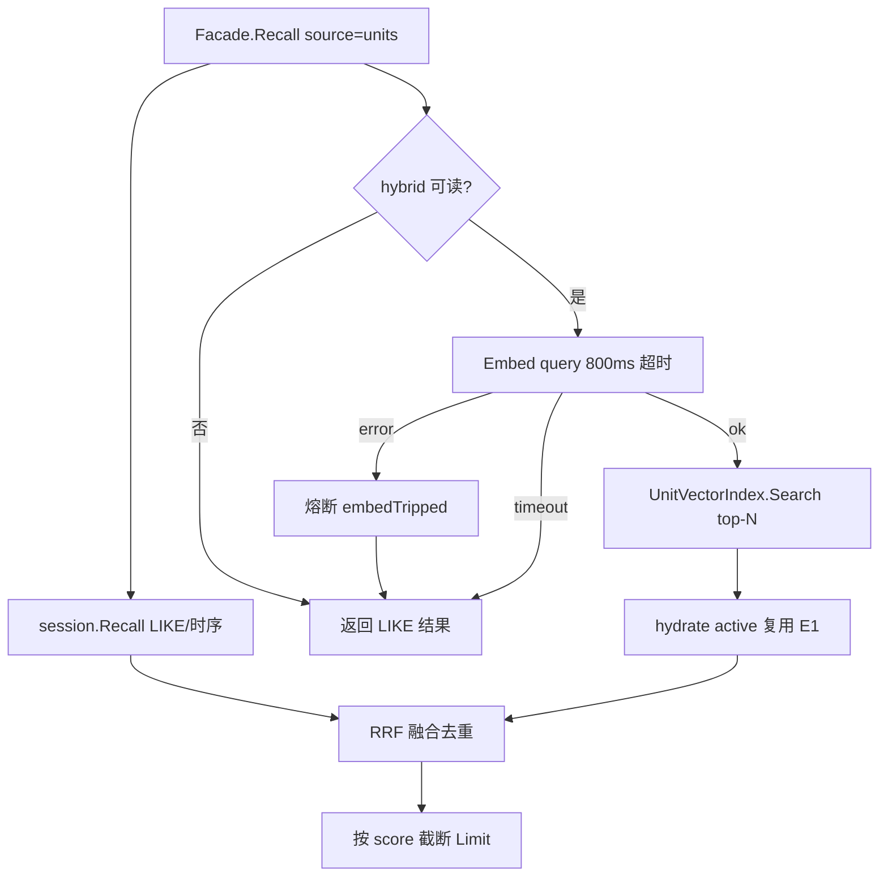

# MemoryStore P2-E2：units Hybrid Recall（RRF 融合 + 写路径解耦）

> 状态：设计中  
> 日期：2026-07-26  
> 回链：[P2-E1 向量 Sidecar](./2026-07-27-memory-store-vector-sidecar-design.md)、[门面 §8.3](./2026-07-25-memory-store-facade-design.md)、[P2-D2 LLM 语义冲突](./2026-07-26-memory-store-llm-conflict-design.md)  
> 前置：P2-E1（`UnitVectorIndex` + SQLite + D2 peer 发现）已交付  
> 切片：**E2 only** — `Recall(source=units)` LIKE∪向量 RRF hybrid；向量写入与 D2 解耦；Agent 级 `hybrid_recall` 开关；不做 backfill / Qdrant / 前端面板

---

## 0. 目标与非目标

### 目标

1. `Facade.Recall(source=units)` 在向量路径可用时做 **LIKE ∪ 向量近邻** 的 **RRF 融合**；不可用（未装配 / 熔断 / 空 query / Agent 关闭）时行为与今日完全一致（纯 LIKE，fail-open）。  
2. 两条读路径统一受益：`memory_recall` 工具显式调用与 `StorePrefetchBackend` 每轮 Prefetch（后者需补传 `AgentID`，见 §2.4）。  
3. **写路径解耦**：units 写入成功且 `vectorReady()` 即 Upsert，不再要求 D2 语义门（`semanticEnabled`）开启；D2 关闭时索引照常积累。  
4. **Agent 级读开关** `runtime_tools.hybrid_recall`（proto3 `optional bool`，unset = 开）：关掉只影响该 Agent 的读路径，向量写入仍全局进行。  
5. 读路径 Embed 独立短超时 + 进程内查询向量小缓存，控制 Prefetch 延迟；失败仍复用 E1 进程级熔断。

### 非目标

| 项 | 归属 |
|----|------|
| 存量 units backfill / rebuild | 后续（老数据靠 LIKE 支路） |
| `QdrantUnitVectorIndex` / ANN | E3 |
| agent files / transcript 向量化 | 不做 |
| 改 D2 裁决语义或 peer 发现逻辑 | 不动（peer 发现继续按 E1） |
| 前端 Agent 面板「混合召回」开关 UI | follow-up（本切片 API + 文档先行） |
| RRF k、Embed 超时做成配置 | 先常量（k=60、800ms） |
| `agent_extra.yaml` 全局 `hybrid_recall` | 不加（避免双源；全局关停用 `provider: none`） |
| 按 Agent 拆分 sqlite 文件 | 不做 |

---

## 1. 背景

E1 交付后：

- 向量索引**只**服务 D2 peer 发现；`Recall(source=units)` 仍是 Portal MySQL `content LIKE %q%` + `updated_at DESC`，`Score` 恒 0（`internal/data/memory_units_backend.go`）。  
- Embed + Upsert 被 E1 有意门控在 `semanticEnabled && vectorReady`：D2 未开启的部署，向量库长期为空。E2 hybrid 读若不先扩大写覆盖面，将无数据可召。  
- 措辞不同、无共享子串的相关事实（如「我偏好深色主题」vs「界面用 dark mode」）在工具召回与 Prefetch 注入中均无法命中。

头脑风暴决议（2026-07-26）：写路径解耦（不加独立写开关、不做 backfill）；读路径两处都走 hybrid；融合用 RRF；`hybrid_recall` 配置在 Agent 上。

---

## 2. 架构

### 2.1 读路径



**hybrid 可读**（全部满足才走向量支路）：

| 条件 | 说明 |
|------|------|
| `vectorReady()` | 同 E1：`UnitVectors != nil && UnitEmbedder != nil && !embedTripped` |
| `strings.TrimSpace(q.Query) != ""` | 空 query（Prefetch 最近 N 条等）不 Embed |
| `hybridAllowed(ctx, q.AgentID)` | Agent 门控，见 §2.3；`AgentID` 空或回调 nil → true |

**RRF 融合**

- 两路各取 `N = 2 * effLimit`（`effLimit = q.Limit`，`<=0` 时取 backend 默认 5）。LIKE 支路即现有 `session.Recall`（改传 `Limit=N`）；向量支路 `UnitVectorQuery{Limit: N}` → hydrate active。  
- `score(unit) = Σ_路 1/(60 + rank_路)`，rank 从 1 起；只出现在一路的照常计入。  
- 同 `unit_id` 去重合并（分数相加），按 score 降序、同分按 LIKE 支路原序，截断到 `effLimit`。  
- 输出 `MemoryHit.Score` = RRF 分（打破今日恒 0；Prefetch 只用 Content 不受影响，工具展示分数变化为**有意**）。

**失败语义（fail-open）**

- Embed 返回 error（含模型不支持 Embed）→ trip 熔断 + 本轮纯 LIKE。  
- Embed 超时（独立 800ms context）→ 本轮纯 LIKE，**不** trip（偶发慢请求不永久降级）。  
- `Search` / hydrate 出错 → 丢弃向量支路，返回 LIKE 结果；不向调用方报错。  
- LIKE 支路出错 → 与今日一致直接返回 error（主路径语义不变）。

### 2.2 写路径解耦（相对 E1 的差异）

| 事件 | E1 门控 | E2 门控 |
|------|---------|---------|
| add / KeepBoth / Supersede 新 id Upsert | `semanticEnabled(in) && vectorReady()` | **仅 `vectorReady()`** |
| D1 replace 新 id Upsert | 同上 | 同上 |
| supersede / remove / Delete 目标 id 的向量 Delete | `UnitVectors != nil` | 不变 |
| D2 关闭时的写入 | 零向量副作用 | Embed + Upsert（服务 hybrid 读） |

- `syncUpsert` 去掉 `semanticEnabled(in)` 条件；`syncUpsertVec`（复用 D2 peer 已算向量）不变。  
- D2 peer 发现（`vectorPeers`）与裁决流程不动。  
- E1 规格「D2 关闭时零 Embed」承诺由本规格**显式取代**（写放大与 hybrid 收益绑定；熔断兜底）。

### 2.3 Agent 级开关

**proto**（`api/agent/v1/agent.proto`）：

```protobuf
message RuntimeToolsConfig {
  // ... 既有 1–8 ...
  optional bool hybrid_recall = 9;  // unset = 开；false = 该 Agent 读路径只走 LIKE
}
```

**biz**：

```go
type RuntimeToolsConfig struct {
    // ...
    HybridRecall *bool `json:"hybrid_recall,omitempty"`
}
```

**Facade 感知**：`FacadeConfig` 增加可选回调（framework 不依赖 Portal biz）：

```go
// HybridRecall reports whether hybrid units recall may run for agentID.
// nil = always allowed. Portal wires AgentMeta.RuntimeTools.HybridRecall.
HybridRecall func(ctx context.Context, agentID string) bool
```

Portal 侧解析规则（fail-open）：

```text
agent 查不到 / AgentID 空 / HybridRecall == nil → true
否则 → *HybridRecall
```

写入 Upsert **不受**此开关影响（索引完整性全局保证）。

### 2.4 Prefetch 补丁

`StorePrefetchBackend.Prefetch` 现在 user/session 两路 `RecallQuery` 未带 `AgentID`（agent/files 路已带）。E2 必须补传 `q.AgentID`，否则 Agent 门控与动态 Embedder 的模型解析都退化为默认。

### 2.5 Embed 成本控制（读路径）

| 项 | 值 |
|----|-----|
| Embed 超时 | 独立 context，常量 800ms |
| 查询向量缓存 | 进程内 LRU，key = `agentID + "\x00" + query`，容量 64；同一轮 Prefetch 的 user+session 两次 Recall 只 Embed 一次 |
| 熔断 | 复用 E1 `embedTripped`（读写共用；Embed error 才 trip，超时不 trip） |

缓存实现放 framework（Facade 内或独立小结构），不引第三方依赖。

---

## 3. 与既有组件关系

| 组件 | 关系 |
|------|------|
| P2-E1 | 复用 `UnitVectorIndex` / `UnitEmbedder` / `vectorReady` / hydrate / 熔断；写门控放宽（§2.2）；E1 非目标「通用 Recall hybrid」由本切片交付 |
| P2-D2 | peer 发现与裁决不变；D2 开关不再影响向量写入 |
| P2-D1 | replace 的向量 Delete/Upsert 语义沿用，仅 Upsert 门控放宽 |
| `memory_units` MySQL | 无 schema 变更、无 migration |
| Prefetch / Orchestrator | 注入质量提升；接口不变（仅补 AgentID） |

---

## 4. 测试与验收

### Framework 单测

| # | 用例 | 断言 |
|---|------|------|
| 1 | hybrid 开、索引热 | 无共享子串的语义近邻进结果；`Score > 0` |
| 2 | 仅 LIKE 能命中（该 unit 无向量） | 结果仍含该 unit（稀疏索引不丢字面命中） |
| 3 | Embed error | 回退 LIKE；同进程再次 Recall 不再调 Embed（熔断） |
| 4 | Embed 超时 | 回退 LIKE；不 trip；后续调用仍尝试向量 |
| 5 | `HybridRecall` 回调返回 false | 不调 Embed/Search，纯 LIKE |
| 6 | 回调 nil / AgentID 空 | 默认走 hybrid（若 `vectorReady`） |
| 7 | 空 query | 不 Embed；行为与现有 backend 一致 |
| 8 | 写解耦 | `ToolSemanticConflict=false` 且非 turn_extract 的 add 仍 Upsert |
| 9 | RRF 去重 | 同 unit 两路命中只留一条，分数为两路贡献之和 |
| 10 | Prefetch 传 AgentID | user/session `RecallQuery.AgentID` == PrefetchQuery.AgentID |

### Portal 单测

1. `HybridRecall=nil` → gate true；`=false` → gate false；agent 查不到 → true。  
2. proto `optional bool` round-trip（unset / true / false）经 Create/Update/Get。  
3. 查询向量缓存：同 agentID+query 连续两次 Recall 只 Embed 一次。

### 验收（手工 / 集成）

1. Agent A（开关默认）：措辞不同的相关事实可被 `memory_recall` 与 Prefetch 召回。  
2. Agent B 显式 `hybrid_recall=false`：同环境同数据只走 LIKE。  
3. D2 关闭、hybrid 开：新写入 unit 落向量，Recall 可向量命中。  
4. Embed 不可用：与纯 LIKE 一致，对话不被打断，无 Embed 风暴。  
5. 无新 MySQL migration。

---

## 5. 文档

- 更新门面规格 §8.3：E2 状态。  
- 更新 E1 规格 §7「后续」：E2 → 本规格；并注明「D2 关闭零 Embed」被 E2 取代。  
- 更新 `portal/docs/memory-integration.md`：hybrid recall 一节 + Agent 开关说明 + Backlog。

---

## 6. 风险

| 风险 | 缓解 |
|------|------|
| Prefetch 每轮多一次 Embed 延迟 | 800ms 超时 + LRU 缓存 + fail-open |
| 存量 units 无向量 | LIKE 支路保底；backfill 归后续 |
| 写放大（每条 units 写入都 Embed） | 熔断兜底；与 hybrid 收益绑定 |
| `Score` 语义变化影响展示 | Prefetch 不受影响；工具展示变化为有意，文档注明 |
| proto `optional` 前端三态成本 | 本切片仅 API；UI follow-up |
| 单次超时误伤 | 超时不 trip，仅 error trip |

---

## 7. 后续（非本切片）

- 存量 backfill / rebuild CLI。  
- E3：`QdrantUnitVectorIndex` / ANN。  
- RRF k、Embed 超时、MinScore 可配置化。  
- 前端 Agent 面板「混合召回」开关。
