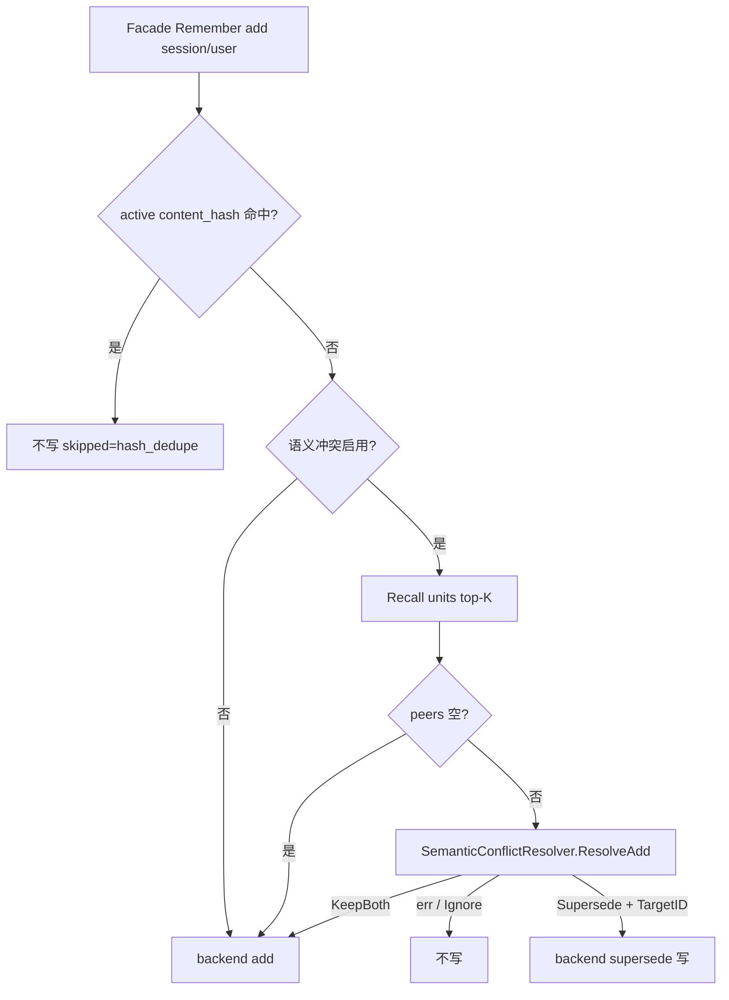

# MemoryStore P2-D2：LLM 语义冲突消解

> 状态：已确认（待实现计划）  

> 日期：2026-07-26  
> 回链：[门面 §8.3](./2026-07-25-memory-store-facade-design.md)、[P2-D1 ConflictResolver](./2026-07-25-memory-store-conflict-resolver-design.md)、[P2-C turn extract](./2026-07-25-memory-store-turn-extract-design.md)  
> 前置：P2-D1（结构化 supersede + `ConflictResolver`）；P2-C（`AddFromTurn` + hash 去重）  
> 切片：**D2 only** — `Remember(add)` 语义冲突；不改 D1 `replace` Structural 门闩

---

## 0. 目标与非目标

### 目标

1. 对 **所有经 Facade 的 `Remember(add)`**（工具 + Turn 提取）在写入前做语义冲突检测（可开关）。  
2. 候选路径：**content_hash 精确去重 →（开启时）Recall top-K → 一次 LLM 裁决**。  
3. 决策：`Ignore` / `Supersede` / `KeepBoth`；LLM 失败 **fail-closed（不写）**。  
4. `Supersede` 复用 D1 链（新 active + 旧 superseded）；`KeepBoth` 正常 `add`。  
5. 与 D1 解耦：新增 `SemanticConflictResolver`，不扩宽单 existing 的 `ConflictResolver`。

### 非目标

| 项 | 归属 |
|----|------|
| `replace` 语义裁决（仍 Structural） | P2-D1 |
| 向量预筛 / Neo4j / Prefetch 配额 | 后续清单 |
| agent 文件语义冲突 | 不做 |
| 多 peer 同时 supersede | 不做 |
| 新 DB 迁移 | 不需要 |

---

## 1. 背景

P2-D1 仅覆盖工具显式 `replace` → 恒 supersede。  
P2-C `AddFromTurn` 与工具 `add` 仅有 hash 去重，无法处理「文本不同但事实矛盾 / 可并存」。  
D1 规格 §6 预留本切片。

---

## 2. 架构



### 2.1 接口

保留 D1：

```go
type ConflictResolver interface {
    Resolve(ctx context.Context, existing MemoryHit, candidate RememberInput) (ConflictDecision, error)
}
```

新增（D2）：

```go
type SemanticConflictVerdict struct {
    Decision     ConflictDecision // Ignore | Supersede | KeepBoth
    TargetUnitID string           // Supersede 时必填；否则空
}

// SemanticConflictResolver judges an add candidate against peer active units.
type SemanticConflictResolver interface {
    ResolveAdd(ctx context.Context, candidate RememberInput, peers []MemoryHit) (SemanticConflictVerdict, error)
}
```

`LLMSemanticConflictResolver`：单次 LLM completion，严格 JSON 输出。

### 2.2 Facade 编排

`FacadeConfig` 增加：

| 字段 | 含义 |
|------|------|
| `SemanticConflicts SemanticConflictResolver` | nil = 不做语义步骤 |
| `SemanticConflictK int` | Recall limit，默认 **8** |
| （既有）`Conflicts ConflictResolver` | 仅 `replace`；nil → Structural |

`rememberUnits`：

| Action | 行为 |
|--------|------|
| `add` | §2 流程图；见下「语义启用」 |
| `replace` | **仅** D1 `Conflicts` 门闩 → backend supersede（不变） |
| `remove` | 直 backend（不变） |

**语义裁决后的 Supersede：** 将 `add` 改写为对 `TargetUnitID` 的 supersede 写（新 content），**直接调用 units backend 的 supersede/replace 实现**，不再次进入 D1 `ConflictResolver`（避免双重裁决）。工具显式 `replace` 仍走 D1 Structural。

**Target 校验：** `TargetUnitID` 必须 ∈ 本次 `peers`，且 Get 后为 `active`；否则视为无效裁决 → fail-closed 不写。

### 2.3 语义启用条件

| 调用路径 | 启用条件 |
|----------|----------|
| Turn 提取产生的 `add` | `memory_extraction.enabled`（及现有 env）为 true，**且**已装配 `SemanticConflicts` + 可用模型 |
| 工具 `memory_remember(add)` | **独立** `memory_conflict.enabled` / `SATH_MEMORY_CONFLICT_ENABLED`（**默认 false**），且已装配 resolver + 模型 |

未配置模型 / resolver=nil：跳过语义步骤并 **直 add**（与「调用失败 fail-closed」区分：未配置 ≠ 调用失败）。

### 2.4 候选集与 hash

1. Facade 对 session/user `add` **统一**做 active `content_hash` 检查（与 P2-C List 扫描语义一致）；命中 → 不写。  
2. Pipeline 可保留自身 hash 预过滤（优化，非唯一关卡）。  
3. Recall：`source=units`，`query=candidate.Content`，`limit=K`。  
4. peers 为空 → 直 add，不调 LLM。  
5. 仅 `scope=session|user`。

### 2.5 决策与失败

| Verdict | 行为 |
|---------|------|
| Ignore | 不写；可选 skipped reason `conflict_ignore` |
| KeepBoth | `backend.Remember(add)` |
| Supersede | backend supersede 链（§2.2） |
| LLM/超时/非法 JSON/非法 target | **fail-closed 不写**；reason `conflict_llm_error` / `conflict_invalid_target` |

对外：不因冲突检测向对话抛硬错误（工具可返回 skipped 观测字段）。

### 2.6 LLM 约束

- 输入：candidate + peers（id、content；单条截断）。  
- 输出：`{"decision":"supersede"|"ignore"|"keep_both","target_unit_id":"..."}`。  
- `supersede` 时 `target_unit_id` 必填且 ∈ peers。  
- 模型：复用提取 auxiliary 或 Agent chat model（与 P2-C 解析策略一致）。  
- 单次 completion；短超时。  
- 日志：decision、target、耗时；不记录全文 prompt。

---

## 3. Portal 接线

- 有 LLM client 时注入 `LLMSemanticConflictResolver`。  
- `agent_extra.yaml`：`memory_conflict.enabled`（默认 false）+ env 覆盖。  
- 提取路径不另设总闸：跟随 `memory_extraction.enabled`。  
- 更新 `docs/memory-integration.md`（P2-D2 小节）；Backlog 去掉「LLM 语义冲突」或标已规格化。

---

## 4. 测试与验收

1. hash 命中 → 不调 LLM、不写。  
2. 开关关 / resolver nil / 无模型 → 直 add。  
3. peers 空 → 直 add。  
4. KeepBoth → 两条 active。  
5. Supersede → 新 id、旧 superseded；Recall 只见新。  
6. LLM error / 非法 JSON / 非法 target → 不写。  
7. 工具 `replace` 仍仅 Structural。  
8. 提取开：矛盾事实可 supersede；P2-C hash 回归仍绿。  

验收：两开关默认关时与现网一致；无新迁移。

---

## 5. 实现落点（文件级）

| 位置 | 变更 |
|------|------|
| `framework/memory/conflict.go`（或 `semantic_conflict.go`） | `SemanticConflictResolver`、Verdict、LLM 实现 |
| `framework/memory/facade.go` | add 编排；hash；K |
| `framework/memory/*_test.go` | §4 用例 |
| Portal `memory_store` / agent_extra / extract 接线 | 双开关 + 注入 |
| `portal/docs/memory-integration.md` | 文档 |

---

## 6. 门面清单回链

门面 §8.3「冲突消解」：D1 结构化 → 已交付；**LLM 语义 → 本规格 P2-D2**。
