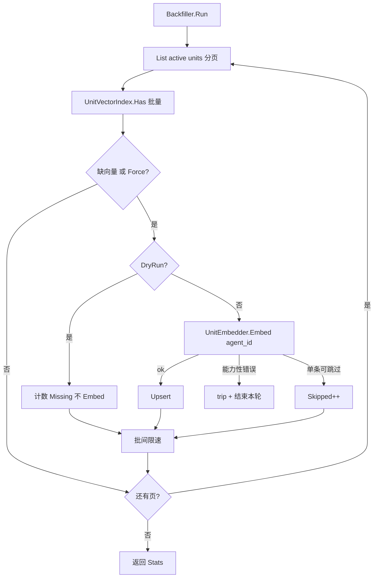

# MemoryStore P2-E2.1：存量 units 向量 Backfill / Rebuild

> 状态：设计中  
> 日期：2026-07-26  
> 回链：[P2-E2 Hybrid Recall](./2026-07-26-memory-store-hybrid-recall-design.md)、[P2-E1 向量 Sidecar](./2026-07-27-memory-store-vector-sidecar-design.md)、[门面 §8.3](./2026-07-25-memory-store-facade-design.md)  
> 前置：P2-E1（`UnitVectorIndex` + Embedder）、P2-E2（写路径解耦 + hybrid 读）已交付  
> 切片：**E2.1 only** — 共享 `UnitBackfiller` + `Has` 接口扩展 + 启动增量 job + CLI；不做 Qdrant、分布式锁、前端 UI、断点续跑

---

## 0. 目标与非目标

### 目标

1. 把存量 `status=active` 的 session/user units 补进 `UnitVectorIndex`，使 E2 hybrid 对老数据也有向量支路。  
2. **同一套核心**：启动增量 job 与 CLI 共用 `UnitBackfiller`。  
3. 默认只补缺（sidecar 对比）；CLI `--force` 才对已有向量重 Embed。  
4. 不阻塞对话：后台限速 + 复用 E1 进程级 `embedTripped` 熔断；失败跳过单条，不回滚主表。  
5. Embed 模型按 **unit 的 `agent_id`** 解析（与在线写路径一致）；空则走 auxiliary，仍失败则 skip。

### 非目标

| 项 | 归属 |
|----|------|
| `QdrantUnitVectorIndex` / ANN | E3 |
| 换模型自动全量迁移 / 维度版本字段 | 后续（换模型时删 sidecar DB 再 `--force`） |
| 分布式锁 / 多副本协调 | 本切片假设单进程；文档注明 |
| 进度持久化 / 断点续跑 | 不做（重跑幂等） |
| yaml 暴露 batch/sleep | 先常量；可后置 |
| 前端「混合召回」开关 UI | 独立切片 C |
| 级联 Delete 回传、改 hybrid 公式 | 不动 |

---

## 1. 背景

E2 写路径已与 D2 解耦：之后的成功写入会 Upsert。但部署前已存在的 active units 在 sidecar 中为空 → hybrid 向量支路对存量事实无增益，只能靠 LIKE。

头脑风暴决议（2026-07-26）：

- 触发：**CLI 全量/重建 + 启动增量补缺**  
- 缺向量判定：sidecar `Has` 对比（非全量重算、非懒补）  
- Embed：按 `unit.agent_id`  
- 启动：全库扫描 + 限速  
- CLI：默认补缺；`--force` 重算  

---

## 2. 架构

### 2.1 数据流



### 2.2 接口扩展（E1 稳定边界）

```go
// UnitVectorIndex 新增
Has(ctx context.Context, scope Scope, scopeID string, unitIDs []string) (map[string]bool, error)
```

| 规则 | 说明 |
|------|------|
| 语义 | 返回 `map[unitID]true` 表示 sidecar 已有 `(scope, scopeID, unitID)` |
| 空 `unitIDs` | 返回空 map，nil error |
| 范围 | **必须**限定同一 `scope` + `scopeID` |
| 禁止 | 用 `Search` 猜存在性 |
| 实现 | `InMemoryUnitVectorIndex` + `SQLiteUnitVectorIndex` 均实现 |

### 2.3 UnitBackfiller

framework 新建（名称可微调）：

```go
type BackfillConfig struct {
	Store        MemoryStore       // List active
	Index        UnitVectorIndex   // Has + Upsert
	Embedder     UnitEmbedder
	Force        bool
	DryRun       bool
	BatchSize    int           // default 50
	BatchSleep   time.Duration // default 200ms
	Scopes       []Scope       // default session + user
	EmbedTripped *atomic.Bool  // nil → 自建；Portal 注入与 Facade 同实例
}

type BackfillStats struct {
	Scanned  int
	Missing  int // Force 时计为「将重算」的候选数
	Upserted int
	Skipped  int
	Failed   int
	Tripped  bool
}

func (b *UnitBackfiller) Run(ctx context.Context) (BackfillStats, error)
```

**分页**：对每个 scope，用 `ListFilter{Scope, Status:"active", Limit:BatchSize, Offset}` 递增 Offset，直到不足一页。`ScopeID` 空 = 该 scope 下全部（依赖 Portal List 支持）。

**AgentID**：`Metadata["agent_id"]`（string）；空则 `Embed(ctx, "", texts)`，由 Portal Embedder 走 aux 回退。

**DryRun（MUST）**：**不**调用 Embed、**不** Upsert；只 List + Has 统计 `Scanned`/`Missing`。

### 2.4 启动 job vs CLI

| | 启动 job | CLI |
|--|----------|-----|
| Force | false | 可选 `--force` |
| DryRun | 无 | `--dry-run` |
| 时机 | backend 就绪后 `go Run`，独立可取消 ctx | 显式命令 |
| Index/Embedder nil | no-op | 报错退出非 0 |
| 单例 | 进程内 mutex/`sync.Once`，防重复 wiring | N/A |
| 退出 | 日志打 Stats；不阻止服务就绪 | Stats 打 stdout；装配失败非 0；Tripped 时 warning 但退 **0**（fail-open） |

**CLI**（建议 `portal/cmd/backfill-vectors`）：

```bash
backfill-vectors [--conf configs] [--force] [--dry-run] \
                 [--scope session|user|all] [--batch 50] [--sleep 200ms]
```

复用 backend 同配置：`data_root`、`memory_vector`、`memory_extraction`、AgentGetter（若需要动态模型）。

### 2.5 并发、幂等与熔断

**幂等**

- Force=false：`Has==true` 跳过 → 重复跑安全。  
- Force=true：全部 Embed+Upsert 覆盖同键 → 结果正确，费 Embed。  

**与在线写入**

| 场景 | 行为 |
|------|------|
| Backfill 与 Remember 并发 Upsert 同 id | 后写覆盖；可接受短暂重复 Embed |
| 扫后 unit 被 soft-delete | Upsert 残留靠 hydrate 过滤（同 E1） |
| 多副本并行 Force | **不做**分布式锁；文档：多副本勿并行 Force |

**熔断**

- 与 Facade 共享 `embedTripped`（或包装同一 Embedder）。  
- Embed **能力性错误**（未实现 Embed、鉴权/网关类、连续失败策略与 E1 写路径一致）→ trip，**本轮 Run 提前结束**（已处理页保留）。  
- 空内容、agent 解析失败 → `Skipped++`，不 trip。  

**限速**：批间 `BatchSleep`（默认 200ms）；BatchSize 默认 50。

### 2.6 可观测

`BackfillStats` 如上。启动 job：开始/结束 info 日志带 Stats。CLI：stdout 同结构。不做进度条 / 持久化进度。

---

## 3. 与既有组件关系

| 组件 | 关系 |
|------|------|
| P2-E1 | 扩展 `Has`；复用 Index/Embedder/熔断 |
| P2-E2 | 补齐存量后 hybrid 向量支路有数据；不改 Recall 编排 |
| `memory_units` MySQL | 只读 List；无 migration |
| Prefetch / 对话路径 | 不被阻塞；job 异步 |

---

## 4. 测试与验收

### Framework

| # | 用例 | 断言 |
|---|------|------|
| 1 | `Has` InMemory | 命中/未命中/scope 隔离/空 ids |
| 2 | `Has` SQLite | 同上 + 重启后可读 |
| 3 | 补缺 | 3 active、1 已有向量 → Embed 2 次；Stats 正确 |
| 4 | Force | Embed 3 次 |
| 5 | DryRun | 无 Embed、无 Upsert；Missing 有值 |
| 6 | 能力性 Embed 错误 | Tripped；Run 提前结束 |
| 7 | 单条 skip | 空内容 → Skipped，继续 |
| 8 | 分页 | BatchSize=2、5 条 → 扫完无重复无遗漏 |
| 9 | scope 过滤 | 只 session 不碰 user |
| 10 | AgentID 传递 | Embed 收到 unit 的 agent_id |

### Portal

1. 启动 job 单例：并发触发只跑一次。  
2. `provider=none` / Index nil → no-op。  
3. CLI flag → BackfillConfig 映射。

### 验收（手工）

1. 老库 CLI 后，措辞不同的存量事实可被 hybrid 召回。  
2. 第二次跑：`Missing=0`、`Upserted=0`。  
3. `--force`：`Upserted≈Scanned`。  
4. Embed 不可用：Tripped，退 0，无脏写。  
5. 启动 job 不拖慢服务就绪（异步）。

---

## 5. 文档

- 更新 `portal/docs/memory-integration.md`：backfill 一节 + CLI 示例；Backlog 去掉「存量 backfill」。  
- 更新门面 §8.3 / E2 规格 §7：指向本规格。  
- 注明：多副本勿并行 `--force`；换模型维度冲突时删 sidecar DB 再 `--force`。

---

## 6. 风险

| 风险 | 缓解 |
|------|------|
| 大库启动扫描成本 | 限速 + 只补缺；建议首次用 CLI |
| 多副本重复 Embed | 文档约束；Upsert 幂等 |
| 维度基准冲突 | 报错提示删 DB 再 force |
| Metadata 无 agent_id | aux 回退；再失败 skip |

---

## 7. 后续（非本切片）

- 前端 hybrid_recall 开关 UI（切片 C）。  
- E3 Qdrant。  
- 断点续跑 / yaml 可配限速。  
- 模型版本字段驱动自动 rebuild。
