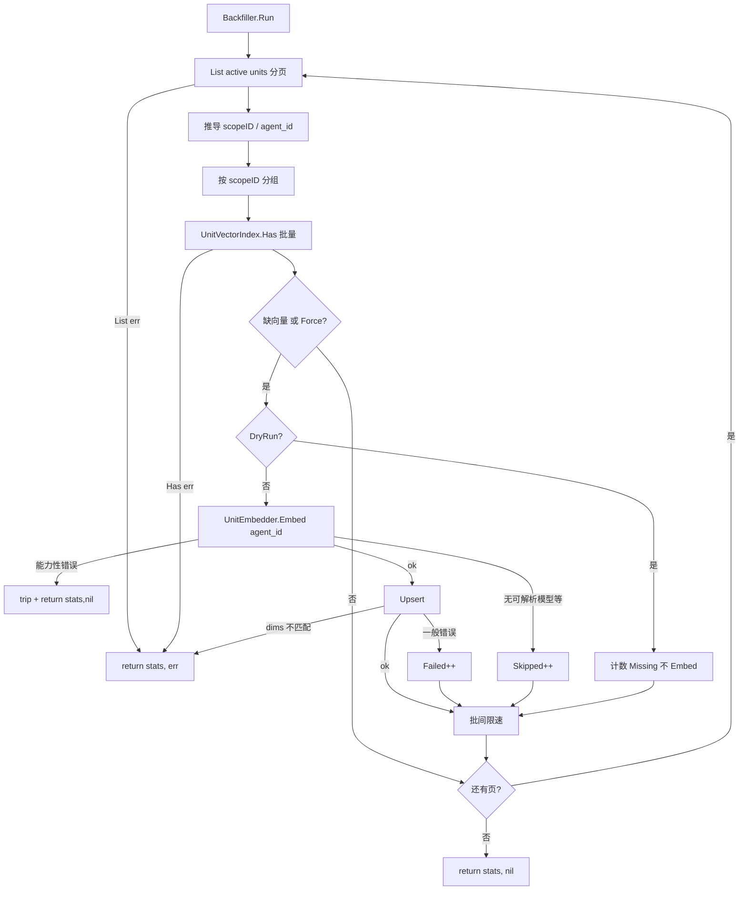

# MemoryStore P2-E2.1：存量 units 向量 Backfill / Rebuild

> 状态：已交付  
> 日期：2026-07-26  
> 回链：[P2-E2 Hybrid Recall](./2026-07-26-memory-store-hybrid-recall-design.md)、[P2-E1 向量 Sidecar](./2026-07-27-memory-store-vector-sidecar-design.md)、[门面 §8.3](./2026-07-25-memory-store-facade-design.md)  
> 前置：P2-E1（`UnitVectorIndex` + Embedder）、P2-E2（写路径解耦 + hybrid 读）已交付  
> 切片：**E2.1 only** — `Has` 接口 + `UnitBackfiller` + Facade `EmbedTripped` 可注入共享 + 启动增量 job + CLI；不做 Qdrant、分布式锁、前端 UI、断点续跑、keyset 分页

---

## 0. 目标与非目标

### 目标

1. 把存量 `status=active` 的 session/user units 补进 `UnitVectorIndex`，使 E2 hybrid 对老数据也有向量支路。  
2. **同一套核心**：启动增量 job 与 CLI 共用 `UnitBackfiller`。  
3. 默认只补缺（sidecar 对比）；CLI `--force` 才对已有向量重 Embed。  
4. 不阻塞对话：后台限速 + 与 Facade **共享**进程级 `embedTripped`（本切片导出 `FacadeConfig.EmbedTripped *atomic.Bool`）；失败跳过单条，不回滚主表。  
5. Embed 模型按 **unit 的 `agent_id`** 解析（与在线写路径一致）；无法解析到可用模型则 **skip**（不 trip）；**已调用** Embed 后的能力性错误（未实现 Embed、鉴权/网关）则 **trip**。  
6. Backfiller 经 `SessionUnitsBackend.List` 扫库（**禁止**经 Facade.List，避免 user 空 ScopeID 静默空结果）。

### 非目标

| 项 | 归属 |
|----|------|
| `QdrantUnitVectorIndex` / ANN | E3 |
| 换模型自动全量迁移 / 维度版本字段 | 后续（换模型时删 sidecar DB 再 `--force`） |
| 分布式锁 / 多副本协调 | 本切片假设单进程；文档注明 |
| 进度持久化 / 断点续跑 | 不做（重跑幂等） |
| yaml 暴露 batch/sleep | 先常量；可后置 |
| 前端「混合召回」开关 UI | 独立切片 C |
| 级联 Delete 回传、改 hybrid 公式 | 不动 |

---

## 1. 背景

E2 写路径已与 D2 解耦：之后的成功写入会 Upsert。但部署前已存在的 active units 在 sidecar 中为空 → hybrid 向量支路对存量事实无增益，只能靠 LIKE。

头脑风暴决议（2026-07-26）：

- 触发：**CLI 全量/重建 + 启动增量补缺**  
- 缺向量判定：sidecar `Has` 对比（非全量重算、非懒补）  
- Embed：按 `unit.agent_id`  
- 启动：全库扫描 + 限速  
- CLI：默认补缺；`--force` 重算  

---

## 2. 架构

### 2.1 数据流



### 2.2 接口扩展（E1 稳定边界）

```go
// UnitVectorIndex 新增
Has(ctx context.Context, scope Scope, scopeID string, unitIDs []string) (map[string]bool, error)
```

| 规则 | 说明 |
|------|------|
| 语义 | 返回 `map[unitID]true` 表示 sidecar 已有 `(scope, scopeID, unitID)` |
| 空 `unitIDs` | 返回空 map，nil error |
| 范围 | **必须**限定同一 `scope` + `scopeID` |
| 禁止 | 用 `Search` 猜存在性 |
| 实现 | `InMemoryUnitVectorIndex` + `SQLiteUnitVectorIndex` 均实现 |

### 2.3 UnitBackfiller

framework 新建（名称可微调）：

```go
type BackfillConfig struct {
	// Units MUST be SessionUnitsBackend (Portal MySQL / in-memory), NOT Facade.
	// Facade.List(ScopeUser, ScopeID="") silently returns empty — would zero-scan user corpus.
	Units        SessionUnitsBackend
	Index        UnitVectorIndex // Has + Upsert
	Embedder     UnitEmbedder
	Force        bool
	DryRun       bool
	BatchSize    int           // default 50
	BatchSleep   time.Duration // default 200ms
	Scopes       []Scope       // default session + user
	EmbedTripped *atomic.Bool  // nil → 自建；Portal 注入 Facade 同指针（见 §2.5）
}

type BackfillStats struct {
	Scanned  int
	Missing  int // Force 时计为「将重算」的候选数
	Upserted int
	Skipped  int // 空内容、缺 scopeID、agent 解析失败等可跳过项
	Failed   int // Upsert 返回 error（非维度致命）时 +1，继续下一条
	Tripped  bool
}

func (b *UnitBackfiller) Run(ctx context.Context) (BackfillStats, error)
```

**分页**：对每个 scope，用 `ListFilter{Scope, Status:"active", Limit:BatchSize, Offset}` 递增 Offset（`ScopeID` 空），直到不足一页。**MUST** 调 `Units.List`，禁止经 Facade。

**scopeID 推导与 Has 分组（MUST）**：`MemoryHit` 无独立 ScopeID 字段。每条 hit：

| Scope | scopeID 来源 |
|-------|----------------|
| session | `Metadata["source_session_id"]`（string） |
| user | `Metadata["user_id"]`（string） |

缺失或空白 → `Skipped++`，不 Embed。同一页内按推导出的 `scopeID` **分组**，每组一次 `Has(ctx, scope, scopeID, ids)`，再按 Force/缺向量决定 Embed。

**AgentID**：`Metadata["agent_id"]`（string）；空则 `Embed(ctx, "", texts)`，由 Portal Embedder 走 aux 回退。

**DryRun（MUST）**：**不**调用 Embed、**不** Upsert；只 List + Has 统计 `Scanned`/`Missing`。

**错误分类与 `Run` 返回契约（MUST）**

| 事件 | 计数 / 行为 | `Run` 返回 |
|------|-------------|------------|
| `Units.List` error | 提前结束（已处理页 Stats 保留） | `(stats, err)` |
| `Index.Has` error | 同上 | `(stats, err)` |
| Upsert 一般错误 | `Failed++`，继续 | 最终 `(stats, nil)`（除非另有致命） |
| Upsert 维度不匹配（SQLite dims） | 提前结束；提示删 sidecar DB 再 `--force` | `(stats, err)` |
| Embed 能力性错误（未实现 Embed、鉴权/网关类） | trip 共享 breaker，本轮结束，`Tripped=true` | `(stats, nil)` |
| 空 Content / 缺 scopeID / 无法解析到可用模型 | `Skipped++`，不 trip | 继续 |

CLI：装配失败 → 非 0；`Run` 返回非 nil error → 非 0；仅 `Tripped`（`err==nil`）→ warning + 退 **0**。

### 2.4 启动 job vs CLI

| | 启动 job | CLI |
|--|----------|-----|
| Force | false | 可选 `--force` |
| DryRun | 无 | `--dry-run` |
| 时机 | backend 就绪后 `go Run`，独立可取消 ctx | 显式命令 |
| Index/Embedder nil | no-op | 报错退出非 0 |
| 单例 | 进程内 mutex/`sync.Once`，防重复 wiring | N/A |
| 退出 | 日志打 Stats；不阻止服务就绪 | Stats 打 stdout；装配失败非 0；`Run` 非 nil error → 非 0；仅 Tripped（err=nil）→ warning 退 **0** |

**CLI**（建议 `portal/cmd/backfill-vectors`）：

```bash
backfill-vectors [--conf configs] [--force] [--dry-run] \
                 [--scope session|user|all] [--batch 50] [--sleep 200ms]
```

复用 backend 同配置：`data_root`、`memory_vector`、`memory_extraction`、AgentGetter（若需要动态模型）。

### 2.5 并发、幂等与熔断

**幂等**

- Force=false：`Has==true` 跳过 → 重复跑安全。  
- Force=true：全部 Embed+Upsert 覆盖同键 → 结果正确，费 Embed。  

**与在线写入**

| 场景 | 行为 |
|------|------|
| Backfill 与 Remember 并发 Upsert 同 id | 后写覆盖；可接受短暂重复 Embed |
| 扫后 unit 被 soft-delete | Upsert 残留靠 hydrate 过滤（同 E1） |
| Offset 分页期间并发 soft-delete / Replace | 本轮可能**漏扫**部分行；下次启动 job / CLI 补齐（**可接受**；Has 兜底使重复扫安全） |
| Offset 分页期间并发新增 | 可能重扫已处理行；Has 跳过，安全 |
| 多副本并行 Force | **不做**分布式锁；文档：多副本勿并行 Force |

**熔断共享（MUST，本切片交付）**

`Facade.embedTripped` 今日为未导出值字段，无法共享。本切片**必须**改 Facade：

```go
// FacadeConfig
EmbedTripped *atomic.Bool // nil → NewFacade 内自建；非 nil → 读写该指针

// Facade 内部持 *atomic.Bool（与 Config 同源）
```

Portal 在装配时：先建共享 `var tripped atomic.Bool`（或 `new(atomic.Bool)`），同时注入 `FacadeConfig.EmbedTripped` 与 `BackfillConfig.EmbedTripped`。  
Backfiller 的 trip 条件由自身错误分类决定（§2.3 表）；trip 后写共享 breaker，使在线 hybrid/写 Upsert 同步降级（语义同 E1「失败即降级」）。

**限速**：批间 `BatchSleep`（默认 200ms）；BatchSize 默认 50。

### 2.6 可观测

`BackfillStats` 如上。启动 job：开始/结束 info 日志带 Stats。CLI：stdout 同结构。不做进度条 / 持久化进度。

---

## 3. 与既有组件关系

| 组件 | 关系 |
|------|------|
| P2-E1 | 扩展 `Has`；复用 Index/Embedder；导出共享 `EmbedTripped` |
| P2-E2 | 补齐存量后 hybrid 向量支路有数据；不改 Recall 编排 |
| `SessionUnitsBackend` | Backfiller **只**经此 List；禁止 Facade |
| `memory_units` MySQL | 只读 List；无 migration |
| Prefetch / 对话路径 | 不被阻塞；job 异步 |

---

## 4. 测试与验收

### Framework

| # | 用例 | 断言 |
|---|------|------|
| 1 | `Has` InMemory | 命中/未命中/scope 隔离/空 ids |
| 2 | `Has` SQLite | 同上 + 重启后可读 |
| 3 | 补缺 | 3 active、1 已有向量 → Embed 2 次；Stats 正确 |
| 4 | Force | Embed 3 次 |
| 5 | DryRun | 无 Embed、无 Upsert；Missing 有值 |
| 6 | 能力性 Embed 错误 | Tripped；Run 提前结束；共享 breaker 被置位 |
| 7 | 单条 skip | 空内容 / 缺 scopeID → Skipped，继续 |
| 8 | 分页 | BatchSize=2、5 条 → 扫完无重复无遗漏 |
| 9 | scope 过滤 | 只 session 不碰 user |
| 10 | AgentID 传递 | Embed 收到 unit 的 agent_id |
| 11 | 页内多 scopeID | 分组 Has；各 scope 隔离正确 |
| 12 | Facade EmbedTripped 注入 | NewFacade 非 nil 指针与 Backfiller 共享；一方 trip 另一方可见 |
| 13 | Upsert 失败 | Failed++，不 trip，继续 |
| 14 | Upsert dims 不匹配 | Run 返回 error；部分 Upserted 保留；不 trip |

### Portal

1. 启动 job 单例：并发触发只跑一次。  
2. `provider=none` / Index nil → no-op。  
3. CLI flag → BackfillConfig 映射。

### 验收（手工）

1. 老库 CLI 后，措辞不同的存量事实可被 hybrid 召回。  
2. 第二次跑：`Missing=0`、`Upserted=0`。  
3. `--force`：`Upserted≈Scanned`。  
4. Embed 不可用：Tripped，退 0，无脏写。  
5. 启动 job 不拖慢服务就绪（异步）。

---

## 5. 文档

- 更新 `portal/docs/memory-integration.md`：backfill 一节 + CLI 示例；Backlog 去掉「存量 backfill」。  
- 更新门面 §8.3 / E2 规格 §7：指向本规格。  
- 注明：多副本勿并行 `--force`；换模型维度冲突时删 sidecar DB 再 `--force`。

---

## 6. 风险

| 风险 | 缓解 |
|------|------|
| 大库启动扫描成本 | 限速 + 只补缺；建议首次用 CLI |
| 多副本重复 Embed | 文档约束；Upsert 幂等 |
| 维度基准冲突 | Upsert 报错提前结束；提示删 DB 再 force |
| Metadata 无 agent_id | aux 回退；再失败 skip |
| Offset 深分页 O(n²) | 本切片接受；§7 后续 keyset 游标 |
| 并发 delete 漏扫 | 下次 job 补齐（§2.5 已声明可接受） |
| 误注入 Facade 作 Store | 类型钉死 `SessionUnitsBackend` + 测试/文档警示 |

---

## 7. 后续（非本切片）

- 前端 hybrid_recall 开关 UI（切片 C）。  
- E3 Qdrant。  
- keyset 分页（按 id 游标）替代 Offset。  
- 断点续跑 / yaml 可配限速。  
- 模型版本字段驱动自动 rebuild。
