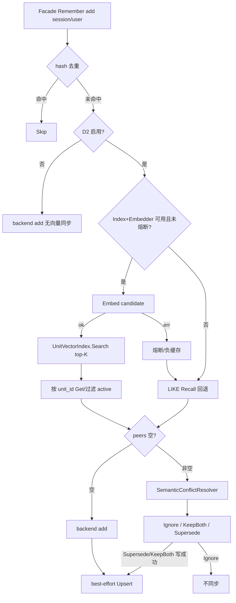

# MemoryStore P2-E：可插拔向量 Sidecar（D2 peer 发现）

> 状态：已交付（E1）  
> 日期：2026-07-27  
> 回链：[门面 §8.3](./2026-07-25-memory-store-facade-design.md)、[P2-D2 LLM 语义冲突](./2026-07-26-memory-store-llm-conflict-design.md)  
> 前置：P2-D2（语义冲突；peer 发现现为 LIKE）；P2-D1（supersede 链）  
> 切片：**E1 only** — 可插拔 `UnitVectorIndex` + SQLite 首实现；**仅**增强 D2 peer 发现；不动 `memory_units` 表、不改通用 `memory_recall` / Prefetch

---

## 0. 目标与非目标

### 目标

1. 引入 **可插拔** `UnitVectorIndex` 接口（framework 稳定边界），写路径与 D2 peer 发现只认接口，不绑具体存储。  
2. 本切片交付首个 provider：**SQLiteUnitVectorIndex**（独立 `.db`，BLOB 向量 + 余弦近邻）。  
3. D2 peer 发现在索引可用时改为：**embed 候选 → Search top-K → 回主表取 active 内容**；不可用时 **fail-open 回退 LIKE**。  
4. **仅当本次写入会走 D2 语义门**（`semanticEnabled`：`source=turn_extract` 或 `ToolSemanticConflict`）时，才做 Embed + Upsert；D2 关闭时**零额外 Embed**。Delete 清理直接 id 在 `UnitVectors != nil` 时仍可执行（无 Embed 成本）。  
5. Embedder **复用**与 D2 相同的模型解析：`memory_extraction.auxiliary`，否则当前 Agent chat model（按调用动态解析，携带 `AgentID`）；不单列冲突开关。  
6. Embed **进程级负缓存/熔断**（MUST）：首次或连续 Embed 失败后降级为本进程向量路径不可用，避免每次写入重复打失败的 `/embeddings`。  
7. 后续可加 Qdrant / 内存 / 列存等实现，**不改 Facade 编排**。

### 非目标

| 项 | 归属 |
|----|------|
| `memory_units` 加 embedding 列 / 新 MySQL 迁移 | 不做（本切片） |
| 通用 `Recall(source=units)` / Prefetch 混合排序 | E2+ |
| Qdrant / sqlite-vss / faiss 生产实现 | 后续 provider |
| agent 文件 / transcript 向量化 | 不做 |
| 改 D2 裁决语义（Ignore/Supersede/KeepBoth） | 仍 P2-D2 |
| 强制 Embed 成功才允许写入 | 不做（写路径向量同步 fail-open） |
| D2 关闭时预热向量索引 / Embed+Upsert | **不做**（见目标 4） |
| 级联链上非直接 target 的向量 Delete | 不做（仅删直接 id；陈旧靠 hydrate 过滤） |
| 写同步 Delete 与 D2 开关解耦 | Delete 仅受 `UnitVectors != nil` 门控（非目标混淆点：这是**有意允许**） |

---

## 1. 背景

P2-D2 peer 发现调用 `SessionUnitsBackend.Recall`，Portal MySQL 实现为 `content LIKE %query%`，`Score` 恒 0。  
验收中：共享关键词的矛盾对可 supersede；**措辞不同、无共享子串的矛盾事实 peers 为空 → 直 add**，语义门形同虚设。

仓内已有平行能力但未接入 units Facade：

- `memory.VectorStore`（内存余弦，`Add`/`Search`/`Clear`，无 scope/Delete）  
- `memorysearch` SQLite BLOB embedding（`modernc.org/sqlite`）+ `memorysearchembed.NewModelEmbedder`  
- Portal `BuildMemoryStore` 对 agent 检索硬编码 `embedder=nil`

本切片把「units 向量索引」提升为 **插件接口**，并只接到 D2 peer 路径。

---

## 2. 架构



### 2.1 插件接口（稳定）

新建 `framework/memory/unit_vector.go`（名称可微调，语义不变）：

```go
// UnitVectorIndex is a pluggable vector sidecar for memory_units (session/user).
// Implementations: SQLite (E1), Qdrant (later), in-memory (tests), etc.
type UnitVectorIndex interface {
	Upsert(ctx context.Context, rec UnitVectorRecord) error
	Delete(ctx context.Context, scope Scope, scopeID string, unitIDs ...string) error
	Search(ctx context.Context, q UnitVectorQuery) ([]UnitVectorHit, error)
	Close() error
}

type UnitVectorRecord struct {
	Scope   Scope
	ScopeID string
	UnitID  string
	Vector  []float32
}

type UnitVectorQuery struct {
	Scope    Scope
	ScopeID  string
	Vector   []float32
	Limit    int
	MinScore float64 // 0 = no floor
}

type UnitVectorHit struct {
	UnitID string
	Score  float64 // MUST be cosine similarity in [-1, 1]
}
```

**约束**

| 规则 | 说明 |
|------|------|
| 主键语义 | `(scope, scope_id, unit_id)` 唯一；Upsert 覆盖同键 |
| Search 范围 | **必须**限定同一 `scope` + `scope_id`（禁止跨会话串扰） |
| Delete | 支持批量 `unitIDs`；空切片为 no-op |
| Close | 释放文件句柄；幂等 |
| 线程安全 | 实现须可并发 Upsert/Search/Delete（sqlite 用互斥或 WAL） |
| Score | 统一余弦 ∈ [-1, 1]；禁止各 provider 自定义量纲 |
| 与旧 `VectorStore` | **不合并**；`VectorStore` 保留给 RAG/其它；units 路径只用 `UnitVectorIndex` |

**测试 stub**：`InMemoryUnitVectorIndex`（可基于现有余弦逻辑），供 Facade 单测。

### 2.2 Embedder 边界

```go
// UnitEmbedder embeds texts for unit vectors. agentID enables Portal dynamic model resolve
// (auxiliary → agent chat model), mirroring dynamicSemanticConflictResolver.
type UnitEmbedder interface {
	Embed(ctx context.Context, agentID string, texts []string) ([][]float32, error)
}
```

Portal 实现：按调用 `resolveMemoryAuxModel(agentMeta)`（与 D2 相同），再调 `model.Model.Embed`；可用薄包装或 `memorysearchembed` 适配。  
空向量 / 维度异常 → 返回 error。

**熔断（MUST，进程级）**

- Embed 失败（含超时、4xx/5xx、未实现 Embed）后：标记本进程「向量路径降级」。  
- 降级期间：peer 发现直接 LIKE；写同步跳过 Embed/Upsert（仍应对 supersede/remove 做 **Delete** 若 Index 非 nil，避免旧 id 残留——Delete 不依赖 Embed）。  
- 可选：定时/下一次进程启动再探测；E1 要求至少「失败即降级至进程结束」。

### 2.3 Facade 编排

`FacadeConfig` 增加：

| 字段 | 含义 |
|------|------|
| `UnitVectors UnitVectorIndex` | nil = 永不走向量 peer / 不同步 |
| `UnitEmbedder UnitEmbedder` | nil = 同上 |
| （既有）`SemanticConflicts` / `SemanticConflictK` / `ToolSemanticConflict` | 不变 |

**何时碰向量**

```text
d2 := semanticEnabled(in)  // turn_extract 或 ToolSemanticConflict，且 SemanticConflicts != nil
vecOK := UnitVectors != nil && UnitEmbedder != nil && !embedderTripped
```

- **peer 发现**：仅 `d2 && vecOK` 时走向量；否则（含 `d2` 但熔断）LIKE。  
- **写同步 Upsert**：仅 `d2 && vecOK` 且本次实际写入成功（KeepBoth/add 或 Supersede）。  
- **写同步 Delete**：`UnitVectors != nil` 且本次 supersede/remove/Delete 成功时删除**直接** target id（不依赖 Embed/熔断）。  
- **`d2 == false`**：backend 直写，**禁止** Embed 与 Upsert。

**D2 peer 发现伪代码**

```text
if d2 && vecOK:
  vecs, err := UnitEmbedder.Embed(ctx, in.AgentID, []string{in.Content})
  if err != nil || empty → trip + fallthrough LIKE
  hits := UnitVectors.Search(...)
  peers := hydrateActive(hits)  // 串行 Get，K 默认 ≤8，可接受
  if len(peers) > 0 → ResolveAdd
  if hits/peers 空 → 直 add（与现网 peers 空一致）
else if d2:
  LIKE Recall → ...
else:
  backend add
```

**hydrate**：对每个 `UnitID` 调 `session.Get`；仅保留 metadata `status=active`（缺省视为 active）；保持 Search 分数序；superseded/deleted/not found 丢弃。

**写路径同步（best-effort，失败不回滚主表）**

| 事件 | 动作 |
|------|------|
| `d2` 下 add / KeepBoth 成功 | Embed → Upsert（熔断则跳过） |
| `d2` 下 Supersede 成功 | Upsert 新 id（若未熔断）；**必须** Delete 旧 id（D1=`UnitID`，D2=`TargetUnitID`） |
| remove / `Delete` 成功 | **必须** Delete **请求的目标 id 仅此一个**（不遍历级联链） |
| D1 `replace` 且 `d2==false` | **不** Upsert；若 Index≠nil 仍 Delete 旧 id（可选一致性；E1 **要求**：D1 replace 成功时若 Index≠nil 则 Delete 旧 id + 若 `d2&&vecOK` 则 Upsert 新 id；若仅 D1 且 d2 关：只 Delete 旧、不 Upsert 新——新行无向量直至日后 d2 写入） |

简化 E1 对 D1：

| D1 replace | Index | d2 | 向量动作 |
|------------|-------|-----|----------|
| 成功 | nil | * | 无 |
| 成功 | 非 nil | false | Delete(旧) only |
| 成功 | 非 nil | true 且未熔断 | Delete(旧) + Upsert(新) |
| 成功 | 非 nil | true 但熔断 | Delete(旧) only |

**陈旧向量**：hydrate 过滤非 active → 正确性不受漏删影响。

**不在本切片做**：rebuild、Delete 返回级联 id、一致性巡检、D2 关闭时预热。

### 2.4 SQLite 首实现

`SQLiteUnitVectorIndex`（`framework/memory/sqlite_unit_vector.go`）：

- 驱动：`modernc.org/sqlite`  
- 文件：Portal `data_root` 下 `memory_unit_vectors.db`（可配相对路径）  
- Schema：

```sql
CREATE TABLE IF NOT EXISTS unit_vectors (
  scope_type TEXT NOT NULL,
  scope_id   TEXT NOT NULL,
  unit_id    TEXT NOT NULL,
  dims       INTEGER NOT NULL,
  embedding  BLOB NOT NULL,
  updated_at INTEGER NOT NULL,
  PRIMARY KEY (scope_type, scope_id, unit_id)
);
CREATE INDEX IF NOT EXISTS idx_uv_scope ON unit_vectors(scope_type, scope_id);
```

- Search：同 scope 扫描 + Go 余弦。  
- **维度基准**：进程内缓存；若缓存空则从 DB 任意已有行读取 `dims`；表空则接受首次 Upsert 的 dims 并缓存；之后 Upsert/Search 向量长度 ≠ 基准 → 返回 error。重启后重新读表恢复基准。

**Close**：Portal 进程退出或显式 teardown 时调用；热重载若重建 Index，先 Close 旧实例。

### 2.5 Portal 接线

| 步骤 | 行为 |
|------|------|
| Embedder | `dynamicUnitEmbedder`：每次 Embed 用 `AgentID` → `resolveMemoryAuxModel`（与 D2 同）；模型无 Embed 或调用失败 → error → Facade 熔断 |
| Provider | 默认 `sqlite`；`memory_vector.provider: sqlite \| none`（省略 = sqlite） |
| 装配 | provider≠none 且能打开 sqlite 文件 → 注入 `UnitVectors`；`UnitEmbedder` 在「auxiliary 已配置 **或** `AgentGetter` 可用」时注入（与 `DefaultMemoryStoreOptions` 注入 semantic resolver 条件对齐）；否则对应字段 nil |
| 熔断 | 实现于 Facade 或 Embedder 包装器；MUST |

**配置示例**

```yaml
# memory_vector:
#   provider: sqlite   # sqlite | none
#   path: ""           # 相对 data_root；空则 memory_unit_vectors.db
```

不新增与 D2 平行的 `enabled`：向量 peer/Upsert **仅当 D2 语义门对本调用启用**时参与。  
无 `/embeddings` → 熔断后 LIKE，不阻塞主表写入。

---

## 3. 与既有组件关系

| 组件 | 关系 |
|------|------|
| P2-D2 | 只换 peer 候选来源；裁决与 fail-closed 写策略不变 |
| P2-D1 | replace 成功时按 §2.3 表同步 Delete/Upsert |
| `memory_units` MySQL | 权威内容仍在此；sidecar 仅 id→vector |
| `memorysearch` | 不共享 DB 文件；可复用 BLOB 编解码 |
| `VectorStore` | 不用于 units |

门面 §8.3「向量 Sidecar」→ 本规格 **P2-E1**（接口 + SQLite + D2 only）。

---

## 4. 测试与验收

### Framework

1. `InMemoryUnitVectorIndex`：Upsert/Search/Delete、**scope 隔离**、**并发** Upsert/Search/Delete。  
2. `SQLiteUnitVectorIndex`：持久化、重启可读、**重启后维度基准**、维度冲突、Close。  
3. Facade：stub 向量返回 LIKE 召不回的近邻 → hydrate → resolver 见 peers。  
4. Facade：Embedder/Index 报错 → 回退 LIKE；**再次调用不再打 Embed**（熔断）。  
5. Facade：`ToolSemanticConflict=false` 且非 turn_extract → **不**调用 Embed/Upsert。  
6. 写同步：d2 开启下 add 后 Upsert；Delete 后 Search 不再命中直接 id。

### 验收（手工 / 集成）

1. 无共享子串矛盾对在索引热且 Embed 可用时可触发 D2。  
2. Embed 不可用/熔断后与纯 LIKE 路径一致，且重复写入无重复 Embed 风暴。  
3. D2 关闭时零向量副作用。  
4. supersede/remove 后旧 unit_id 不在 Search 结果中（或 hydrate 丢弃）。  
5. 无新 MySQL migration。  
6. aux 未配、Agent 有 chat model 且支持 Embed 时，动态 Embedder 仍可用（若网关支持）。

---

## 5. 文档

- 更新 `portal/docs/memory-integration.md`：P2-E1 一节 + Backlog。  
- 更新门面规格 §8.3 第 4 条：E1 状态。  
- 回写 D2 规格：peer = LIKE **或** UnitVectorIndex（若装配且未熔断）。

---

## 6. 风险

| 风险 | 缓解 |
|------|------|
| 网关无 Embeddings API | MUST 熔断 + LIKE 回退；E1 熔断持续至进程结束（短暂抖动亦需重启才恢复向量路径） |
| Embed 时 AgentID 空且无 aux | 与 D2 一致：解析失败 → error → 当次回退 LIKE 并触发熔断 |
| sidecar 与主表漂移 | Delete 直接 id + hydrate active；接受短暂不一致 |
| SQLite 全表扫 | 会话事实量小；E2 ANN |
| D2 刚开启时索引冷 | 仅此后写入有向量；可接受，rebuild 归后续 |
| 插件接口固化 | 字段最小；Score 钉死 [-1,1] |

---

## 7. 后续（非本切片）

- **E2**：`Recall(source=units)` hybrid；可选 D2 关闭时预热。  
- **E3**：`QdrantUnitVectorIndex`。  
- Rebuild / backfill；级联 id 回传 Delete。  
- Neo4j 图记忆。
