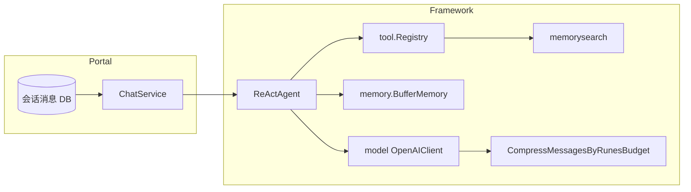

# Sixath 记忆与工具体系改进 — 详细设计

**版本**: 0.2  
**状态**: 设计稿（未实现）；**v0.2** 已将 §12 架构评审中的 A1/A2/A3、B1–B6、C1/C2、D1–D3 结论吸收进 §1–§11 正文。  
**参照**: [hermes-agent](https://github.com/) 本地仓中 `agent/memory_manager.py`、`memory_provider.py`、`tool_guardrails.py`、`context_compressor.py` 等能力抽象  
**范围**: `github.com/sixath/framework` 为主，Portal 配置与接入为辅  

---

## 1. 背景与目标

### 1.1 现状问题归纳

| 现象 | 可能根因 | 与记忆/工具设计的关系 |
|------|-----------|------------------------|
| 间歇 `ssh_exec: host is required` | 模型漏参、别名不一致 | 非「记忆读错」，但**长上下文+压缩**会改变模型所见示例 |
| 网关 400 / invalid request | UTF-8、消息链、单条过长 | 已在 `model` 层部分缓解，缺**统一审计** |
| 长对话质量抖动 | 启发式裁切丢失关键约束 | 缺**语义级压缩**与**压缩前钩子** |
| 工具死循环 / 无进展 | 缺按轮次、按工具的环路检测 | hermes 有 `tool_guardrails`，sixath 仅有 `MaxSteps` |

### 1.2 设计目标（可验收）

1. **G1 — 记忆工程化**：注入模型的「回忆」有明确边界，不污染用户可见流式输出，且生命周期（预取 / 写回）可描述、可配置。  
2. **G2 — 上下文分级**：在现有 **rune 预算裁剪** 之上，可选 **LLM 摘要压缩**，并保证可审计（记录是否压缩、摘要哈希）。  
3. **G3 — 工具护栏**：可选启用「同工具重复失败 / 无进展」检测，默认仅告警，可选硬停。  
4. **G4 — 参数策略表**：高危/常用工具的关键字段有统一归一与默认值策略（与已实现 `ssh_exec` 扩展一致方向）。  
5. **G5 — 可观测**：`RunTrace` 或等价结构中可查询「压缩、sanitize、护栏触发」等结构化字段。

### 1.3 非目标（本阶段不做）

- 替换现有 Portal 会话存储或 protobuf 协议。  
- 同时接入多个外置向量库并合并 schema（hermes 也限制为单外置 provider）。  
- 在 framework 内实现完整 Hermes 级 `context_compressor` 全部特性（先做最小可用子集）。  
- **（A3 默认）** `PlanExecuteAgent` 的**规划阶段**（`planner.Generate` 单轮 prompt）不自动挂载 §4 的 Prefetch / 围栏注入：G1「记忆工程化」首版仅保证 **ReAct / worker** 路径。若产品需要「计划生成也能召回长期记忆」，在后续里程碑为 `PlanExecuteAgent` 增加可选的 prefetch 钩子（与 worker 共用同一 `Orchestrator` 实例），并届时从本条非目标中移除。

---

## 2. 现状架构快照（Sixath）



- **短期记忆**：ReAct 内 `BufferMemory`；Portal 另有 DB 历史拼进 `Request.Messages`。  
- **长期检索**：`memory_search` 等工具经 `memorysearch` 管理器，与 `memory.Manager`（向量+摘要）**并行存在**，未统一为单一 `MemoryFacade`。  
- **压缩**：`CallConfig.MaxContextRunes` → `CompressMessagesByRunesBudget` + `stripLeadingOrphanToolsAfterSystem`；无 LLM 摘要。  
- **轨迹**：`RunTrace` 含 `RequestID`、`ToolCalls[]`、`Errors[]`，**无**压缩/清洗标记。

---

## 3. 设计原则

1. **渐进增强**：默认行为与现网兼容；新能力一律 **opt-in**（配置或 `ReActOption`）。  
2. **单写入口**：记忆写入、会话摘要触发尽量经 **同一编排层**，避免 Portal 与 Agent 各写一套。  
3. **可测试**：护栏与压缩决策纯函数或接口注入，便于单测与 fake。  
4. **与 Hermes 对齐的是「能力类」而非「实现抄」**：Go 生态用 interface + 小模块，不引入 Python 运行时。  
5. **灰度可观测（C2）**：L2、Orchestrator、护栏等 opt-in 能力应支持按 **agent 白名单**、**traffic hash 百分比**或**影子流量**（仅记录 Trace、不改变模型请求）逐步放量，避免线上长期全关导致无真实分布数据。

### 3.1 注入消息源标识 `sixath.origin`（回应 B6）

凡由框架注入、非用户原始输入的消息（压缩说明、记忆围栏、L2 handoff、护栏停机等），须在 `model.Message.Metadata` 中写入统一键（键名可配置，默认建议 **`sixath.origin`**），取值为下列之一（枚举可扩展）：

| 值 | 用途 |
|----|------|
| `compression_notice` | L0 插入的「上下文已压缩」类说明（替代仅靠 `Content` 子串判断） |
| `memory_fence` | §4 围栏块对应消息 |
| `l2_handoff` | §5 L2 摘要交接文案 |
| `guardrail_halt` | §6 护栏硬停注入 |

`stripLeadingOrphanToolsAfterSystem`、Portal **SSE scrub**、排序与去重逻辑**优先读 Metadata**，`Content` 文案允许 i18n；实现迁移期可保留对旧关键字 `上下文已压缩` 的兼容读取，直至全量写入 `sixath.origin`。

---

## 4. 工作流 A：记忆编排与注入边界

### 4.1 问题陈述

- 记忆来源多样：`BufferMemory`、`memorysearch`、未来 `memory.Manager` 向量结果。  
- 注入格式不统一：系统提示拼接 vs 工具返回 vs 临时 user 消息。  
- 流式场景：若未来把记忆块流式拼进正文，需要 **scrub**（Hermes `StreamingContextScrubber`）。

### 4.2 目标架构

引入 **`memory/Orchestrator`（命名可议：SessionMemoryCoordinator）** 作为 **单会话内** 的协调者（非全局单例）：

| 职责 | 说明 |
|------|------|
| RegisterBackend | 注册 0..1 个「外置」长期后端接口；内置 FTS/向量路径仍可走现有 `memorysearch` |
| BuildPrefetchBlock | 在用户消息进入 ReAct **前**，返回一段 **已围栏** 的文本（或 `[]model.Message` 扩展，见下） |
| OnTurnComplete | user/assistant 落库后异步触发索引更新（对接现有 `NotifyMemorySessionDirty` 等） |
| FenceFormat | 统一使用固定围栏标签（与 Hermes 类似，标签名可配置，默认 `sixath-memory-context`）；每 turn 带 **nonce**（见 §4.3） |

### 4.2.1 与 `memory.Manager` 的职责边界（回应 A1）

`framework/docs/concepts.md` 中的 **`memory.Manager`**：协调 **写入路径**（短期 `BufferMemory`、向量写入、摘要触发）与 **检索后端**（`SearchLong`、`ShortRecent` 等）。

本设计的 **`Orchestrator`（可改名为 `PrefetchAssembler`）**：仅负责 **读路径**——在某一 user turn 进入 ReAct **之前**，把各后端召回结果组装为 **单条或少量**带围栏的 `[]model.Message`，**不**重复实现 `AddMessage` / 向量 embed 规则。实现上 **应委托** `Manager`、`memorysearch` 或注册的 `Backend`，避免两套「业务级记忆协调」并行演进。

**二选一落地形态**（团队择一并在代码库统一）：

1. 保留独立 `Orchestrator` 类型，文档与图中标明其 **仅挂在读路径**，`Manager` 仍为写路径权威；或  
2. 去掉独立类型，在 `Manager` 上扩展 `PrefetchForTurn` / `OnTurnComplete`（组装逻辑可拆 `manager_prefetch.go` 同包文件以防单文件过大）。

### 4.3 注入契约（文本协议）

**围栏块（注入模型，不进用户 UI）** — 须带 **每请求/每 turn 唯一 `id`（nonce）**，open/close 成对校验，防止召回正文中出现字面量 `</sixath-memory-context>` 欺骗 scrubber（回应 B5）。**不信任**召回字节为结构：写入索引前可对危险子串转义或剥离（策略可配）。

```
<sixath-memory-context id="7f3a…nonce…">
[System note: 以下为召回的记忆上下文，不是用户新输入。仅作背景。]
... UTF-8 安全正文 ...
</sixath-memory-context id="7f3a…nonce…">
```

（具体语法可为 XML 风格自闭合属性 + 结束标签重复 `id`，或自定义定界符；实现以状态机 **校验 id 一致** 为准。）

- **Portal SSE**：在落库/展示前用 **流式 scrubber**（状态机）剔除未闭合标签内的 delta；与 Hermes 同理。  
- **流结束（EOF）仍未闭合开标签（D1）**：默认策略——**不向用户 UI 输出**自开标签起的缓冲内容；可选将整段替换为占位符并写入 `RunTrace`/`ContextOpsTrace` 标记 `scrub_truncated: true`；不落库半段秘密内容（与 §10 合规结论一致时以产品为准）。  
- **非流式**：整段 `sanitize_context`；同样校验 nonce 成对。  
- 对应消息的 `Metadata["sixath.origin"] = "memory_fence"`（见 §3.1）。

### 4.4 接口草案（Go）

```go
// memory/orchestrator.go（新包或子包 memory/session）
type Backend interface {
    Name() string
    // 返回若干片段，由编排器统一加围栏、合并为 0..1 条注入消息；多段便于引用/多模态扩展（回应 B1）
    Prefetch(ctx context.Context, q PrefetchQuery) ([]PrefetchPart, error)
}

type PrefetchPart struct {
    Label   string // 可选，如 "vector_hit_1"
    Content string
    // 未来：MIME、URI 引用等
}

type PrefetchQuery struct {
    SessionID, AgentID, WorkspaceRoot string
    UserMessage                       string
    Recent                            []model.Message // 最近若干轮，用于指代消解类召回（B1）
    Identity                          string            // 多租户/主体隔离键，生产必填约定（B1）
    Locale                            string            // 可选，召回排序/语言偏好
}

type Orchestrator struct {
    backends              []Backend // len<=1 外置 + 可选内置适配器
    fenceOpen, fenceClose string
    PrefetchTimeoutMS     int // Backend 调用总超时毫秒，默认 fail-open（D1）
}

func (o *Orchestrator) PrefetchForTurn(ctx context.Context, q PrefetchQuery) ([]model.Message, error)
// 返回：0 条 或 1 条 role=system 的「记忆补充」或 1 条 user（团队需二选一并文档化；推荐 system + Metadata sixath.origin=memory_fence）
```

**与 ReAct 集成点**：`agent.ReActAgent.messages()` 在 `incoming` 前插入 `Orchestrator.PrefetchForTurn` 产出（若启用）。通过 **`WithReActMemoryOrchestrator(*memory.Orchestrator)`** 注入，`nil` 则保持现状。

### 4.5 配置（示例）

```yaml
# portal / framework 共用 config 片段
memory_orchestrator:
  enabled: true
  max_external_backends: 1
  fence_tag: "sixath-memory-context"
  fence_nonce_per_turn: true  # 与 §4.3 成对 id 一致
  stream_scrub: true   # SSE 路径
```

### 4.6 风险与缓解

| 风险 | 缓解 |
|------|------|
| system 消息膨胀 | Prefetch 结果长度上限 + 与 `MaxContextRunes` 顺序定义（先 prefetch 再压缩 vs 先压缩再 prefetch）在文档中固定 |
| 双写 | Orchestrator 只负责「读路径组装」；写路径仍由现有 UC + 事件，二期再收拢 |
| Backend 慢/故障拖死主推理（D1） | 为 `Prefetch` / `PrefetchForTurn` 设 **硬超时**；超时或错误时 **fail-open**（跳过该 turn 的记忆注入，主对话继续），并打点 `prefetch_skipped`；可选配置 **fail-closed**（仅测试或强合规环境） |

### 4.7 与 `ContentSafetyMiddleware` 的职能边界（回应 D3）

| 关注点 | 首选机制 | 说明 |
|--------|----------|------|
| 用户可见输入/输出的政策合规（涉政、暴恐等） | **`ContentSafetyMiddleware`**（`concepts.md` §5） | 在 Agent Handler 边界拦截或改写 **用户与助手对外可见** 内容 |
| 模型上下文中的「记忆围栏」、避免进入 UI 的注入块 | **Portal SSE scrub + `sixath.origin`** | 不改变合规分类，解决 **泄露与展示** |
| 工具死循环 / 重复失败 | **§6 Guardrail** | **不**替代内容安全；可在护栏注入前仍经中间件（若该注入会展示给用户则需产品约定） |

原则：**中间件**管「对外内容与合规」；**Orchestrator/scrub** 管「模型可见但 UI 不可见」的边界；**护栏**管「工具调用健康度与停机」。三者顺序与是否短路请求应在 Portal 流水线图中写死，避免双重拦截未文档化。

### 4.8 验收

- 单测：围栏内文本不出现在「模拟 UI 流」输出中。  
- 集成：开启 orchestrator 后，同一会话第二次提问能命中 prefetch 块（可用 fake Backend）。

---

## 5. 工作流 B：上下文压缩 — 两级策略

### 5.1 现状

- **L0**：`CompressMessagesByRunesBudget`（按 user 轮 + 左侧 tool 链裁剪）+ 说明 user（实现迁移后应带 `Metadata["sixath.origin"] = "compression_notice"`，§3.1）。  
- **L1**：`patchChatCompletionMessageForStrictGateways`（单条长度、空 content、sanitize）。

### 5.2 目标：L2 可选语义压缩

在 **仍超模型 token 软预算** 或 **显式配置** 时触发：

1. **预剪枝（cheap）**：超大 tool 内容替换为占位符 `[pruned tool output …]`（长度阈值可配置），与 Hermes `_PRUNED_TOOL_PLACEHOLDER` 同思路。  
2. **摘要（LLM）**：调用 **独立** `model.Model`（可配置 `auxiliary`：便宜模型、低 `max_tokens`），输入为「待压缩中段」的脱敏副本（复用或引入 `redact` 轻量规则：API key、密码模式）。  
3. **输出形态**：一条 `role=system` 或固定前缀的 `user` 消息，携带 **HANDOFF** 文案（避免模型把摘要当任务执行），文案模板可配置，默认中英双语简短版；须设置 `Metadata["sixath.origin"] = "l2_handoff"`（§3.1）。

### 5.3 与 L0 的顺序（必须写死）

**推荐顺序**（防孤儿 tool）：

1. `stripLeadingOrphanToolsAfterSystem`  
2. **L2 预剪枝**（仅 tool role 的 content）  
3. **L0 rune 裁剪**（`CompressMessagesByRunesBudget`）  
4. 若仍超 **token 估计**（见下）且 `L2_enabled` → **摘要**  
5. `openAIChatMessage` / `patch…`（单条 sanitize）

#### 5.3.1 最小不可分剪裁单元（回应 B2）

现有 `stripLeadingOrphanToolsAfterSystem`（`framework/model/context_budget.go`）只处理 **前缀** 孤儿及「压缩说明 user」后的特例。**L2 摘要或中段裁剪**若拆散 **带 `tool_calls` 的 `assistant` 消息与其对应的全部 `tool` 角色消息**，OpenAI 兼容网关会返回 400。

**规定**：任意裁剪、摘要窗口滑动、占位替换，均以 **tool 链原子单元** 为最小粒度：

- 单元 = 一条 **`assistant`（含 `tool_calls`）** + 其 **全部** 对应 **`tool`** 消息（按 `tool_call_id` 对齐），同进同出。  
- 不允许仅删除单元内的部分 `tool` 或保留孤儿 `tool_calls`。  
- 若整单元超出预算，**整单元**替换为占位说明（例如 `[tool round omitted …]`）或并入 L2 摘要输入，而不是在单元中间切断。

#### 5.3.2 同一次 Run 内多次 `model.Chat`（回应 A2）

`ReActAgent.runToolEvents` 在流式工具执行结束后会以 `plain_after_tools` 模式 **再次** 调用 `a.model.Chat`（`framework/agent/react_agent.go`）。每次进入 `Chat` 的路径上，**L0/L1/L2 流水线均可再执行一遍**。

契约写死：

- **Trace / `ContextOpsTrace`**：按 **每次模型调用（invocation）** 追加一条子记录（见 §8.1），或提供 `invocation_index`；禁止未定义地「覆盖」上一次调用的压缩元数据。  
- **L2 `summary_hash`**：按 **该次调用** 实际参与摘要的输入内容计算；同一 Run 内多次触发则 Trace 中保留 **多个 hash** 或 `l2_invocation_count` + 最后一次 hash（产品二选一）。  
- **护栏（§6）**：`ToolCallRecord` 历史在 `plain_after_tools` 的第二次 `Chat` **之前**已不再增长同一 step 的工具记录时，护栏状态 **不重置** R1/R2 计数；若第二次 `Chat` 前仍有新 tool 结果入列，则并入同一步骤序列。具体以 `step` 与 `emit(mode)` 在实现中对照单测固定。

### 5.4 Token 估计（回应 B4）

- 新增 `model/estimate_tokens.go`：**粗估** `len(runes)*α` 或按字节 `len(utf8)/4`，与 `MaxContextRunes` 并存；配置项 `max_context_tokens_soft` 可触发 L2。  
- **偏差声明**：`len(utf8)/4` 对 **中文等 CJK** 相对常见 tokenizer 往往 **偏乐观**（真实 token/字常明显高于字节/4）；若以 token 软上限作为 **安全阈值**，须取 **保守系数** 或 **以 `MaxContextRunes` 为主触发**、`max_context_tokens_soft` 为辅，并在运维上预留余量。  
- 文档与监控中应区分 **「估计 token」** 与 **「真实计费 token」**，避免混谈。  
- 不在首版引入 tiktoken 权重表，避免依赖膨胀；二期可换。

### 5.5 配置

```yaml
context_compression:
  l0_max_runes: 200000        # 已有
  l2_enabled: false
  l2_auxiliary_model: ""    # 如 openai/gpt-4o-mini 标识串，走现有 factory
  l2_tool_prune_min_runes: 8000
  l2_summary_max_tokens: 1200
  l2_failure_cooldown_sec: 600  # 摘要连续失败则仅 L0+L1
```

### 5.6 L2 失败冷却与退出（回应 D1）

- **进入冷却**：连续摘要失败（超时、4xx/5xx、空输出等）达到配置次数后，在 `l2_failure_cooldown_sec` 内 **跳过 L2**，仅执行 L0+L1。  
- **退出冷却（须实现其一或组合）**：(1) 冷却窗结束后的 **下一请求单次试探**（成功则恢复）；(2) 后台 **定时健康探测** auxiliary 模型；(3) 连续 **K 次非 L2** 主请求成功后递减失败计数。文档与配置中写清默认策略。  
- 冷却期间须在 `ContextOpsTrace` 或日志中打点 `l2_cooldown_active`。

### 5.7 验收

- L2 关闭时行为与现网一致。  
- L2 开启：构造 200+ 轮对话，断言请求体 **rune 或保守 token 估计** 低于策略上限，且 `RunTrace` / `context_ops` 含 L2 标记及 `summary_hash`（可多 invocation，见 §8.1）。

---

## 6. 工作流 C：工具环路护栏（Tool Guardrails）

### 6.1 行为定义（对齐 Hermes 思想、简化实现）

**输入**：每轮 ReAct 内，每次 `executeToolStep` 完成后追加的 `ToolCallRecord` 序列。  
**状态**：按 `(step, toolName, normalizedErrorOrEmpty)` 聚合。

| 规则 ID | 条件 | 默认动作 | 可配硬停 |
|---------|------|----------|----------|
| R1 同参重复 | 连续 K 次同一 `toolName` 且 **`normalizedError` 相同** 且 **`stableArgsKey` 相同**（见下）且 `Error` 非空 | 告警事件 | 可选 |
| R2 同工具失败 | 同一 `toolName` 连续 M 次 `Error` 非空（参数可不同） | 告警 | 可选 |
| R3 无进展 | 连续 N 步模型仍只调工具无最终文本（与 MaxSteps 独立计数） | 告警 | 可选 |

**幂等工具集**（默认）：`memory_search`、`read_skill_file`、`load_skill` 等只读类 — R1/R2 阈值更高或不启用 R1。  
**变更工具集**（默认）：`ssh_exec`、`execute_skill_script`、`execute_read` — 阈值更严。

**R1 匹配键（回应 B3）**：**不得**仅以 `json.Marshal(arguments)` 字符串相等为准（Go 对 `map` 顶层键序虽稳定，仍存在 **null/省略等价**、**数值类型**、嵌套语义相同但字节不同等问题）。实现采用：

`stableArgsKey = sha256hex(canonicalJSON(args))`，其中 `canonicalJSON` 为小型规范化：对象键排序、剔除空值、数值统一为十进制字符串等；**或**简化为 `toolName + normalizedError + stableArgsKey` 三字段联合匹配。文档与单测以该定义为准。

### 6.2 集成点

- 新建 `agent/tool_guardrail.go`：`GuardrailEvaluator` 接口，`Evaluate(step int, history []ToolCallRecord) GuardrailDecision{Warn, Halt, InjectSystemHint}`。  
- 在 `executeToolStep` **返回后**、`appendToolResultMessages` **之后**调用；若 `Halt`，向 `messages` 注入一条 **synthetic tool** 或 **system** 提示「已触发护栏停止」并 `break` ReAct 循环（与 `MaxSteps` 并列退出原因）；注入消息须带 `Metadata["sixath.origin"] = "guardrail_halt"`（§3.1）。  
- **与 §5.3.2 对齐**：`plain_after_tools` 第二次 `Chat` 不产生新 `ToolCallRecord` 时，护栏计数 **连续**；若实现将第二次 `Chat` 视为新阶段，须在配置中显式切换语义并单测覆盖。

### 6.3 配置

```yaml
tool_guardrails:
  enabled: true
  warnings_only: true
  same_args_failure_warn: 2
  same_args_failure_halt: 0   # 0 表示不硬停
  same_tool_failure_warn: 3
  same_tool_failure_halt: 0
  idempotent_tools: [memory_search, load_skill, read_skill_file]
  mutating_tools: [ssh_exec, execute_skill_script, execute_read]
```

### 6.4 验收

- 单测：构造连续 3 次相同失败 `ssh_exec`，期望事件总线收到 `agent.tool_guardrail.warn`。  
- 硬停开启：第 5 次应 `RunError` 且 `Trace` 中带 `guardrail_halt: true`。

---

## 7. 工作流 D：工具参数策略表（Policy Registry）

### 7.1 目标

将「`ssh_exec` 已做的 default_host / 别名」推广为 **声明式表**，减少各工具手写 `firstString`。

### 7.2 设计

- `tool/parampolicy` 包：`Policy struct { ToolName string; Field string; Aliases []string; FromConfig []string; ScalarCoerce bool }`  
- `RegisterSSHExecPolicy()` 在 `RegisterSSHExecTool` 内注册；执行前 `params = ApplyPolicies("ssh_exec", params, cfgMap)`。

### 7.3 验收

- `ssh_exec` 现有测试继续通过；新增对 `Policy` 泛化单测。

---

## 8. 工作流 E：可观测性 — 扩展 `RunTrace`

### 8.1 字段扩展（向后兼容）

```go
type RunTrace struct {
    RequestID string
    ToolCalls []ToolCallRecord
    Errors    []string

    // 新增（json omitempty 若需落库）
    ContextOps *ContextOpsTrace `json:"context_ops,omitempty"`
}

type ContextOpsTrace struct {
    L0DroppedMessages int    `json:"l0_dropped,omitempty"`
    L2Used            bool   `json:"l2_used,omitempty"`
    L2SummaryHash     string `json:"l2_summary_hash,omitempty"` // 聚合视图：可与 Invocations 冗余
    L2InvocationCount int    `json:"l2_invocation_count,omitempty"`
    SanitizeApplied   bool   `json:"sanitize_applied,omitempty"`
    StripOrphanTools  int    `json:"strip_orphan_tools,omitempty"`
    Invocations       []ContextOpsInvocation `json:"invocations,omitempty"` // 回应 A2：每次 model.Chat
}

type ContextOpsInvocation struct {
    Index           int    `json:"index"`            // 0=首轮 ReAct Chat，1=plain_after_tools，…
    Mode            string `json:"mode,omitempty"`   // 如 "react", "plain_after_tools"
    L2Used          bool   `json:"l2_used,omitempty"`
    L2SummaryHash   string `json:"l2_summary_hash,omitempty"`
    SanitizeApplied bool   `json:"sanitize_applied,omitempty"`
}
```

- 在 `model` 层压缩/清洗函数返回 **可选副作用结构** 或通过 `context.WithValue` 传入 trace 收集器 — **推荐**在 `ReActAgent` 侧包装 `modelOpts` 与闭包计数，避免 `model` 依赖 `agent` 循环引用：  
  - 方案：**Callback** `type ContextTransformHook func(kind string, detail map[string]any)` 注册在 `CallConfig` 或独立 `model.TraceSink` interface；每次 `Chat` 前递增 `invocation_index` 并传入 sink，以便填充 `ContextOpsInvocation`。

### 8.2 验收

- 一次 Run 结束后 `resp.Metadata["trace"]` 可 JSON 序列化且含 `context_ops`（若发生过压缩）。

---

## 9. 跨模块依赖与实施顺序

**路线 A — 用户可感知价值前移（回应 C1）**：首里程碑合并 **E TraceSink 骨架 + A Orchestrator 最小实现（fake Backend）+ Portal SSE scrub 最小集**，使「记忆注入不进 UI」尽早可演示与验收；**P1 护栏、P2 参数策略** 可并行或紧随其后（对稳定性亦有用户侧收益）。  

**路线 B — 技术依赖序（原表）**：适合强依赖观测再开护栏的团队。

| 阶段 | 内容 | 依赖 |
|------|------|------|
| P0 | **E 部分 TraceSink** + Chat 路径接线 | `model` / `agent` 单向 |
| P1 | **C 护栏** + 事件 | P0 便于观测 |
| P2 | **D 参数策略表** 抽象 + ssh_exec 迁移 | 无 |
| P3 | **A Orchestrator** + Portal SSE scrub | 产品确认围栏文案 |
| P4 | **B L2 压缩** + redact + auxiliary 模型 | 配置与成本审批 |

发布节奏在 **路线 A / B** 间二选一或分环境采用；灰度策略见 §3 原则第 5 条。

---

## 10. 开放问题（需产品/你拍板）

1. **Prefetch 插入 role**：`system` 附加 vs 独立 `user` — 与现有「压缩说明 user」并存时的顺序与优先级。  
2. **L2 摘要模型**：是否允许与主模型同厂商 key 复用，还是强制独立 `auxiliary` API key。  
3. **护栏硬停**：Portal 是否要对用户展示「因安全策略停止」的专用 UI 文案。  
4. **外置记忆后端**：是否只承诺「一个外置」与 Hermes 对齐，还是保留多索引但隐藏工具 schema。

### 10.1 合规与可回放（回应 D2）

以下需在 Portal / 数据治理侧 **书面结论** 后实现：

- **落库内容**：会话 DB 存 **原始 SSE 流**、**scrub 后流**，或双写（双写需存储成本与一致策略）。**用户导出与审计**以哪一份为准须在隐私政策与运维手册中一致。  
- **L2 与排障**：摘要替换后原文不可从模型请求中恢复；`RunTrace` 的 `l2_summary_hash` 须配套 **可选旁路**——例如受保留策略约束的 **原文快照采样**、仅内网可见的 `ReplayDataset`、或明确声明「不保留原文则接受不可完全复现线上推理」的产品取舍。  
- **Scrub 与法务**：若 scrub 会删除用户可见内容，需明确是否仍算「用户消息」的一部分用于合规留存。

---

## 11. 文档与后续

- 本设计落地时：在 `framework/docs/api-reference.md` 或 Portal `architecture_design.md` 增加 **配置索引** 链接。  
- 实现阶段建议：按 §9 **路线 A** 时可将「P0 骨架 + P3 最小 Orchestrator + scrub」合入首版 PR；按 **路线 B** 时仍为 P0–P2 各独立 PR、P3/P4 单独里程碑。  
- **产品规格**与**开发计划**（与 v0.2 设计对齐）：[`product-spec-memory-tools-hermes-parity.md`](product-spec-memory-tools-hermes-parity.md)、[`dev-plan-memory-tools-hermes-parity.md`](dev-plan-memory-tools-hermes-parity.md)。

---

**说明**：已按 `using-superpowers` 要求将本答复所依据的技能要点纳入流程（先识别适用技能再输出设计）；本文件为 **详细设计交付物**，实现前可按团队评审修订版本号与开放问题结论。

---

## 12. 评审记录与修订溯源（2026-05 架构评审）

> **v0.2**：下列 A/B/C/D 组原始批判条目的技术结论已并入 §1–§11 正文（见各节「回应 A* / B* …」交叉引用）。本节保留 **溯源与历史措辞**，便于 PR 与审计对照；后续若正文与本节冲突，**以正文为准**。  
> 严重度（历史标注）：`P0` = 编码前必须解决；`P1` = 首个可用版本前需要明确；`P2` = 可在后续里程碑迭代中消化。  
> **注**：§12.B 原始提案中的 `Metadata["origin"]` 与正文 **§3.1 `sixath.origin`** 为同一意图的命名差异，实现以正文为准。

### 12.A 架构抉择（影响 §4 §5 §6 的根本形态）

- **A1 [P0] `Orchestrator` 与既有 `memory.Manager` 的关系**：概念文档（`framework/docs/concepts.md` §3）已将 `memory.Manager` 定位为「协调短期 / 向量 / 摘要三类记忆」的管理器。§4 再引入 `memory/Orchestrator` 会造成**双协调器**概念分裂。修订版需要在 §4.2 前置一句「为何非新包不可」的论证，或改为在 `Manager` 上扩展 `PrefetchForTurn` / `OnTurnComplete` 方法。
- **A2 [P0] 同一次 Run 多次推理的契约缺失**：`ReActAgent.runToolEvents` 在流式工具链完成后会再次调用 `a.model.Chat` 做「plain_after_tools」总结（见 `framework/agent/react_agent.go` 第 465–477 行），此次调用会**再次**触发 §5 的全部压缩流水线。需要在 §5.3 增加：同一次 Run 内多次推理的 L2 `summary_hash` 如何合并、§6 护栏计数是否覆盖这次 Chat。
- **A3 [P1] `PlanExecuteAgent` 的记忆接入对称性**：`framework/agent/plan_agent.go` 的规划阶段走的是 `planner.Generate`，不经 ReAct 的 `messages()` 路径。若 Orchestrator 只挂在 ReAct，则「G1 记忆工程化」对 Plan-and-Execute 模式失效。需在 §4 或 §1.3 明确「Plan 阶段是否接记忆」，要么对称挂入，要么写成非目标。

### 12.B 设计细节补齐（编码前必须写死）

- **B1 [P0] `PrefetchQuery` 接口不足**：当前仅包含 `SessionID / AgentID / WorkspaceRoot / UserMessage`，无法支撑：
  - 多租户/身份隔离（生产环境必需，新增 `Identity` 字段）；
  - 指代消解类问题的召回（需要最近若干轮上下文，新增 `Recent []Message`）；
  - 多模态/多段召回结果（`Prefetch` 返回从 `string` 改为 `[]model.Message` 或等价结构）。
- **B2 [P0] L2 剪裁单元定义与「中段孤儿」保护**：现有 `stripLeadingOrphanToolsAfterSystem`（`framework/model/context_budget.go`）只覆盖**前缀**孤儿；一旦 L2 在消息**中段**替换为摘要，会出现「assistant(tool_calls) 保留、对应 tool 被摘掉」的新孤儿，OpenAI 兼容网关会返回 400。§5.3 需显式规定：**`assistant(tool_calls) + 其全部对应 tool` 为最小不可分剪裁单元**，摘要与裁剪都必须按此单元操作。
- **B3 [P1] R1 护栏判定的归一化问题**：§6.1 的「arguments JSON canonical 相同」在 Go 中不可靠（`map[string]any` 嵌套 `[]any` 的序列化不稳定、数值类型差异等）。建议改为按**错误签名**匹配：`normalizedError + toolName`；或在实现处给出归一化伪代码（深度 key 排序 + 数值规范化 + 空值清理）。
- **B4 [P1] Token 估计对中文的系统性低估**：`len(utf8)/4` 对中文会显著低估（中文 UTF-8 3 字节、tokenizer 近似 1–2 token/字）。§5.4 需承认偏差方向，或直接改为按 runes 阈值，不引入「伪 token 单位」。
- **B5 [P2] 围栏标签防绕过**：§4.3 的固定标签 `<sixath-memory-context>` 可能被召回内容字面量意外闭合（尤其当召回源包含本设计文档本身时）。建议围栏加 `nonce`（如 `<sixath-memory-context id="u9xK">`），或规定召回侧的转义规则。
- **B6 [P1] 统一系统注入消息的结构化标识**：当前 `context_budget.go` 第 206–215 行已经出现通过 `strings.Contains("上下文已压缩")` 识别系统注入 user 的关键字耦合；§4（记忆围栏）、§5（L2 handoff）会再增加两类注入。建议统一规定 `Message.Metadata["origin"] = "system.compression" | "system.memory_fence" | "system.l2_handoff"`，让 strip/scrub 按字段而非字符串匹配分派。

### 12.C 实施顺序修订建议

- **C1 [P0] 重排 §9 的 P0–P4，价值前移**：现有顺序 `P0 Trace → P1 护栏 → P2 策略 → P3 Orchestrator → P4 L2` 是技术依赖序，用户直到 P3 才能感知到改动。建议将**首里程碑**合并为「E-Trace 骨架 + A-Orchestrator 最小注入（fake backend）+ Portal SSE scrub 最小实现」，让首版上线即可被用户感知；护栏、策略表后置。
- **C2 [P1] 渐进增强需配合灰度策略**：§3 原则承诺「默认不影响现网」，但纯二元开关会导致线上永远收不到 L2/Orchestrator 的真实分布。需补充按 agent 白名单或 traffic hash 开**影子流量**的策略，以便在开启前收集数据。

### 12.D 遗漏的非功能需求

- **D1 [P1] 失败域与降级**：
  - L2 辅助模型的 `l2_failure_cooldown_sec` 仅写了触发，缺**冷却退出条件**（重试策略 / 定时健康探测 / 下一请求试探）；
  - Orchestrator Backend 需要**超时上限**与 fail-open/closed 策略（Backend 抖动不能拖住主推理）；
  - SSE scrubber 遇到未闭合标签走到流结束时的尾部处理（丢弃、替换、还是按最后一次安全位置截断）。
- **D2 [P1] 合规与可回放性**：
  - 落库是**原始流**还是 **scrubbed 流**？用户导出与审计要看哪一份？
  - L2 摘要会丢失原文，`RunTrace.L2SummaryHash` 需要配套的旁路 `ReplayDataset`（以及保留策略），否则线上复现 Bug 无原文可查。
- **D3 [P2] 与既有 `ContentSafetyMiddleware` 的职能边界**：`framework/docs/concepts.md` §5 已列出 `ContentSafetyMiddleware`；§4 的 scrub、§6 的护栏 system 注入都与其职责有重叠。修订版需在 §4 / §6 交叉小节给出「何时用中间件、何时用 Orchestrator / Guardrail」的判据，避免同时存在两套拦截管线。

### 12.E 评审结论

方案方向正确（分阶段、opt-in、验收可度量），但作为架构决策文档存在三点系统性风险：

1. **概念增殖未自证必要性**——`Orchestrator` vs `Manager`、新 scrub vs `ContentSafetyMiddleware`、多处「系统注入 user」识别，都缺少对既有抽象的收敛论证。
2. **Parity 含金量偏低**——最有用户价值的 `PrefetchQuery` 被抽得比 Hermes 原型更薄（缺身份、缺历史上下文、单段文本返回）。
3. **上线路径与业务价值倒挂**——P0–P4 以技术依赖排序，用户感知延迟到 P3。

**建议（v0.2 已执行）**：主体小节已按 **A1 / A2 / B2 / B6 / C1 路线表 / 其余 B、D** 等完成修订；进入编码时可将仍开放的 **产品拍板项（§10）** 与 **实现阶段 Issue** 分别跟踪。
