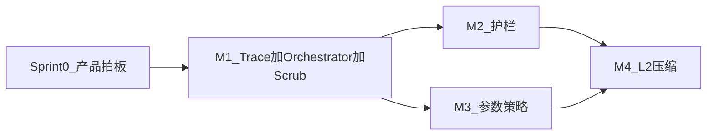

# 开发计划：记忆与工具体系改进（Hermes 能力对齐）

**版本**: 0.6  
**状态**: 执行计划（随迭代更新）  
**依据设计**: [design-memory-tools-hermes-parity.md](design-memory-tools-hermes-parity.md)（**v0.2**）  
**产品规格**: [product-spec-memory-tools-hermes-parity.md](product-spec-memory-tools-hermes-parity.md)（**v0.1**）

**框架侧已落地（§2.1 Epic E、§2.7 Epic X、规格 G5 O1–O2）**：`PrepareChatContextCtx` + `model.ContextTraceFunc` / **`model.TraceSink` 类型别名**与 **`WithTraceSink`**（O2：model 不依赖 agent）；`RunTrace.ContextOps` 含 **聚合字段 + `invocations[]` 每次 model 调用的增量**（`contextTraceMerge` 写入当前 invocation）；每次 model 调用前 `beginModelInvocation`；`l2_pre_prune_tool` 计入 `L2PrePruneRunesRemoved`。Epic X：`insertCompressionNotice` 写入 `sixath.origin=compression_notice`，`stripLeadingOrphanToolsAfterSystem` 优先读 Metadata（见 `model/context_budget_origin_test.go`）。**单测**：`agent/context_ops_test.go`、`agent/react_agent_test.go`（`TestReActAgent_Run_MetadataTraceJSONWithContextOps`）、`model/trace_sink_test.go`。另：`memory.Orchestrator` + `WithReActMemoryOrchestrator`（§2.2）。

**§2.4 Epic C（工具护栏）已在仓库落地（M2 核心，默认 opt-in）**：`agent/tool_guardrail.go` + `agent/guardrail_evaluator.go`（`GuardrailEvaluator` / `GuardrailDecision`、`NewGuardrailEvaluator`、`WithReActGuardrailEvaluator`；`CanonicalJSON` / `StableArgsKey`、R1/R2/R3、幂等/变更工具倍率、硬停 `RunTrace.GuardrailHalt` + `GuardrailHaltMessage` 含 `sixath.origin=guardrail_halt`）；`events.ToolGuardrailWarn`；`ReActAgent` 三路径在 `appendToolResultMessages` 后经 `guardrailEval().Evaluate` 评估；工具执行期错误软返回以支持连续失败检测；`config.ToolGuardrails`（含 `no_progress_tool_only_warn` / `no_progress_tool_only_halt`）+ `agent.ToolGuardrailsFromConfig`；`templates/skills_handler`、`templates/dataquery`（`NewDataQueryHandlerFromConfig`）、`templates/mcp`（`Config.ToolGuardrails`）可从框架 `config.yaml` 或构造参数接线。**Portal**：`configs/agent_extra.yaml` + `LoadPortalAgentExtra` / `SetPortalAgentExtra`、`BuildReActAgent` 全局护栏；`portal.guardrail_halt` 展示策略（`SendMessage` / `SendMessageStream` / `Agent.Chat`）。**§6.4 验收**：`react_agent_test.go` / `guardrail_evaluator_test.go` 中对 `ssh_exec` 连续失败与流式同轮双工具批次的单测。

**仍未实现**：**Epic D**、**Epic B（L2）** 中未勾选项；**Sprint 0 / 规格 §9** 开放决策与合规结论（流程项，非本文件可勾选代码）。**Portal SSE scrub（§2.3）** 已落地：`internal/chat/memory_fence_scrub.go`、`server/chat_sse.go`、`memory_orchestrator_prefetch.stream_scrub`。

---

## 0. 执行方式（对齐 using-superpowers）

本计划执行时（人或 Agent），须在 **PR 描述 / 工单 / 团队 wiki** 中保留可追溯留痕，满足最小集：

| 类型 | 必填 |
|------|------|
| **起始** | 本迭代目标、对照的规格章节（如 G1、M1）、预期合并的 PR 列表。 |
| **动作** | 每次关键提交：触点文件、单测命令与结果摘要（通过/失败）。 |
| **决策** | 触及 [产品规格 §9](product-spec-memory-tools-hermes-parity.md) 或设计 §10 时：选项、取舍、负责人、结论日期。 |
| **异常** | 构建/测试失败：现象、已查项、下一步（含重试或回滚）。 |
| **收尾** | 里程碑 DoD 勾选、未交付项、风险与下一里程碑建议。 |

**禁止**：仅写「已完成」而无 PR 链接或测试证据。

---

## 1. 目标与原则

- **目标**: 按 **产品规格 §3（G1–G5）** 与设计实现能力，默认 **opt-in**，灰度可观测（设计 §3）。  
- **路线选择**: 默认采用设计 [§9 路线 A](design-memory-tools-hermes-parity.md)——首里程碑合并 **TraceSink 骨架 + Orchestrator 最小实现 + Portal SSE scrub**，使用户可感知价值前移；路线 B 可作为保守环境备选。  
- **不在本计划内写死**: [产品规格 §9](product-spec-memory-tools-hermes-parity.md) / 设计 §10 未关闭的产品与合规结论（由产品/法务输出后再改配置与落库实现）。

### 1.1 规格—任务追溯矩阵

| 规格目标 / 需求 | 产品规格锚点 | 本计划 WBS |
|-----------------|--------------|------------|
| **G1** 记忆工程化 | §3.1、§6.1 M1–M5 | §2.2 Epic A（**已满足**，见 §2.2） |
| **G2** 上下文 L0/L1/L2 | §3.2、§6.2 C1–C5 | §2.6 Epic B + §2.1 E（invocation）（**已满足**，见 §2.6） |
| **G3** 工具护栏 | §3.3、§6.3（表内 ID 为 G1–G4，指护栏史诗） | §2.4 Epic C（**已满足**：C1–C5、Evaluator 接口、`plain_after_tools` 前护栏与 §6.4 单测，见 §2.4） |
| **G4** 参数策略 | §3.4、§6.4 P1–P2 | §2.5 Epic D |
| **G5** 可观测 | §3.5、§6.5 O1–O2 | §2.1 Epic E + §2.7 Epic X（**已满足**：见文首 G5 段落与单测） |
| **SSE scrub** | §4.1、§5.2、§10 | §2.3 Epic Portal（**已满足**，见 §2.3） |
| **发布闸门** | 规格 §10 | 本计划 §3 里程碑 + §7 |

### 1.2 Sprint 0：产品规格 §9 关闭项（阻塞 M1 Portal/落库/L2）

在开工 M1 的 Portal 与 L2 相关任务前，工单中须对下列项给出 **已关闭 / 明确延后 + 日期** 结论并留痕：

| # | 主题 | 规格 §9 条目 | 影响 WBS |
|---|------|--------------|----------|
| 1 | Prefetch 消息 role 与压缩说明相对顺序 | 开放决策 1 | A2、E3、B |
| 2 | L2 auxiliary 与主模型密钥/厂商关系 | 开放决策 2 | B3 |
| 3 | 护栏硬停 Portal 文案与错误码 | 开放决策 3 | C2、Portal |
| 4 | 外置记忆后端单实例约束 | 开放决策 4 | A1、运维 |
| 5 | 落库/导出/审计与 L2 ReplayDataset | 开放决策 5 + 规格 §7 NFR 合规 | P1、B、法务 |

---

## 2. 工作分解结构（WBS）

### 2.1 Epic E — 可观测与 TraceSink（设计 §8）

| 任务 ID | 描述 | 主要触点 | 依赖 |
|---------|------|----------|------|
| E1 | 定义 `ContextOpsTrace`、`ContextOpsInvocation` 与 `RunTrace` 扩展 | [agent/trace.go](../agent/trace.go) | 无 |
| E2 | `model.TraceSink`（= `ContextTraceFunc`）+ `WithTraceSink` / `CallConfig.ContextTrace` | [model/context_pipeline.go](../model/context_pipeline.go)、[model/model.go](../model/model.go) | E1 |
| E3 | `OpenAIClient` 的 `Chat` / `ChatWithTools` / `ChatWithToolsStream` 在压缩与 patch 路径打点 | [model/openai.go](../model/openai.go)、[model/openai_tools.go](../model/openai_tools.go)、[model/openai_tools_stream.go](../model/openai_tools_stream.go) | E2 |
| E4 | `ReActAgent` 构造 `trace`，合并 sink 回调；`plain_after_tools` 第二次 `Chat` 递增 invocation；**invocation 级** L0/strip/L2 预剪枝/L2/sanitize | [agent/context_ops.go](../agent/context_ops.go)、[agent/react_agent.go](../agent/react_agent.go) | E1–E3 |
| E5 | 单测：`Run` / `Metadata["trace"]` JSON 可序列化且含 `context_ops` 与 `invocations` | [agent/react_agent_test.go](../agent/react_agent_test.go)、[agent/trace_json_test.go](../agent/trace_json_test.go)、[agent/context_ops_test.go](../agent/context_ops_test.go)、[model/trace_sink_test.go](../model/trace_sink_test.go) | E4 |

**完成定义（DoD）**: 关闭所有新能力开关时行为与现网一致；开启 sink 后至少能记录 L0 是否丢消息、strip 次数占位。——**已补强**：`PrepareChatContextCtx` 将 **L1**、**L2 预剪枝**、**L0**、**strip**、**L2 摘要** 串成流水线；`ContextTrace` 回调含 `l1_sanitize`、`l2_pre_prune_tool`、`l2_summarize`、`l2_cooldown_*`；`RunTrace.ContextOps` 含 `L2CooldownActive`、`L2PrePruneRunesRemoved`；**每次 model 调用**在 `invocations[i]` 上可区分上述变换是否发生在该轮。

### 2.2 Epic A — 记忆 Orchestrator 与集成（设计 §4）

| 任务 ID | 描述 | 主要触点 | 依赖 | 状态 |
|---------|------|----------|------|------|
| A1 | `memory` 包：`Backend`、`PrefetchQuery`、`PrefetchPart`、`Orchestrator` | [memory/orchestrator.go](../memory/orchestrator.go) | 无 | **已满足** |
| A2 | `PrefetchForTurn`：合并 `PrefetchPart`、加围栏 nonce、写 `sixath.origin` | 同 A1 | A1 | **已满足**（含 M2/M5） |
| A3 | `WithReActMemoryOrchestrator` + `messages()` 注入点 | [agent/react_agent.go](../agent/react_agent.go) | A2、E4（trace 记 prefetch_skipped） | **已满足** |
| A4 | Fake `Backend` 集成测试 | [memory/orchestrator_test.go](../memory/orchestrator_test.go)、[agent/react_memory_orchestrator_test.go](../agent/react_memory_orchestrator_test.go) | A3 | **已满足** |
| A5 | `SearchPrefetchBackend`（memorysearch 检索 → PrefetchPart）+ Portal `memory_orchestrator_prefetch` | [memory/search_prefetch_backend.go](../memory/search_prefetch_backend.go)、`portal/internal/chat`、`portal/internal/service/chat.go` | A1、A2 | **已满足** |

**DoD**: `Orchestrator==nil` 时零行为变化；fake backend 第二次 turn 可验证注入消息存在且带 metadata。——**已实现**：`PrefetchFailClosed`（M3 fail-closed）、`PrefetchForTurn` skip reason、`RunTrace.PrefetchSkipped` / `PrefetchSkipReason`、事件 `agent.memory.prefetch_skipped`；`PrefetchQuery` 包含 `Recent` + `Identity`（M4，支持 metadata 与 context 键回填）；Portal `agent_extra.yaml` + `NewChatService` 集成预取并向 `agent.Request.Metadata` 传递 `session_id/agent_id/workspace_root/identity`。

### 2.3 Epic Portal — SSE scrub（设计 §4.3–§4.6）

| 任务 ID | 描述 | 主要触点 | 依赖 | 状态 |
|---------|------|----------|------|------|
| P1 | 流式状态机：解析 `fence_tag` + `id` 开闭，缓冲区内不向 UI 转发 | [portal/internal/chat/memory_fence_scrub.go](../../portal/internal/chat/memory_fence_scrub.go)、[portal/internal/server/chat_sse.go](../../portal/internal/server/chat_sse.go) | 产品确认标签名与 §10 | **已满足** |
| P2 | EOF 未闭合：不向 UI/落库泄露缓冲（`Flush` 截断 + 日志） | 同上 | P1 | **已满足** |
| P3 | 配置：`memory_orchestrator_prefetch.stream_scrub` + `fence_tag` | [framework/config/tool_guardrails.go](../config/tool_guardrails.go)、[portal/internal/chat/portal_agent_extra.go](../../portal/internal/chat/portal_agent_extra.go) | P1 | **已满足** |

**DoD**: 单测 `portal/internal/chat/memory_fence_scrub_test.go` — 分块围栏内正文不出现在拼接 UI 输出；EOF 围栏内丢弃。

### 2.4 Epic C — 工具护栏（设计 §6）

| 任务 ID | 描述 | 主要触点 | 依赖 | 状态（2026-05-02 仓库） |
|---------|------|----------|------|-------------------------|
| C1 | `canonicalJSON` / `stableArgsKey` 小工具 + 单测 | [agent/tool_guardrail.go](../agent/tool_guardrail.go) | 无 | **已满足** |
| C2 | `GuardrailEvaluator` + `executeToolStep` 后评估 | [agent/guardrail_evaluator.go](../agent/guardrail_evaluator.go)、[agent/react_agent.go](../agent/react_agent.go) | E1（事件载荷） | **已满足** |
| C3 | 事件 `agent.tool_guardrail.warn`（或 `events` 包统一 Kind） | [events/event.go](../events/event.go) | C2 | **已满足**（`ToolGuardrailWarn`） |
| C4 | `plain_after_tools` 与计数连续性单测 | [agent/react_agent_test.go](../agent/react_agent_test.go)（`TestReActAgent_RunEvents_Streaming_TwoSshExecBatch_GuardrailBeforePlain`） | C2、设计 §5.3.2、§6.2 | **已满足** |
| C5 | R3 无进展（连续多轮 `ChatWithTools` 仍选仅工具路径） | [agent/tool_guardrail.go](../agent/tool_guardrail.go)、[agent/react_agent.go](../agent/react_agent.go) | C2 | **已满足**（`Run` / `runToolEventsSync` 递增计数；`runToolEvents` 每轮后接 `plain_after_tools`，R3 计数固定为 0，与设计语义一致） |

**DoD**: `warnings_only=true` 默认；硬停可选且 trace 带 `guardrail_halt`。——**已实现**（YAML `warnings_only` / `HardHalt`、trace 字段与注入消息、**R3**）；**§6.4** 见 `TestDesignSection6_4_*` 与流式批次护栏顺序单测。

### 2.5 Epic D — 参数策略表（设计 §7）

| 任务 ID | 描述 | 主要触点 | 依赖 |
|---------|------|----------|------|
| D1 | 新建 `tool/parampolicy`：`Policy`、`ApplyPolicies` | `framework/tool/parampolicy/` | 无 |
| D2 | `RegisterSSHExecTool` 内注册并迁移 host 解析 | [tool/ssh_exec.go](../tool/ssh_exec.go) | D1 |
| D3 | 泛化单测 + ssh 回归 | [tool/*_test.go](../tool/) | D2 |

### 2.6 Epic B — L2 压缩（设计 §5）

| 任务 ID | 描述 | 主要触点 | 依赖 | 状态 |
|---------|------|----------|------|------|
| B1 | `estimate_tokens.go` + 保守系数与文档注释 | [model/estimate_tokens.go](../model/estimate_tokens.go) | E2 | **已满足** |
| B2 | L2 预剪枝占位 + 原子单元剪裁实现 | [model/context_budget.go](../model/context_budget.go)、[model/context_pipeline.go](../model/context_pipeline.go) | B1、设计 §5.3.1 | **已满足** |
| B3 | auxiliary `Chat` 摘要管线 + redact | [model/l2_runtime.go](../model/l2_runtime.go)、[model/redact_l2.go](../model/redact_l2.go) | B2 | **已满足** |
| B4 | 冷却进入/退出（设计 §5.6） | [model/l2_runtime.go](../model/l2_runtime.go) + `ContextOpsTrace.L2CooldownActive` | B3、E3 | **已满足** |
| B5 | 多 invocation 下 `L2SummaryHash` 策略（最后一次 + 列表） | [agent/context_ops.go](../agent/context_ops.go)、[agent/trace.go](../agent/trace.go) | E1、B3 | **已满足** |

**DoD**: `l2_enabled=false` 时与现网二进制等价（回归测）；开启后极端用例不 400。——**已实现**：`EstimateTokensConservative`、`PrepareChatContextCtx`（L1→L2 预剪枝→L0 rune→L0 token-soft→strip→L2）、`L2Runtime`、`WithReActContextCompression`、`ContextOps.invocations`；`CallConfig` 提供独立 `MaxContextRunes` 与 `MaxContextTokensSoft` 双阈值开关（含 `TokenEstimateAlpha`），并在 trace 区分 `l0_compress` / `l0_compress_tokens`；`L2SummaryHash` 同时保留“最后一次”与 `L2SummaryHashes` 列表。

### 2.7 Epic X — `sixath.origin` 与 L0 迁移（设计 §3.1）

| 任务 ID | 描述 | 主要触点 | 依赖 | 状态 |
|---------|------|----------|------|------|
| X1 | `insertCompressionNotice` 写入 `sixath.origin=compression_notice` | [model/context_budget.go](../model/context_budget.go) | 无 | **已满足** |
| X2 | `stripLeadingOrphanToolsAfterSystem` 优先读 metadata，保留关键字兼容期 | 同上 | X1 | **已满足**（`context_budget_origin_test.go`） |

---

## 3. 里程碑与顺序

| 里程碑 | 交付物 | 包含 Epic | 建议时长（人周·粗估） |
|--------|--------|------------|------------------------|
| **Sprint 0** | 完成本计划 **§1.2** 与 [产品规格第 9 节](product-spec-memory-tools-hermes-parity.md) 开放决策（或书面延后）；冻结设计 [§10](design-memory-tools-hermes-parity.md) 可阻塞项；灰度策略书面化；**§0 留痕**起表 | 产品 + 架构 + 合规 | 0.5–1 |
| **M1** | 用户侧「记忆不进 UI」+ Trace 可观测 | E、A、Portal P、X 部分 | 2–4 |
| **M2** | 工具护栏上线（默认告警） | C | 1–2 |
| **M3** | `ssh_exec` 策略表迁移 | D | 1–2 |
| **M4** | L2 可选上线（含冷却与 invocation trace） | B | 2–4 |

并行建议：**M2 与 M3** 可在 M1 合并后由不同开发者并行，**M4** 依赖 E 与产品对 auxiliary/L2 的决策。

### 3.1 按周 Sprint（M1–M4）

下列 **周次为相对时间**：以「M1 在仓库内开工」为 **第 1 周（W1）** 周一（或团队 Sprint 起点）；**Sprint 0** 不计入下表，须在此前完成（见上表）。每周结束应满足 **§0 留痕**（合并 PR 链接 + `go test` 相关包摘要）及当周 **退出标准**。

#### 方案 A — 串行（单主力开发，约 9 周）

| 周次 | 里程碑切片 | 主要任务 ID（§2） | 退出标准（DoD 摘要） |
|------|------------|-------------------|----------------------|
| **W1** | M1 · 观测骨架 | E1、E2、X1、X2 | `TraceSink`/Option 可编译接入；compression_notice 与 strip 元数据路径有单测 |
| **W2** | M1 · 模型打点 | E3 | OpenAI 三条路径（Chat / WithTools / Stream）打点一致；失败不静默 |
| **W3** | M1 · ReAct 聚合 | E4、E5 | `Metadata["trace"]` 可序列化、`context_ops` 有内容；双 invocation 场景单测通过 |
| **W4** | M1 · 记忆编排 | A1、A2、A3 | 注入 0..1 条围栏消息、`sixath.origin`、nonce；`Orchestrator==nil` 零回归 |
| **W5** | M1 · 集成 + Portal | A4、P1、P2、P3 | Fake backend 集成通过；SSE scrub 单测通过（`memory_fence_scrub_test`）；配置键可读 |
| **W6** | M2 · 护栏 | C1、C2、C3、C4 | 默认 `warnings_only`；硬停可选且带 `guardrail_halt`；事件可订阅 |
| **W7** | M3 · 参数策略 | D1、D2、D3 | `ssh_exec` 走策略表；泛化单测 + 回归通过 |
| **W8** | M4 · L2 主体 | B1、B2、B3 | `l2_enabled=false` 与现网等价；开启后摘要管线可跑通 |
| **W9** | M4 · 冷却与收尾 | B4、B5 | 冷却可配置可观测；invocation/L2 hash 策略与规格 §3.2 一致；M4 发布闸门自检 |

#### 方案 B — 双开发并行（M2 ∥ M3，约 8 周）

在 **方案 A** 基础上：**W6** 由开发者 α 做 Epic **C**（M2），开发者 β 做 Epic **D**（M3）全部任务；**W7** 两人联调合并冲突 + 共享回归（`react_agent` + `ssh_exec`）。**M4** 仍为 **W8–W9**（与方案 A 的 W8–W9 对齐），总周数 **9→8** 的前提是 C/D 无大块返工。

| 周次 | 开发者 α | 开发者 β |
|------|-----------|-----------|
| W1–W5 | 同方案 A（可全程单人，或 W4–W5 另一人帮测 Portal） | — |
| W6 | C1–C4 | D1–D3 |
| W7 | 合并、护栏与策略联合回归 | 同上 |
| W8–W9 | 可共同拆 B1–B5 或按 B1–B3 / B4–B5 分工 | 同上 |

#### 周内容与产品规格的快速对照

| 周次范围 | 产品规格目标 |
|----------|----------------|
| W1–W5 | **G1**（M1–M5）、**G5**（O1–O2）、SSE 与 **G2** 的 L0/轨迹基础 |
| W6 | **G3** |
| W7 | **G4** |
| W8–W9 | **G2**（L2 子集）、**G5**（多 invocation / L2 hash） |

> **调整说明**：若 M1 已在仓库部分落地（见文首「框架侧已落地」），可将 **W1–W3** 压缩为「差距核对 + 补单测」一周，整体周数相应减少；压缩后仍须在留痕中写明「跳过/已满足」的证据（PR 或测试列表）。

---

## 4. 分支与 PR 策略

- 与设计 [§11](design-memory-tools-hermes-parity.md) 一致：**M1** 可合为「骨架 PR」（framework）+「scrub PR」（portal），或单 PR 若仓库单仓发布。  
- **M4（L2）** 独立 PR：涉及成本、辅助模型与冷却，便于回滚与 feature flag。  
- 每个 PR 附带：配置样例片段、灰度说明、`CHANGELOG` 或等价发布说明。

---

## 5. 测试矩阵

| 层级 | 覆盖 |
|------|------|
| 单元 | `canonicalJSON`、`strip`+`sixath.origin`、Orchestrator fake、guardrail 计数 |
| 集成 | ReAct 多步工具 + `plain_after_tools` 双 invocation trace |
| 契约 | Portal scrub 输入输出向量（文件级 golden） |
| 回归 | 全开关 off 时现有 `react_agent_test`、`openai_tools_test`、`ssh_exec` 测试 |
| 发布闸门 | 对照 [产品规格 §10](product-spec-memory-tools-hermes-parity.md) 功能验收 + 回归 + 灰度三项 |

---

## 6. 风险与缓解

| 风险 | 缓解 |
|------|------|
| L2 摘要质量差导致任务错误 | 默认关闭；灰度；冷却；HANDOFF 模板可配置 |
| scrub 与 DB 内容不一致引发客诉 | 按 [§10.1](design-memory-tools-hermes-parity.md) 产品结论选落库策略 |
| `model` 与 `agent` 循环依赖 | 严格 TraceSink 在 `model`，聚合在 `agent`（设计 §8.1） |
| 中文 token 低估导致仍爆上下文 | 以 runes 为主阈值 + 保守系数（设计 §5.4） |

---

## 7. 发布与回滚

- **Feature flag**: `memory_orchestrator.enabled`、`context_compression.l2_enabled` 独立；**护栏**当前通过 **`config.yaml` 的 `tool_guardrails`** 与 **Portal `agent_extra.yaml`** 启用（`enabled: true`）；可选 **`no_progress_tool_only_warn` / `no_progress_tool_only_halt`**（R3）。尚未单独提供环境变量级 `tool_guardrails.enabled` 三态开关（可按 §7 灰度需求补）。  
- **回滚**: 关 flag 即回退到现网逻辑；Portal scrub 可与 orchestrator 同 flag 或独立 flag（建议独立，便于只关 UI 不断模型）。  
- **观测**: 上线后监控 `prefetch_skipped`、`l2_cooldown_active`、护栏 warn 计数（设计 §4.6、§5.6）。

---

## 8. 文档与交接

- 实现完成后：更新 [api-reference.md](api-reference.md) 中 `RunTrace`、`ReActOption`、`CallConfig` 相关条目。  
- Portal：更新 `memory-integration` 或等价架构文档中的 SSE 与落库说明。  
- 本开发计划随里程碑勾选更新 **§9 版本历史**。

---

## 9. 版本历史

| 版本 | 日期 | 说明 |
|------|------|------|
| 0.2 | （沿用） | Trace/Orchestrator 骨架与 WBS 初版 |
| 0.3 | 2026-05-02 | 对齐 [product-spec-memory-tools-hermes-parity.md v0.1](product-spec-memory-tools-hermes-parity.md)；新增 **§0**（using-superpowers 留痕）、**§1.1** 规格—任务追溯、**§1.2** Sprint 0 与规格第 9 节；更新 Sprint 0 里程碑行 |
| 0.4 | 2026-05-02 | 新增 **§3.1**：M1–M4 按周 Sprint（方案 A 串行约 9 周、方案 B 双轨约 8 周）及与 G1–G5 对照 |
| 0.5 | 2026-05-02 | 文首与 **§2.4** 对齐仓库：**Epic C（C1–C3 已满足，C4 部分）**、Portal `agent_extra` 与 `guardrail_halt` 展示；明确仍缺 R3、SSE scrub、Epic B/D、Sprint 0；§7 补充护栏启用方式说明；**§1.1** G3 行补充「部分落地」追溯说明 |
| 0.6 | 2026-05-02 | **R3** 落地（`applyToolGuardrails` 第四参、`config` YAML 字段）；`dataquery` / `mcp` 模板接线护栏；**§2.4** 增 C5 与 DoD；文首与 **§1.1** G3、**§7**、**§9** 同步 |
