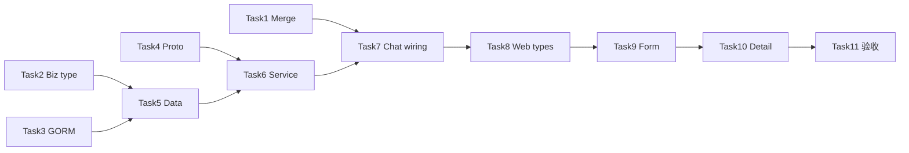

# Agent 运行时工具（P0）Web/Portal 配置 — Implementation Plan

> **For agentic workers:** REQUIRED SUB-SKILL: Use superpowers:subagent-driven-development (recommended) or superpowers:executing-plans to implement this plan task-by-task. Steps use checkbox (`- [ ]`) syntax for tracking.

**Goal:** 让管理员在 Web 控制台为每个 Agent 勾选 Hermes P0 运行时工具开关，Portal 持久化并在 Chat 注册工具时与全局 env 合并生效；Chat 对话页无需改动。

**Architecture:** 在 `agents` 表新增 JSON 列 `runtime_tools` 存 7 个 bool；新增 `MergeHermesP0Flags(global, agent)`（OR 合并）；`RegisterAgentRuntimeTools` 三处调用点传入 per-agent 合并结果；Web `AgentForm`/`AgentDetail` 读写 proto 字段 `runtime_tools`。

**Tech Stack:** Go 1.25、Kratos、GORM MySQL、protobuf、React 19 + Vite 8

**Spec 关联:** [2026-05-25-hermes-capability-gap-requirements.md](../specs/2026-05-25-hermes-capability-gap-requirements.md) §14 Portal 工具注册清单、NFR-1 opt-in  
**前置:** [2026-05-25-hermes-capability-gap-p0.md](./2026-05-25-hermes-capability-gap-p0.md) framework 工具已实现  
**非目标:** Web 搜索 API Key 系统设置页、Chat 历史消息加载、`confirm_response` 专用 body

---

## 背景与现状

| 层 | 现状 | 缺口 |
|----|------|------|
| Framework | P0 工具 + `CheckFn` 已落地 | — |
| Portal | `HermesP0ToolFlags` 仅进程级 env（`hermes_p0_flags.go`） | 无 per-agent 配置 |
| Chat | `RegisterAgentRuntimeTools` 未传 `Flags` | 始终用 global default |
| Web | `AgentForm` 无运行时工具 UI | 只能改 env 启用 P0 |

**Chat 无需改：** `confirm_required` / `input_required` 已支持 `skill_manage`、`execute_write`、`ask_user`（`web/src/pages/ChatPage.tsx`）。

---

## File Structure

| 文件 | 职责 |
|------|------|
| `portal/internal/biz/runtime_tools.go` | **新建** — `RuntimeToolsConfig` biz 类型 + proto/model 转换 |
| `portal/internal/biz/runtime_tools_test.go` | **新建** — 转换单测 |
| `portal/internal/data/model/runtime_tools.go` | **新建** — GORM JSON 类型（`Value`/`Scan`） |
| `portal/internal/data/model/agent.go` | 增加 `RuntimeTools` 列 |
| `portal/internal/data/agent_mysql.go` | Create/Get/List/Update 读写 JSON |
| `portal/internal/chat/hermes_p0_flags.go` | 增加 `MergeHermesP0Flags` |
| `portal/internal/chat/hermes_p0_flags_test.go` | Merge OR 逻辑单测 |
| `portal/internal/chat/runtime_tools.go` | 增加 `RuntimeToolsForAgent(*biz.AgentMeta)` |
| `portal/internal/chat/runtime_tools_agent_test.go` | **新建** — 合并 + 注册集成测 |
| `portal/api/agent/v1/agent.proto` | `RuntimeToolsConfig` message + CRUD 字段 |
| `portal/internal/service/agent.go` | Create/Update/Reply 映射；`Chat` 传 Flags |
| `portal/internal/service/chat.go` | `SendMessage` / `SendMessageStream` 传 Flags |
| `portal/internal/biz/agent.go` | `AgentMeta.RuntimeTools` |
| `portal/internal/biz/agent_usecase.go` | Create 签名扩展（或 updates） |
| `web/src/api/client.ts` | `RuntimeToolsConfig` 类型 |
| `web/src/pages/AgentForm.tsx` | 7 个 checkbox + 编码助手预设 |
| `web/src/pages/AgentDetail.tsx` | 只读 badge 展示 |
| `web/tests/runtimeTools.test.ts` | **新建**（可选）— 表单序列化 helper 单测 |

**不改：** `web/src/pages/ChatPage.tsx`、`framework/tool/*`

---

## 合并语义（写死）

```go
// MergeHermesP0Flags：global(env/YAML) 与 per-agent 按字段 OR。
// agent 全 false 且 global 全 false → 工具不注册（NFR-1）。
func MergeHermesP0Flags(global, agent HermesP0ToolFlags) HermesP0ToolFlags {
    return HermesP0ToolFlags{
        MemoryWriteEnabled:             global.MemoryWriteEnabled || agent.MemoryWriteEnabled,
        SkillRuntimeManageEnabled:      global.SkillRuntimeManageEnabled || agent.SkillRuntimeManageEnabled,
        SkillManageConfirmCreateDelete: global.SkillManageConfirmCreateDelete || agent.SkillManageConfirmCreateDelete,
        TodoEnabled:                    global.TodoEnabled || agent.TodoEnabled,
        WorkspaceFilesEnabled:          global.WorkspaceFilesEnabled || agent.WorkspaceFilesEnabled,
        WebToolsEnabled:                global.WebToolsEnabled || agent.WebToolsEnabled,
        TerminalLocalEnabled:           global.TerminalLocalEnabled || agent.TerminalLocalEnabled,
        CronjobToolEnabled:             global.CronjobToolEnabled || agent.CronjobToolEnabled,
    }
}
```

`SkillManageConfirmCreateDelete` 默认 global=true（现有 `DefaultHermesP0ToolFlags`）；Web **不暴露**此开关（MVP）。

---

### Task 1: MergeHermesP0Flags

**Files:**
- Modify: `portal/internal/chat/hermes_p0_flags.go`
- Modify: `portal/internal/chat/hermes_p0_flags_test.go`

- [ ] **Step 1: 写失败单测**

`portal/internal/chat/hermes_p0_flags_test.go` 追加：

```go
func TestMergeHermesP0Flags_ORPerField(t *testing.T) {
    global := HermesP0ToolFlags{}
    agent := HermesP0ToolFlags{WebToolsEnabled: true}
    merged := MergeHermesP0Flags(global, agent)
    if !merged.WebToolsEnabled {
        t.Fatal("expected web tools enabled from agent")
    }
    if merged.TerminalLocalEnabled {
        t.Fatal("terminal should stay false")
    }
}

func TestMergeHermesP0Flags_GlobalEnables(t *testing.T) {
    global := HermesP0ToolFlags{TodoEnabled: true}
    agent := HermesP0ToolFlags{}
    merged := MergeHermesP0Flags(global, agent)
    if !merged.TodoEnabled {
        t.Fatal("expected todo from global")
    }
}
```

- [ ] **Step 2: 运行确认 FAIL**

```bash
cd portal && go test ./internal/chat/... -run TestMergeHermesP0Flags -count=1 -v
```

Expected: `undefined: MergeHermesP0Flags`

- [ ] **Step 3: 实现 MergeHermesP0Flags**

在 `hermes_p0_flags.go` 末尾添加上节函数。

- [ ] **Step 4: 运行确认 PASS**

```bash
cd portal && go test ./internal/chat/... -run TestMergeHermesP0Flags -count=1 -v
```

Expected: PASS

---

### Task 2: Biz RuntimeToolsConfig 类型

**Files:**
- Create: `portal/internal/biz/runtime_tools.go`
- Create: `portal/internal/biz/runtime_tools_test.go`

- [ ] **Step 1: 定义 biz 类型与空值 helper**

`portal/internal/biz/runtime_tools.go`:

```go
package biz

// RuntimeToolsConfig per-agent Hermes P0 工具开关（JSON 列）。
type RuntimeToolsConfig struct {
    MemoryWriteEnabled        bool `json:"memory_write_enabled,omitempty"`
    SkillRuntimeManageEnabled bool `json:"skill_runtime_manage_enabled,omitempty"`
    TodoEnabled               bool `json:"todo_enabled,omitempty"`
    WorkspaceFilesEnabled     bool `json:"workspace_files_enabled,omitempty"`
    WebToolsEnabled           bool `json:"web_tools_enabled,omitempty"`
    TerminalLocalEnabled      bool `json:"terminal_local_enabled,omitempty"`
    CronjobToolEnabled        bool `json:"cronjob_tool_enabled,omitempty"`
}

func (c RuntimeToolsConfig) AnyEnabled() bool {
    return c.MemoryWriteEnabled || c.SkillRuntimeManageEnabled || c.TodoEnabled ||
        c.WorkspaceFilesEnabled || c.WebToolsEnabled || c.TerminalLocalEnabled || c.CronjobToolEnabled
}
```

- [ ] **Step 2: 单测 AnyEnabled**

```bash
cd portal && go test ./internal/biz/... -run TestRuntimeToolsConfig -count=1 -v
```

- [ ] **Step 3: AgentMeta 增加字段**

`portal/internal/biz/agent.go` 的 `AgentMeta` 增加：

```go
RuntimeTools RuntimeToolsConfig
```

---

### Task 3: GORM JSON 模型

**Files:**
- Create: `portal/internal/data/model/runtime_tools.go`
- Modify: `portal/internal/data/model/agent.go`

- [ ] **Step 1: 实现 JSON Scan/Value**（参照 `ModelConfig` 模式）

`portal/internal/data/model/runtime_tools.go`:

```go
package model

import (
    "database/sql/driver"
    "encoding/json"
    "errors"
)

type RuntimeToolsConfig struct {
    MemoryWriteEnabled        bool `json:"memory_write_enabled,omitempty"`
    SkillRuntimeManageEnabled bool `json:"skill_runtime_manage_enabled,omitempty"`
    TodoEnabled               bool `json:"todo_enabled,omitempty"`
    WorkspaceFilesEnabled     bool `json:"workspace_files_enabled,omitempty"`
    WebToolsEnabled           bool `json:"web_tools_enabled,omitempty"`
    TerminalLocalEnabled      bool `json:"terminal_local_enabled,omitempty"`
    CronjobToolEnabled        bool `json:"cronjob_tool_enabled,omitempty"`
}

func (c RuntimeToolsConfig) Value() (driver.Value, error) {
    b, err := json.Marshal(c)
    if err != nil {
        return nil, err
    }
    return string(b), nil
}

func (c *RuntimeToolsConfig) Scan(value interface{}) error {
    if value == nil {
        *c = RuntimeToolsConfig{}
        return nil
    }
    bytes, ok := value.([]byte)
    if !ok {
        return errors.New("failed to unmarshal RuntimeToolsConfig")
    }
    return json.Unmarshal(bytes, c)
}
```

- [ ] **Step 2: Agent 表增加列**

`portal/internal/data/model/agent.go`:

```go
RuntimeTools RuntimeToolsConfig `gorm:"column:runtime_tools;type:json"`
```

- [ ] **Step 3: 验证 AutoMigrate**（本地有 MySQL 时）

```bash
cd portal && go build -o bin/backend ./cmd/backend/...
```

启动一次 backend 或跑现有 data 测试；GORM AutoMigrate 在 `internal/data/data.go` 已包含 `&model.Agent{}`。

---

### Task 4: Proto API

**Files:**
- Modify: `portal/api/agent/v1/agent.proto`

- [ ] **Step 1: 追加 message 与字段**

```protobuf
message RuntimeToolsConfig {
  bool memory_write_enabled = 1;
  bool skill_runtime_manage_enabled = 2;
  bool todo_enabled = 3;
  bool workspace_files_enabled = 4;
  bool web_tools_enabled = 5;
  bool terminal_local_enabled = 6;
  bool cronjob_tool_enabled = 7;
}
```

在 `CreateAgentRequest` 增加 `RuntimeToolsConfig runtime_tools = 8;`  
在 `UpdateAgentRequest` 增加 `optional RuntimeToolsConfig runtime_tools = 8;`  
在 `AgentReply` 增加 `RuntimeToolsConfig runtime_tools = 12;`

- [ ] **Step 2: 生成代码**

```bash
cd portal && make api
```

Expected: 更新 `api/agent/v1/agent.pb.go`、`agent_http.pb.go` 等，无 protoc 错误。

---

### Task 5: Data 层读写

**Files:**
- Modify: `portal/internal/data/agent_mysql.go`
- Create: `portal/internal/data/runtime_tools_convert.go`（model ↔ biz 转换，可选内联）

- [ ] **Step 1: 写 round-trip 单测**（可用 sqlite 或 mock；若无则集成测放 Task 7）

`portal/internal/data/agent_runtime_tools_test.go`（需 test DB 或 skip）：

```go
func TestAgentRepo_RuntimeToolsRoundTrip(t *testing.T) {
    // 创建 agent runtime_tools 全 true → GetByID 字段一致
}
```

- [ ] **Step 2: Create 写入 runtime_tools**

扩展 `agentRepo.Create` 签名，增加 `runtimeTools biz.RuntimeToolsConfig` 参数；写入 `model.Agent.RuntimeTools`。

- [ ] **Step 3: GetByID / List 回填**

在返回 `biz.AgentMeta` 时映射 `RuntimeTools`。

- [ ] **Step 4: Update 支持 runtime_tools**

`Update` 的 switch 增加：

```go
case "runtime_tools":
    upd["runtime_tools"] = bizRuntimeToolsToModel(v.(biz.RuntimeToolsConfig))
```

- [ ] **Step 5: 扩展 AgentRepo 接口与 Usecase Create**

`portal/internal/biz/agent.go` `AgentRepo.Create` 增加 `runtimeTools RuntimeToolsConfig` 参数。  
`agent_usecase.go` `Create` 同步扩展。

---

### Task 6: Service 层 proto 映射

**Files:**
- Modify: `portal/internal/service/agent.go`
- Modify: `portal/internal/biz/runtime_tools.go`（proto 转换函数）

- [ ] **Step 1: 转换 helper**

```go
func runtimeToolsFromProto(p *agentv1.RuntimeToolsConfig) biz.RuntimeToolsConfig {
    if p == nil {
        return biz.RuntimeToolsConfig{}
    }
    return biz.RuntimeToolsConfig{
        MemoryWriteEnabled:        p.GetMemoryWriteEnabled(),
        SkillRuntimeManageEnabled: p.GetSkillRuntimeManageEnabled(),
        TodoEnabled:               p.GetTodoEnabled(),
        WorkspaceFilesEnabled:     p.GetWorkspaceFilesEnabled(),
        WebToolsEnabled:           p.GetWebToolsEnabled(),
        TerminalLocalEnabled:      p.GetTerminalLocalEnabled(),
        CronjobToolEnabled:        p.GetCronjobToolEnabled(),
    }
}

func runtimeToolsToProto(c biz.RuntimeToolsConfig) *agentv1.RuntimeToolsConfig {
    return &agentv1.RuntimeToolsConfig{
        MemoryWriteEnabled:        c.MemoryWriteEnabled,
        SkillRuntimeManageEnabled: c.SkillRuntimeManageEnabled,
        TodoEnabled:               c.TodoEnabled,
        WorkspaceFilesEnabled:     c.WorkspaceFilesEnabled,
        WebToolsEnabled:           c.WebToolsEnabled,
        TerminalLocalEnabled:      c.TerminalLocalEnabled,
        CronjobToolEnabled:        c.CronjobToolEnabled,
    }
}
```

- [ ] **Step 2: CreateAgent 传入 runtime_tools**

```go
agent, err := s.uc.Create(ctx, req.GetName(), ..., runtimeToolsFromProto(req.GetRuntimeTools()))
```

- [ ] **Step 3: UpdateAgent 可选更新**

```go
if req.RuntimeTools != nil {
    updates["runtime_tools"] = runtimeToolsFromProto(req.RuntimeTools)
}
```

- [ ] **Step 4: agentMetaToReply 回填**

```go
RuntimeTools: runtimeToolsToProto(m.RuntimeTools),
```

- [ ] **Step 5: 单测 HTTP 层**（可选）

用 httptest POST `/api/v1/agents` body 含 `runtime_tools`，GET 断言字段一致。

---

### Task 7: Chat 注册 wiring

**Files:**
- Modify: `portal/internal/chat/runtime_tools.go`
- Modify: `portal/internal/service/chat.go`（2 处）
- Modify: `portal/internal/service/agent.go`（`Chat` 1 处）
- Create: `portal/internal/chat/runtime_tools_agent_test.go`

- [ ] **Step 1: RuntimeToolsForAgent helper**

`portal/internal/chat/runtime_tools.go`:

```go
func RuntimeToolsForAgent(meta *biz.AgentMeta) *HermesP0ToolFlags {
    if meta == nil {
        f := DefaultHermesP0ToolFlags
        return &f
    }
    agentFlags := HermesP0ToolFlags{
        MemoryWriteEnabled:        meta.RuntimeTools.MemoryWriteEnabled,
        SkillRuntimeManageEnabled: meta.RuntimeTools.SkillRuntimeManageEnabled,
        TodoEnabled:               meta.RuntimeTools.TodoEnabled,
        WorkspaceFilesEnabled:     meta.RuntimeTools.WorkspaceFilesEnabled,
        WebToolsEnabled:           meta.RuntimeTools.WebToolsEnabled,
        TerminalLocalEnabled:      meta.RuntimeTools.TerminalLocalEnabled,
        CronjobToolEnabled:        meta.RuntimeTools.CronjobToolEnabled,
    }
    merged := MergeHermesP0Flags(DefaultHermesP0ToolFlags, agentFlags)
    return &merged
}
```

- [ ] **Step 2: 三处 RegisterAgentRuntimeTools 传入 Flags**

`portal/internal/service/chat.go` ~173、~373：

```go
Flags: chat.RuntimeToolsForAgent(agentMeta),
```

`portal/internal/service/agent.go` ~221 `Chat`：

```go
Flags: chat.RuntimeToolsForAgent(agentMeta),
```

- [ ] **Step 3: 集成单测**

```go
func TestRegisterAgentRuntimeTools_AgentWebFlagRegistersTool(t *testing.T) {
    reg := tool.NewRegistry()
    meta := &biz.AgentMeta{RuntimeTools: biz.RuntimeToolsConfig{WebToolsEnabled: true}}
    flags := RuntimeToolsForAgent(meta)
    // RegisterAgentRuntimeTools with flags; assert web_search in reg when env has key or mock
}
```

- [ ] **Step 4: 全量 chat 包测试**

```bash
cd portal && go test ./internal/chat/... ./internal/service/... -count=1
```

Expected: PASS（现有 E2E 测试可扩展 agent flags case）

---

### Task 8: Web 类型与 API

**Files:**
- Modify: `web/src/api/client.ts`

- [ ] **Step 1: 增加接口**

```typescript
export interface RuntimeToolsConfig {
  memory_write_enabled?: boolean
  skill_runtime_manage_enabled?: boolean
  todo_enabled?: boolean
  workspace_files_enabled?: boolean
  web_tools_enabled?: boolean
  terminal_local_enabled?: boolean
  cronjob_tool_enabled?: boolean
}

export const RUNTIME_TOOL_LABELS: Record<keyof RuntimeToolsConfig, string> = {
  memory_write_enabled: '记忆写入 (memory)',
  skill_runtime_manage_enabled: '技能管理 (skills_list/view/manage)',
  todo_enabled: '任务列表 (todo)',
  workspace_files_enabled: '工作区文件 (read/write/patch/search)',
  web_tools_enabled: 'Web 搜索 (web_search/extract)',
  terminal_local_enabled: '本地终端 (terminal)',
  cronjob_tool_enabled: '定时任务 (cronjob)',
}
```

- [ ] **Step 2: Agent / CreateAgentRequest 扩展**

```typescript
runtime_tools?: RuntimeToolsConfig
```

---

### Task 9: AgentForm UI

**Files:**
- Modify: `web/src/pages/AgentForm.tsx`

- [ ] **Step 1: state 初始化**

```typescript
const [runtimeTools, setRuntimeTools] = useState<RuntimeToolsConfig>({})
```

编辑模式从 `agent.runtime_tools` 加载。

- [ ] **Step 2: 渲染 checkbox 组**

7 个 checkbox，key 对应 `RuntimeToolsConfig` 字段；`web_tools_enabled` 与 `terminal_local_enabled` 旁加 `<small>` 提示（需 BOCHA_API_KEY / 安全风险）。

- [ ] **Step 3: 编码助手预设按钮**

```typescript
function applyCodingPreset(setter: ...) {
  setter({
    workspace_files_enabled: true,
    memory_write_enabled: true,
    skill_runtime_manage_enabled: true,
    terminal_local_enabled: true,
    todo_enabled: true,
  })
}
```

- [ ] **Step 4: submit 携带 runtime_tools**

`CreateAgentRequest` / update body 增加 `runtime_tools: runtimeTools`。

- [ ] **Step 5: 手工验证**

1. 新建 Agent，勾选「工作区文件」  
2. Chat 对话让 Agent 读 workspace 内文件  
3. 取消勾选后更新，确认 tool 不可用

---

### Task 10: AgentDetail 展示

**Files:**
- Modify: `web/src/pages/AgentDetail.tsx`

- [ ] **Step 1: 基本信息区展示已启用工具**

读取 `agent.runtime_tools`，过滤 true 的 key，渲染为 badge 列表；全 false 显示「未启用运行时工具（依赖全局 env）」。

---

### Task 11: 验收闸门

- [ ] **Portal 单测**

```bash
cd portal && go test ./internal/chat/... ./internal/biz/... ./internal/data/... -count=1
cd portal && go test ./internal/chat/... -run TestHermesP0E2E_Checklist -count=1 -v
```

- [ ] **Web 构建**

```bash
cd web && npm run build
```

- [ ] **Web 单测**（若 Task 8 加了 helper test）

```bash
cd web && npm test
```

- [ ] **手工 E2E 清单**

| # | 操作 | 预期 |
|---|------|------|
| 1 | Agent 勾选 file+memory，Chat | `read_file` / `memory` 可用 |
| 2 | 取消 web_tools | schema 无 `web_search` |
| 3 | 勾选 web + env 有 BOCHA_API_KEY | `web_search` 返回结果 |
| 4 | skill_manage create | ConfirmCard → 确认落盘 |
| 5 | 仅 global env 开、Agent 关 | 工具仍可用（OR） |
| 6 | global 与 Agent 都关 | 工具不可用 |
| 7 | GET agent 详情 | `runtime_tools` JSON 与表单一致 |

---

## 依赖与顺序



**建议 2 个工作日：**

| 时段 | 任务 |
|------|------|
| Day1 AM | Task 1–4 |
| Day1 PM | Task 5–7 |
| Day2 AM | Task 8–10 |
| Day2 PM | Task 11 + 文档更新 mapping |

---

## 文档更新（Task 11 附带）

- [ ] `framework/docs/toolsets-hermes-mapping.md` — 补充「Portal per-agent runtime_tools + env OR」说明
- [ ] `framework/docs/superpowers/specs/2026-05-25-hermes-capability-gap-requirements.md` §14 — 注明 Web 配置路径（可选 footnote）

---

## 风险与缓解

| 风险 | 缓解 |
|------|------|
| `AgentRepo.Create` 签名变更影响面广 | 一次性改 interface + mock + mysql impl |
| proto 字段号冲突 | 使用 field 8/12 未占用号；`make api` 后编译检查 |
| Web 勾选 web 但无 API Key | UI 提示 + 现有 `CheckFn` 隐藏 schema |
| OR 合并过于宽松 | MVP 接受；后续可加「global 作为 ceiling」模式 |

---

## 执行选项

Plan 已保存至 `framework/docs/superpowers/plans/2026-05-25-agent-runtime-tools-web-portal.md`。

**两种执行方式：**

1. **Subagent-Driven（推荐）** — 每 Task 派生子 agent，Task 间人工/自动 review  
   - REQUIRED SUB-SKILL: `@superpowers:subagent-driven-development`

2. **Inline Execution** — 本会话按 Task 顺序实现，Task 7 / 11 设 checkpoint  
   - REQUIRED SUB-SKILL: `@superpowers:executing-plans`

你想用哪种方式开始实现？
