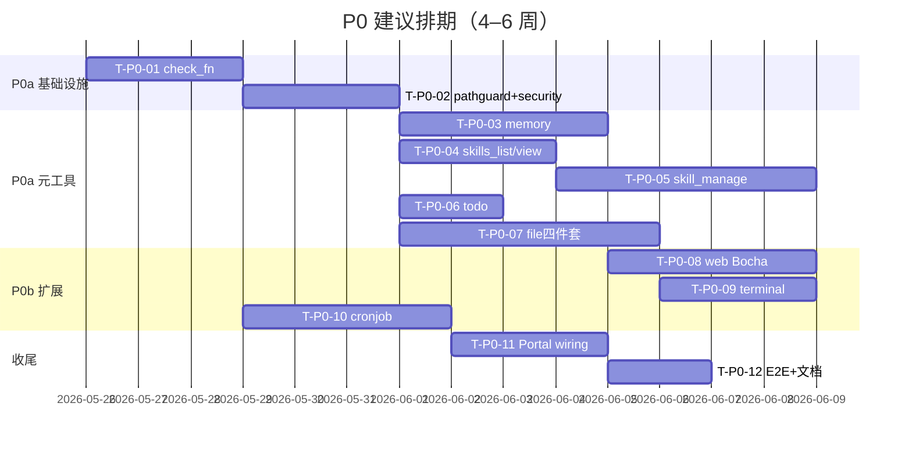

# Hermes 能力差距 — 开发任务拆分（Master Plan）

> **For agentic workers:** REQUIRED SUB-SKILL: Use superpowers:subagent-driven-development (recommended) or superpowers:executing-plans to implement this plan task-by-task. P0 细粒度步骤见 [`2026-05-25-hermes-capability-gap-p0.md`](./2026-05-25-hermes-capability-gap-p0.md)。

**Goal:** 按 spec v0.4 将 Sixath Agent 运行时对齐 Hermes 核心元工具与工程化能力，P0 交付「记记忆 → 管技能 → 列任务 → 读写文件 → 博查搜索 → 本地 Shell → Agent cron」闭环。

**Architecture:** Framework 实现工具 + 共用基础设施（`check_fn`、`pathguard`、`security`）；Portal `agent_builder.go` wiring + feature flag opt-in；Web 仅 `skill_manage` confirm 需扩展 ConfirmCard。Growth 后台路径复用 `ApplyPatchBatch` / 租约，runtime 与 Worker 并发安全。

**Tech Stack:** Go 1.22+ / `github.com/sixath/framework`、Kratos portal、React 19 / TypeScript（web）、博查 Bocha Web Search API

**Spec:** [`../specs/2026-05-25-hermes-capability-gap-requirements.md`](../specs/2026-05-25-hermes-capability-gap-requirements.md)

---

## 文档结构

| 文档 | 范围 |
|------|------|
| **本文件** | 全阶段任务索引、依赖、排期、P1–P3 backlog |
| [`2026-05-25-hermes-capability-gap-p0.md`](./2026-05-25-hermes-capability-gap-p0.md) | P0 可执行任务（含测试命令与关键代码骨架） |

---

## 依赖与排期总览



**并行建议：** T-P0-03~07 在 T-P0-02 完成后可部分并行（不同开发者）；T-P0-08/09/10 依赖 T-P0-01。

---

## Spec 覆盖映射（P0）

| Spec Epic | 任务 ID | 详细计划 |
|-----------|---------|----------|
| H-P0-0 check_fn | T-P0-01 | p0.md §Task 1 |
| 共用 pathguard + security | T-P0-02 | p0.md §Task 2 |
| H-P0-A memory | T-P0-03 | p0.md §Task 3 |
| H-P0-B skills | T-P0-04 ~ T-P0-06 | p0.md §Task 4–6 |
| H-P0-C todo | T-P0-07 | p0.md §Task 7 |
| H-P0-D file | T-P0-08 | p0.md §Task 8 |
| H-P0-E web | T-P0-09 ~ T-P0-10 | p0.md §Task 9–10 |
| H-P0-F terminal | T-P0-11 | p0.md §Task 11 |
| H-P0-G cronjob | T-P0-12 ~ T-P0-13 | p0.md §Task 12–13 |
| Portal wiring + Web confirm | T-P0-14 ~ T-P0-15 | p0.md §Task 14–15 |
| Release Gate | T-P0-16 | p0.md §Task 16 |

---

## P0 任务清单（摘要）

| ID | 标题 | 需求 ID | 估时 | 依赖 | 交付物 |
|----|------|---------|------|------|--------|
| **T-P0-01** | Tool.CheckFn + ListForAPI + ReActAgent 集成 | H-P0-0* | 2–3d | — | `tool.go`, `registry_api.go`, `react_agent.go` 单测 |
| **T-P0-02** | pathguard + growth/security 共用包 | H-P0-A4, D5, NFR-3/4 | 2d | T-P0-01 | `pathguard.go`, `growth/security.go` |
| **T-P0-03** | memory 写工具 + 索引 Sync | H-P0-A* | 3–4d | T-P0-02 | `memory_tool.go`, Portal RegisterMemoryTools |
| **T-P0-04** | skills_list + skill_view | H-P0-B1/B2 | 2d | T-P0-02 | 扩展 `skills_tool.go` |
| **T-P0-05** | skill_manage 写盘 + 租约 | H-P0-B3/B4/B5/B8 | 3d | T-P0-04 | `skill_manager_tool.go`, 租约单测 |
| **T-P0-06** | skill_manage create/delete confirm | H-P0-B9 | 3d | T-P0-05 | PendingStore, Portal SSE, Web ConfirmCard |
| **T-P0-07** | todo 工具 + ToolsetTodo | H-P0-C* | 1–2d | T-P0-01 | `todo_tool.go`, toolset 更新 |
| **T-P0-08** | read/write/patch/search_files | H-P0-D* | 4–5d | T-P0-02 | `file_tools.go`, pathguard 集成 |
| **T-P0-09** | WebSearchBackend + Bocha 默认 | H-P0-E1/E1a/E3 | 3d | T-P0-01 | `web/backend.go`, `web/bocha.go`, `ssrf.go` |
| **T-P0-10** | web_extract + Tavily 备选 | H-P0-E2/E1b | 2d | T-P0-09 | `web_tools.go`, `web/tavily.go` |
| **T-P0-11** | terminal 前景 + denylist | H-P0-F0/F1 | 2–3d | T-P0-01 | `terminal_tool.go` |
| **T-P0-12** | cronjob 工具 Framework | H-P0-G1/G5/G6 | 2d | T-P0-01 | `cronjob_tool.go` |
| **T-P0-13** | cron Executor metadata + biz 对接 | H-P0-G2/G4 | 2d | T-P0-12 | `executor.go`, CronUsecase 注入 |
| **T-P0-14** | Portal 统一 wiring + feature flags | §14, NFR-8 | 2d | T-P0-03~13 | `*_wiring.go`, `agent_builder.go` |
| **T-P0-15** | toolsets-hermes-mapping 文档更新 | Release Gate | 0.5d | T-P0-14 | `toolsets-hermes-mapping.md` |
| **T-P0-16** | P0 集成/E2E 验收脚本 | §11 | 2d | T-P0-14 | `go test` 集成 + 手动 Chat 清单 |

**P0 合计：** ~32–38 人日（1 人约 6–8 周；2 人并行约 4 周）

---

## P1 任务清单（Epic 级）

| ID | Epic | 需求 ID | 估时 | 依赖 P0 | 说明 |
|----|------|---------|------|---------|------|
| **T-P1-01** | Tool 生命周期 Hook | H-P1-B1/B2 | 1w | T-P0-01 | `hooks.go`，pre/post_tool_call 最小集 |
| **T-P1-02** | delegate_task 单 goal | H-P1-C1/C3/C4 | 1.5w | T-P0-08 | 子 agent 屏蔽表含 cronjob |
| **T-P1-03** | session_search trigram CJK | H-P1-D1 | 3d | — | `sessionsearch/index.go` 第二 FTS 表 |
| **T-P1-04** | session_search LLM 摘要 | H-P1-D2/D4 | 1w | T-P1-03 | Semaphore max 3 + 流式 user 消息索引 |
| **T-P1-05** | Curator stale + usage bump | H-P1-E1/E2/E4 | 1w | T-P0-05 | `usage.go`, curator 30d/90d |
| **T-P1-06** | skill_view usage 计数 | H-P0-B6 | 2d | T-P0-04 | view/use bump |
| **T-P1-07** | load_skill → skill_view 双注册 | H-P0-B7 | 2d | T-P0-04 | alias + telemetry |
| **T-P1-08** | parampolicy + ssh_exec 迁移 | H-P1-F1 | 1w | T-P0-11 | dev-plan §2.5 |
| **T-P1-09** | clarify ↔ ask_user 统一 | H-P1-G1 | 3d | — | alias 或 schema 扩展 |
| **T-P1-10** | todo L2 压缩保留 | H-P0-C4 | 2d | T-P0-07 | `l2_runtime.go` |
| **T-P1-11** | terminal process 后台栈 | H-P0-F2/F3/F4 | 1.5w | T-P0-11 | `process_registry.go` |
| **T-P1-12** | Bocha AI Search 垂直卡 | H-P0-E6 | 1w | T-P0-09 | `bocha_ai_search.go` |
| **T-P1-13** | web LLM 摘要 + http SSRF | H-P0-E4/E5 | 3d | T-P0-10 | |
| **T-P1-14** | PromptBuilder / Runner / 并行 D2 | H-P1-F2/F3/F4 | 2w | T-P1-01 | design-agent-runtime |
| **T-P1-15** | ask_user Layer 3 checkpoint | H-P1-F5 | 2w | — | 独立 spec 执行 |

**P1 合计：** ~8–10 周（可再拆独立 plan）

---

## P2 任务清单（Epic 级 backlog）

| ID | Epic | 需求 ID | 估时 |
|----|------|---------|------|
| T-P2-01 | Gateway WS MVP | H-P2-A1 | 2w |
| T-P2-02 | send_message 工具 | H-P2-A2/A4 | 1.5w |
| T-P2-03 | 首 IM 渠道双向 | H-P2-A3 | 2w |
| T-P2-04 | browser 最小 4 工具 | H-P2-B1 | 2w |
| T-P2-05 | vision_analyze | H-P2-C1 | 1w |
| T-P2-06 | MCP resources/prompts | H-P2-D1/D2 | 1w |
| T-P2-07 | MCP OAuth + 熔断 | H-P2-D3/D4 | 1.5w |
| T-P2-08 | cron deliver 扩展 | H-P0-G3 | 3d |
| T-P2-09 | file patch 语法检查 | H-P0-D7 | 2d |
| T-P2-10 | terminal pty + docker/ssh | H-P0-F5/F6 | 2w |

---

## P3 任务清单（远期 backlog）

| ID | Epic | 需求 ID |
|----|------|---------|
| T-P3-01 | 平台原生工具（Discord/飞书等） | H-P3-A |
| T-P3-02 | Kanban 7 工具 | H-P3-B |
| T-P3-03 | Trajectory + RL | H-P3-C |
| T-P3-04 | CLI/TUI + OpenAI API Server | H-P3-D |
| T-P3-05 | Toolset preset（debugging/safe） | H-P3-E |
| T-P3-06 | browser 全栈 10+CDP | H-P2-B2/B3 |
| T-P3-07 | Skills Hub | H-P1-E6 |
| T-P3-08 | Shell Hook | H-P1-B4 |

---

## 跨层文件责任（P0 新建/修改）

| 层 | 新建 | 修改 |
|----|------|------|
| **framework/tool** | `registry_api.go`, `pathguard.go`, `memory_tool.go`, `skill_manager_tool.go`, `todo_tool.go`, `file_tools.go`, `web/*`, `ssrf.go`, `web_tools.go`, `terminal_tool.go`, `cronjob_tool.go`, `skill_manage_pending.go` | `tool.go`, `toolset.go`, `skills_tool.go`, `http_tool.go`(P1) |
| **framework/growth** | `security.go` | `applier.go`(可选抽取) |
| **framework/agent** | — | `react_agent.go` |
| **framework/memorysearch** | — | manager Sync hook |
| **portal/internal/chat** | `*_wiring.go`, `skill_manage_confirm.go` | `agent_builder.go` |
| **portal/internal/service** | — | `chat_stream.go`, `chat.go` |
| **portal/internal/cron** | — | `executor.go` |
| **web** | — | `client.ts`, ConfirmCard 组件 |

---

## 验收检查表（Release Gate 对应）

复制到 PR / 里程碑：

```markdown
### P0 Release Checklist
- [ ] T-P0-01: 无 BOCHA_API_KEY 时 web_search 不在 schema
- [ ] T-P0-03: memory add → 下轮 memory_search 命中
- [ ] T-P0-06: skill create 未 confirm 不落盘；patch 直写
- [ ] T-P0-05+06: Growth 与 skill_manage 租约单测 PASS
- [ ] T-P0-08: 越界路径 permission 错误
- [ ] T-P0-09: Bocha web_search 返回 ≥1 结果
- [ ] T-P0-11: 本地 git status 不依赖 ssh_exec
- [ ] T-P0-13: Chat 创建 cron → Portal 列表可见；cron 会话禁止嵌套 create
- [ ] T-P0-15: toolsets-hermes-mapping 已更新
```

---

## 执行方式

**Plan 已保存。** 两种执行选项：

1. **Subagent-Driven（推荐）** — 按 `2026-05-25-hermes-capability-gap-p0.md` 逐 Task 派发 subagent，Task 间 review
2. **Inline Execution** — 本会话按 p0.md 批量执行，每 Epic 结束后 checkpoint

建议从 **T-P0-01（check_fn）** 开始，完成后并行 **T-P0-02** 与 **T-P0-07（todo，无 security 依赖可仅依赖 T-P0-01）**。
