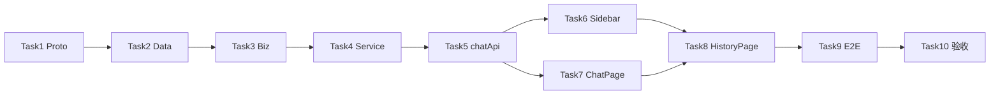

# 会话管理 — Implementation Plan

> **For agentic workers:** REQUIRED SUB-SKILL: Use superpowers:subagent-driven-development (recommended) or superpowers:executing-plans to implement this plan task-by-task. Steps use checkbox (`- [ ]`) syntax for tracking.

**Goal:** 在 Web 控制台完成会话侧栏、历史恢复、全局 `/sessions` FTS 搜索，并通过 Portal 分层 API 暴露 `parent_session_id`、preview 与跨 Agent 列表。

**Architecture:** 扩展 `chat.proto`（`ListSessions` 过滤 + `ListAllSessions` + `SearchSessions`）；Biz/Data MySQL 子查询 preview；Service 层包装 `sessionsearch`；Web 新增 `SessionSidebar` / `SessionHistoryPage`，`ChatPage` 加载 `listMessages` 与自动标题。

**Tech Stack:** Go 1.25、Kratos、GORM MySQL、protobuf、React 19 + Vite 8、Playwright

**Spec:** [2026-05-25-session-management-design.md](../specs/2026-05-25-session-management-design.md)  
**前置:** Portal Chat CRUD、`session_search` R1 已落地、`chat_sessions.parent_session_id` 迁移 005  
**非目标:** 深链页强制侧栏、侧栏树形折叠、Gateway 渠道会话

---

## File Structure

| 文件 | 职责 |
|------|------|
| `portal/api/chat/v1/chat.proto` | 扩展 message/RPC |
| `portal/internal/biz/chat.go` | `CreateSession(parent)`、`ListSessionsFiltered`、`ListAllSessions` |
| `portal/internal/biz/chat_session_search.go` | **新建** — `SearchSessions` 聚合 FTS |
| `portal/internal/biz/chat_test.go` | **新建** — preview 截断、parent 校验 helper 单测 |
| `portal/internal/data/chat_mysql.go` | SQL：`q` 过滤、preview 子查询、`ListAll` JOIN agents |
| `portal/internal/data/chat_mysql_test.go` | **新建**（可选）— integration 需 test DB；或 biz 层 mock repo 单测 |
| `portal/internal/service/chat.go` | 新 RPC handler；`sessionToReply` 扩展字段 |
| `portal/internal/service/chat_sessions_test.go` | **新建** — List/Search handler 单测（mock UC 或 httptest） |
| `web/src/api/client.ts` | `listMessages`、`listSessions` opts、`listAllSessions`、`searchSessions`、`normalizeSession` |
| `web/src/components/SessionSidebar.tsx` | **新建** |
| `web/src/components/SessionSidebar.css` | **新建** |
| `web/src/pages/SessionHistoryPage.tsx` | **新建** |
| `web/src/pages/SessionHistoryPage.css` | **新建** |
| `web/src/pages/ChatHome.tsx` | 三栏布局 + 挂侧栏 |
| `web/src/pages/ChatHome.css` | 侧栏宽度、flex |
| `web/src/pages/ChatPage.tsx` | `listMessages`、自动标题、切换 abort |
| `web/src/App.tsx` | `/sessions` 路由 + NavLink |
| `web/e2e/helpers/mock-api.ts` | chat session mock helpers |
| `web/e2e/session-sidebar.spec.ts` | **新建** |
| `web/e2e/session-history.spec.ts` | **新建** |

**不改:** `framework/sessionsearch/*`（仅调用）、`ChatPage` 流式 SSE 协议

---

## 常量（写死）

```go
const (
    sessionPreviewMaxRunes = 120
    sessionAutoTitleMaxRunes = 30
    defaultSessionTitle = "新对话"
    listSessionsDefaultPageSize = 50
    searchSessionsDefaultLimit = 20
    searchSessionsMaxLimit = 50
)
```

```typescript
// web/src/api/client.ts
export const DEFAULT_SESSION_TITLE = '新对话'
export const SESSION_LIST_PAGE_SIZE = 50
```

---

### Task 1: Proto 扩展 + `make api`

**Files:**
- Modify: `portal/api/chat/v1/chat.proto`
- Regenerate: `portal/api/chat/v1/chat*.pb.go`（via `make api`）

- [ ] **Step 1: 编辑 `chat.proto`**

在 `SessionReply` 增加字段 7–9：`parent_session_id`、`preview`、`agent_name`（optional string）。

`ListSessionsRequest` 增加：`optional string q = 4;`、`optional bool include_preview = 5;`

`CreateSessionRequest` 增加：`optional string parent_session_id = 3;`

新增 messages + RPC（路径见 spec §2.2）：

```protobuf
message ListAllSessionsRequest {
  int32 page = 1;
  int32 page_size = 2;
  optional bool include_preview = 3;
}
message ListAllSessionsReply {
  api.common.BaseResponse ret = 1;
  repeated SessionReply items = 2;
  int32 total = 3;
}
message SearchSessionsRequest {
  string query = 1;
  optional string agent_id = 2;
  int32 limit = 3;
}
message SearchHitReply {
  string session_id = 1;
  string root_session_id = 2;
  string agent_id = 3;
  string agent_name = 4;
  string title = 5;
  string preview = 6;
  repeated string matched_snippets = 7;
  string updated_at = 8;
}
message SearchSessionsReply {
  api.common.BaseResponse ret = 1;
  repeated SearchHitReply items = 2;
}

rpc ListAllSessions (ListAllSessionsRequest) returns (ListAllSessionsReply) {
  option (google.api.http) = { get: "/api/v1/sessions" };
}
rpc SearchSessions (SearchSessionsRequest) returns (SearchSessionsReply) {
  option (google.api.http) = { get: "/api/v1/sessions/search" };
}
```

- [ ] **Step 2: 生成代码**

```powershell
cd d:\workspace\github\sixath\portal
make api
```

Expected: `chat.pb.go` / `chat_http.pb.go` 含新类型；编译无 duplicate route。

- [ ] **Step 3: 编译门禁**

```powershell
cd d:\workspace\github\sixath\portal
& "C:\Program Files\Go\bin\go.exe" build ./...
```

Expected: 可能 FAIL（handler 未实现）— 记录缺失方法，Task 2–3 补齐。

---

### Task 2: Data 层 — 过滤、preview、ListAll

**Files:**
- Modify: `portal/internal/biz/chat.go` — `ChatSessionRepo` 接口扩展
- Modify: `portal/internal/data/chat_mysql.go`

- [ ] **Step 1: 扩展 `ChatSessionRepo` 接口**

```go
// portal/internal/biz/chat.go
type ChatSessionRepo interface {
    Create(ctx context.Context, agentID, title, parentSessionID string) (*ChatSession, error)
    // ...
    ListByAgent(ctx context.Context, agentID string, q string, page, pageSize int32, includePreview bool) ([]*ChatSession, int, error)
    ListAll(ctx context.Context, page, pageSize int32, includePreview bool) ([]*ChatSession, int, error)
}
```

- [ ] **Step 2: `Create` 写入 `parent_session_id`**

`chat_mysql.go` `Create` 接受 `parentSessionID`，写入 `model.ChatSession.ParentSessionID`。

- [ ] **Step 3: `ListByAgent` + `q` + preview**

- `ORDER BY updated_at DESC`（保持）
- `q != ""`：`WHERE agent_id = ? AND (title LIKE ? OR id IN (SELECT session_id FROM chat_messages WHERE content LIKE ? LIMIT 500))` — 简化可用仅 title LIKE MVP；spec 允许首期 title-only，消息 LIKE 为增强
- `includePreview`：对每个 session 查最后一条 user/assistant（子查询或应用层批量 — 推荐单 SQL 窗口函数若 MySQL 8+，否则 loop + `LastMessageForSession` helper）

Preview 截断 helper：

```go
func truncatePreview(s string, max int) string {
    r := []rune(strings.TrimSpace(s))
    if len(r) <= max { return string(r) }
    return string(r[:max]) + "…"
}
```

- [ ] **Step 4: `ListAll` JOIN agents**

```sql
SELECT cs.*, a.name AS agent_name FROM chat_sessions cs
JOIN agents a ON a.id = cs.agent_id
ORDER BY cs.updated_at DESC LIMIT ? OFFSET ?
```

Biz `ChatSession` 增加 `AgentName string`（仅 ListAll 填充）或单独 `ChatSessionWithAgent` 类型。

- [ ] **Step 5: 运行 data 相关编译**

```powershell
cd portal
& "C:\Program Files\Go\bin\go.exe" build ./internal/data/...
```

---

### Task 3: Biz — CreateSession(parent) + SearchSessions

**Files:**
- Create: `portal/internal/biz/chat_session_search.go`
- Modify: `portal/internal/biz/chat.go`
- Create: `portal/internal/biz/chat_test.go`

- [ ] **Step 1: 单测 parent 校验（先写失败测试）**

```go
func TestCreateSession_InvalidParent(t *testing.T) {
    // mock repo: parent agent mismatch → error
}
```

- [ ] **Step 2: `CreateSession` 扩展**

```go
func (uc *ChatUsecase) CreateSession(ctx context.Context, agentID, title, parentSessionID string) (*ChatSession, error) {
    if parentSessionID != "" {
        parent, err := uc.sessionRepo.GetByID(ctx, parentSessionID)
        if err != nil { return nil, err }
        if parent.AgentID != agentID {
            return nil, ErrInvalidParentSession // 新建 biz 错误
        }
    }
    // ...
}
```

- [ ] **Step 3: `SearchSessions` usecase**

`chat_session_search.go`：

- 依赖 `AgentRepo.List` + `sessionsearch.GetSessionSearchManager(cfg, agentID)`
- `agentIDFilter` 非空只搜一个；否则遍历 agents（cap 100 agents MVP）
- 合并 hits，按 `UpdatedAt` 排序，截断 `limit`
- 映射为 `SearchHit` biz 类型

- [ ] **Step 4: 单测 `truncatePreview`**

```powershell
cd portal
go test ./internal/biz/... -run TestTruncate -v -count=1
```

---

### Task 4: Service 层 — 实现新 RPC + 扩展 ListSessions

**Files:**
- Modify: `portal/internal/service/chat.go`
- Create: `portal/internal/service/chat_sessions_test.go`

- [ ] **Step 1: 更新 `sessionToReply`**

```go
func sessionToReply(s *biz.ChatSession) *chatv1.SessionReply {
    reply := &chatv1.SessionReply{ /* existing */ }
    if s.ParentSessionID != "" {
        reply.ParentSessionId = &s.ParentSessionID
    }
    if s.Preview != "" {
        reply.Preview = &s.Preview
    }
    if s.AgentName != "" {
        reply.AgentName = &s.AgentName
    }
    return reply
}
```

（`ChatSession` biz 增加 `Preview`、`AgentName` 字段。）

- [ ] **Step 2: `CreateSession` / `ListSessions` 接线**

- `CreateSession` → `chatUC.CreateSession(ctx, agentID, title, req.GetParentSessionId())`
- `ListSessions` → `ListByAgent(..., req.GetQ(), includePreview)`

- [ ] **Step 3: `ListAllSessions` / `SearchSessions` handler**

`ListAllSessions`：分页默认 page=1, page_size=20, max 100。

`SearchSessions`：`query` 必填；`limit` clamp；FTS disabled 返回空 items + ret.message。

- [ ] **Step 4: 注册 HTTP（`make api` 已生成，确认 wire）**

检查 `portal/internal/server` 或 wire 是否自动注册 `ChatService` — 沿用现有 Chat 注册，无需新 service。

- [ ] **Step 5: 全量测试**

```powershell
cd portal
go test ./... -count=1
go build ./cmd/backend/...
```

Expected: PASS

---

### Task 5: Web `chatApi` + normalize

**Files:**
- Modify: `web/src/api/client.ts`

- [ ] **Step 1: 类型扩展**

```typescript
export interface ChatSession {
  id: string
  agent_id: string
  title: string
  created_at: string
  updated_at: string
  parent_session_id?: string
  preview?: string
  agent_name?: string
}

export interface SessionSearchHit {
  session_id: string
  root_session_id: string
  agent_id: string
  agent_name: string
  title: string
  preview: string
  matched_snippets?: string[]
  updated_at: string
}
```

- [ ] **Step 2: `normalizeSession`**

camelCase ↔ snake_case，与 `normalizeAgent` 同模式。

- [ ] **Step 3: API 方法**

```typescript
listMessages: async (sessionId: string, limit = 100) => { /* GET /sessions/:id/messages */ }
listSessions: async (agentId: string, opts?: { page?, pageSize?, q?, includePreview? }) => { /* query q */ }
listAllSessions: async (opts?: { page?, pageSize? }) => { /* GET /api/v1/sessions */ }
searchSessions: async (opts: { query: string; agentId?: string; limit?: number }) => { /* GET /api/v1/sessions/search */ }
createSession: async (agentId, title?, parentSessionId?) => { /* body parent_session_id */ }
```

- [ ] **Step 4: 本地 typecheck**

```powershell
cd d:\workspace\github\sixath\web
npm run build
```

---

### Task 6: `SessionSidebar` 组件

**Files:**
- Create: `web/src/components/SessionSidebar.tsx`
- Create: `web/src/components/SessionSidebar.css`
- Modify: `web/src/pages/ChatHome.tsx`
- Modify: `web/src/pages/ChatHome.css`

- [ ] **Step 1: 实现侧栏**

Props: `agentId`, `sessionId`, `onSelect(sessionId?)`, `onNewSession()`.

行为：
- `agentId` 空 → 占位文案
- `useEffect` load `listSessions(agentId, { pageSize: 50, includePreview: true })`
- 搜索框 debounce 300ms → 带 `q` 重载
- 列表项 `data-testid={`session-item-${id}`}`
- ⋯ 菜单：重命名（prompt 或 inline）、删除（confirm）
- `parent_session_id` → 显示「分支」badge

- [ ] **Step 2: `ChatHome` 布局**

```tsx
<div className="chat-home-layout-with-sidebar">
  <SessionSidebar agentId={agentId} sessionId={sessionId} onSelect={...} onNewSession={...} />
  <div className="chat-home-content"><ChatPage ... /></div>
</div>
```

Agent 顶栏保留；侧栏 240px，`min-width: 200px`，可折叠按钮（localStorage 可选）。

- [ ] **Step 3: 新建会话**

`onNewSession` → `createSession` → `updateUrl(agentId, newId)`

---

### Task 7: `ChatPage` 历史加载 + 自动标题

**Files:**
- Modify: `web/src/pages/ChatPage.tsx`

- [ ] **Step 1: `sessionId` 变化加载历史**

```typescript
useEffect(() => {
  if (!sessionId) { setMessages([]); return }
  let cancelled = false
  setLoadingHistory(true)
  chatApi.listMessages(sessionId)
    .then((res) => { if (!cancelled) setMessages(res.items.map(normalizeMessage)) })
    .catch((e) => { if (!cancelled) setError(...) })
    .finally(() => { if (!cancelled) setLoadingHistory(false) })
  return () => { cancelled = true }
}, [sessionId])
```

- [ ] **Step 2: 切换 session 时 abort stream**

在 `sessionId` effect 开头：`abortRef.current?.abort()`。

- [ ] **Step 3: 自动标题**

`sendMessageStream` `onDone` 回调：

```typescript
if (agent && sessionId && messages.filter(m => m.role === 'user').length === 1) {
  const sess = await chatApi.getSession(sessionId)
  if (sess.title === DEFAULT_SESSION_TITLE) {
    const autoTitle = content.slice(0, 30).replace(/\s+/g, ' ').trim()
    if (autoTitle) await chatApi.updateSession(sessionId, autoTitle)
  }
}
```

（以首条 user 的 `content` 为准，非 display 文案。）

- [ ] **Step 4: 手动验证**

启动 portal + web，发一条消息 → F5 → 历史仍在。

---

### Task 8: `SessionHistoryPage` + 导航

**Files:**
- Create: `web/src/pages/SessionHistoryPage.tsx`
- Create: `web/src/pages/SessionHistoryPage.css`
- Modify: `web/src/App.tsx` — route + NavLink + Breadcrumb

- [ ] **Step 1: 历史页**

- 无 query：`listAllSessions` 分页 + 「加载更多」
- 有 query：`searchSessions` debounce 300ms
- Agent 筛选下拉（可选）→ `searchSessions({ agentId })`
- 行操作「打开」→ `navigate('/?agent=' + id + '&session=' + sid)`
- `data-testid="sessions-history-search"`、`sessions-open-{id}`

- [ ] **Step 2: 路由与面包屑**

```tsx
<Route path="/sessions" element={<SessionHistoryPage />} />
<NavLink to="/sessions">会话历史</NavLink>
```

Breadcrumb：`segments[0] === 'sessions'` → `会话历史`

---

### Task 9: Playwright E2E

**Files:**
- Modify: `web/e2e/helpers/mock-api.ts`
- Create: `web/e2e/session-sidebar.spec.ts`
- Create: `web/e2e/session-history.spec.ts`

- [ ] **Step 1: mock helpers**

```typescript
export const sampleSession = { id: 'sess-1', agent_id: 'agent-1', title: '测试对话', ... }
export async function mockChatSessions(page, agentId, items) { /* GET .../agents/:id/sessions */ }
export async function mockListMessages(page, sessionId, items) { /* GET .../messages */ }
export async function mockListAllSessions(page, items) { /* GET /api/v1/sessions */ }
export async function mockSearchSessions(page, items) { /* GET /api/v1/sessions/search */ }
```

- [ ] **Step 2: `session-sidebar.spec.ts`（≥4 用例）**

1. 选 Agent 后列表展示  
2. 搜索过滤（mock 不同 q 返回）  
3. 新建会话切换 URL  
4. 删除会话确认  

- [ ] **Step 3: `session-history.spec.ts`（≥3 用例）**

1. 空搜索列表  
2. FTS 搜索展示 hit  
3. 打开跳转 `/?agent=&session=`  

- [ ] **Step 4: 运行 mock E2E**

```powershell
cd web
npm run test:e2e
```

Expected: 全部 PASS（含既有 runtime-tools 用例）

---

### Task 10: 验收闸门

- [ ] **Portal**

```powershell
cd portal
go test ./... -count=1
go build ./cmd/backend/...
```

- [ ] **Web**

```powershell
cd web
npm run build
npm run test:e2e
```

- [ ] **DoD 对照 spec §6.3** — 逐项勾选

- [ ] **（可选）用户要求时 commit**

```text
feat(portal,web): session management sidebar, history page, and chat APIs
```

---

## 实施顺序与依赖



**并行建议:** Task 6 + Task 7 可并行（不同文件）；Task 2–4 须串行。

---

## 风险速查

| 风险 | 任务中的处理 |
|------|----------------|
| `make api` Windows 环境 | 用 WSL 或现有 portal CI 命令；失败时手跑 `protoc` 同 Makefile |
| Preview N+1 | Task 2 优先批量子查询；page_size≤50 |
| FTS 全 agent 慢 | Task 3 cap agents；Search limit≤50 |
| 深链无侧栏 | spec 已接受；Task 8 打开走首页 query |

---

## 修订记录

| 版本 | 日期 | 说明 |
|------|------|------|
| 0.1 | 2026-05-25 | 初稿，对应 spec 0.1 |
