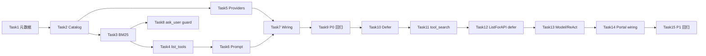

# 工具发现与渐进式披露 — Implementation Plan

> **For agentic workers:** REQUIRED SUB-SKILL: Use superpowers:subagent-driven-development (recommended) or superpowers:executing-plans to implement this plan task-by-task. Steps use checkbox (`- [ ]`) syntax for tracking.

**Goal:** 为 Sixath Agent 建立泛化的 ToolCatalog 工具发现体系（P0）与 tool_search 渐进式披露（P1），解决「工具多了找不到」及 ask_user 冗余索取凭据问题。

**Architecture:** 每轮对话从 Registry 无状态构建 ToolCatalog；CatalogProvider 插件 enrich 绑定元数据；P0 通过 `list_tools` + 置顶 prompt + ask_user BM25 守卫暴露能力；P1 对 deferrable toolset 启用 Hermes 式桥接三件套（`tool_search` / `tool_describe` / `tool_call`），`ListForAPI` 仅 inline 非 defer 工具。

**Tech Stack:** Go 1.22+、现有 `framework/tool` Registry、Portal `chat` wiring、OpenAI tools schema

**Spec:** [`../specs/2026-06-05-tool-discovery-design.md`](../specs/2026-06-05-tool-discovery-design.md)

---

## File Structure

| 文件 | 职责 |
|------|------|
| `framework/tool/tool.go` | 扩展 `SearchHints` / `AlwaysLoad` / `Bindings`；`ContextKeyToolCatalog` |
| `framework/tool/catalog.go` | `ToolCatalogEntry`、`ToolCatalog`、`CatalogProvider`、`BuildToolCatalog` |
| `framework/tool/catalog_hints.go` | toolset 默认 SearchHints；`BuiltinHintProvider` |
| `framework/tool/catalog_search.go` | 内联 BM25；`SearchCatalog`；`MatchAskUserIntent` |
| `framework/tool/list_tools.go` | `list_tools` 工具注册与执行 |
| `framework/tool/mcp_catalog.go` | MCP 工具注册时 enrich + `McpCatalogProvider` |
| `framework/tool/defer.go` | `DeferConfig`、`ShouldDefer`（P1） |
| `framework/tool/tool_search.go` | 桥接三件套 + 激活门控（P1） |
| `framework/tool/registry_api.go` | `ListForAPIWithDefer`、`ListDeferred`（P1） |
| `portal/internal/chat/catalog_prompt.go` | `FormatToolCatalogPrompt` |
| `portal/internal/chat/catalog_wiring.go` | 组装 catalog、注册 `list_tools`、注入 context |
| `portal/internal/chat/datasource_catalog.go` | `DatasourceCatalogProvider` |
| `portal/internal/chat/channel_catalog.go` | `ChannelCatalogProvider` |
| `portal/internal/chat/skills_catalog.go` | `SkillsCatalogProvider` |
| `portal/internal/chat/web_catalog.go` | `WebToolsCatalogProvider` |
| `portal/internal/chat/tool_search_wiring.go` | P1 tool_search 条件注册（P1） |
| `portal/internal/service/chat.go` | prompt 顺序 + runCtx 注入 |
| `framework/tool/ask_user.go` | ask_user BM25 守卫 |
| `framework/model/openai_tools.go` | 使用 `ListForAPIWithDefer`（P1） |
| `framework/agent/react_agent.go` | `tool_call` 解包路由（P1） |

---

## Phase P0 — 统一工具目录（预计 3–4 天）

### Task 1: Tool 元数据扩展

**Files:**
- Modify: `framework/tool/tool.go`
- Test: `framework/tool/catalog_test.go`（同 Task 2 创建）

- [ ] **Step 1: 扩展 Tool 结构与 context key**

在 `framework/tool/tool.go` 的 `Tool` 增加：

```go
// SearchHints 额外 BM25 检索词（中/英）；Register 时可为空，由 BuiltinHintProvider 补充。
SearchHints []string
// AlwaysLoad 为 true 时强制 inline，忽略 defer 策略（P1 使用，P0 可先定义）。
AlwaysLoad bool
// Bindings 运行时绑定摘要，供 catalog / prompt 展示。
Bindings map[string]string
```

新增：

```go
const ContextKeyToolCatalog = "tool_catalog"
```

- [ ] **Step 2: Register 时复制新字段**

确保 `Registry.Register` 将 `SearchHints`、`AlwaysLoad`、`Bindings` 原样存入 map（与现有字段一致，无特殊逻辑）。

- [ ] **Step 3: 运行现有测试确认无回归**

```bash
cd d:/workspace/github/sixath/framework && go test ./tool/... -count=1
```

Expected: PASS

- [ ] **Step 4: Commit**

```bash
git add framework/tool/tool.go
git commit -m "feat(tool): add SearchHints, AlwaysLoad, Bindings metadata fields"
```

---

### Task 2: Catalog 核心 + BuiltinHintProvider

**Files:**
- Create: `framework/tool/catalog.go`
- Create: `framework/tool/catalog_hints.go`
- Create: `framework/tool/catalog_test.go`

- [ ] **Step 1: 写失败单测**

`framework/tool/catalog_test.go`:

```go
func TestBuildToolCatalog_AvailableOnly(t *testing.T) {
	reg := NewRegistry()
	_ = reg.Register(Tool{
		Name: "alpha", Description: "does alpha", Toolset: ToolsetWeb,
		Execute: func(ctx context.Context, params map[string]any) (any, error) { return "ok", nil },
	})
	_ = reg.Register(Tool{
		Name: "gated", Description: "gated", Toolset: ToolsetWeb,
		CheckFn: func(ctx context.Context) error { return errors.New("no key") },
		Execute: func(ctx context.Context, params map[string]any) (any, error) { return nil, nil },
	})
	cat := BuildToolCatalog(context.Background(), reg)
	if len(cat.Entries) != 1 {
		t.Fatalf("want 1 available entry, got %d", len(cat.Entries))
	}
	if cat.Entries[0].Name != "alpha" {
		t.Fatalf("want alpha, got %s", cat.Entries[0].Name)
	}
}

func TestBuildToolCatalog_BuiltinHints(t *testing.T) {
	reg := NewRegistry()
	_ = reg.Register(Tool{
		Name: "web_search", Description: "search web", Toolset: ToolsetWeb,
		Execute: func(ctx context.Context, params map[string]any) (any, error) { return nil, nil },
	})
	cat := BuildToolCatalog(context.Background(), reg, &BuiltinHintProvider{})
	found := false
	for _, e := range cat.Entries {
		if e.Name == "web_search" && len(e.SearchHints) > 0 {
			found = true
		}
	}
	if !found {
		t.Fatal("web_search should have builtin search hints")
	}
}
```

- [ ] **Step 2: 运行确认失败**

```bash
cd d:/workspace/github/sixath/framework && go test ./tool/... -run TestBuildToolCatalog -v
```

Expected: FAIL（`BuildToolCatalog` undefined）

- [ ] **Step 3: 实现 catalog.go**

```go
type ToolCatalogEntry struct {
	Name, Toolset, Description string
	SearchHints                []string
	Bindings                   map[string]string
	Available, Deferred        bool
	RelatedTools               []string
}

type ToolCatalog struct {
	Entries     []ToolCatalogEntry
	GeneratedAt time.Time
}

type CatalogProvider interface {
	Enrich(ctx context.Context, entries []ToolCatalogEntry) []ToolCatalogEntry
}

func BuildToolCatalog(ctx context.Context, reg *Registry, providers ...CatalogProvider) ToolCatalog {
	// 1. reg.List() + CheckFn → entries
	// 2. 依次 providers.Enrich
	// 3. BuiltinHintProvider（若未在 providers 中则最后调用）
	// 4. Deferred = false（P0）；P1 Task 8 改为 ShouldDefer
}
```

- [ ] **Step 4: 实现 catalog_hints.go**

```go
var defaultToolsetHints = map[string][]string{
	ToolsetFile:          {"文件", "读写", "SQL", "查询", "表", "数据库"},
	ToolsetWeb:           {"搜索", "网页", "抓取", "联网"},
	ToolsetSkills:        {"技能", "skill", "脚本"},
	ToolsetMemory:        {"记忆", "历史", "会话"},
	ToolsetSessionSearch: {"跨会话", "搜索", "历史对话"},
	ToolsetTerminal:      {"SSH", "终端", "远程", "命令"},
	ToolsetCronjob:       {"定时", "计划任务", "cron"},
	ToolsetTodo:          {"待办", "任务列表"},
	ToolsetCore:          {"用户输入", "确认", "工具目录"},
}

type BuiltinHintProvider struct{}

func (p *BuiltinHintProvider) Enrich(ctx context.Context, entries []ToolCatalogEntry) []ToolCatalogEntry {
	// 合并 defaultToolsetHints + entry.SearchHints（去重）
}
```

- [ ] **Step 5: 运行测试**

```bash
cd d:/workspace/github/sixath/framework && go test ./tool/... -run TestBuildToolCatalog -v
```

Expected: PASS

- [ ] **Step 6: Commit**

```bash
git add framework/tool/catalog.go framework/tool/catalog_hints.go framework/tool/catalog_test.go
git commit -m "feat(tool): add ToolCatalog builder and builtin hint provider"
```

---

### Task 3: BM25 搜索 + ask_user 意图匹配

**Files:**
- Create: `framework/tool/catalog_search.go`
- Create: `framework/tool/catalog_search_test.go`

- [ ] **Step 1: 写失败单测**

```go
func TestSearchCatalog_HitsExecuteRead(t *testing.T) {
	cat := ToolCatalog{Entries: []ToolCatalogEntry{{
		Name: "execute_read", Toolset: ToolsetFile, Available: true,
		SearchHints: []string{"mysql", "查询", "数据库"},
		Description: "Run read-only SQL",
	}}}
	results := SearchCatalog(cat, "mysql group by status", 5)
	if len(results) == 0 || results[0].Name != "execute_read" {
		t.Fatalf("expected execute_read top hit, got %v", results)
	}
}

func TestMatchAskUserIntent_BlocksCredentialAsk(t *testing.T) {
	cat := ToolCatalog{Entries: []ToolCatalogEntry{{
		Name: "execute_read", Available: true,
		SearchHints: []string{"mysql", "数据库", "host", "password"},
	}}}
	match, ok := MatchAskUserIntent(cat, AskUserGuardConfig{MinScore: 2.0}, "请提供 MySQL host 和 password", "text")
	if !ok || match.Name != "execute_read" {
		t.Fatal("expected block with execute_read redirect")
	}
}

func TestMatchAskUserIntent_ExemptConfirm(t *testing.T) {
	cat := ToolCatalog{Entries: []ToolCatalogEntry{{
		Name: "execute_read", Available: true, SearchHints: []string{"mysql"},
	}}}
	_, ok := MatchAskUserIntent(cat, AskUserGuardConfig{ExemptKinds: []string{"confirm"}}, "是否继续？", "confirm")
	if ok {
		t.Fatal("confirm kind should be exempt")
	}
}
```

- [ ] **Step 2: 实现 BM25**

`catalog_search.go` 内联 BM25（参考 Hermes `tool_search.py` L261-399）：

- `tokenize(s string) []string` — 小写、按非字母数字切分、snake_case / CamelCase 拆词
- `buildDoc(entry ToolCatalogEntry) string` — name + description + hints + bindings 值
- `SearchCatalog(cat, query, limit) []ToolCatalogEntry`
- `MatchAskUserIntent(cat, cfg, prompt, kind) (ToolCatalogEntry, bool)`

- [ ] **Step 3: 运行测试**

```bash
cd d:/workspace/github/sixath/framework && go test ./tool/... -run "TestSearchCatalog|TestMatchAskUser" -v
```

Expected: PASS

- [ ] **Step 4: Commit**

```bash
git add framework/tool/catalog_search.go framework/tool/catalog_search_test.go
git commit -m "feat(tool): add BM25 catalog search and ask_user intent matcher"
```

---

### Task 4: list_tools 工具

**Files:**
- Create: `framework/tool/list_tools.go`
- Create: `framework/tool/list_tools_test.go`

- [ ] **Step 1: 写失败单测**

```go
func TestListTools_ExecuteAll(t *testing.T) {
	reg := NewRegistry()
	_ = reg.Register(Tool{Name: "web_search", Toolset: ToolsetWeb, Description: "search",
		Execute: func(ctx context.Context, params map[string]any) (any, error) { return nil, nil }})
	cat := BuildToolCatalog(context.Background(), reg, &BuiltinHintProvider{})
	_ = RegisterListToolsTool(reg, nil)
	ctx := context.WithValue(context.Background(), ContextKeyToolCatalog, cat)
	tool, ok := reg.Get("list_tools")
	if !ok {
		t.Fatal("list_tools not registered")
	}
	out, err := tool.Execute(ctx, map[string]any{})
	if err != nil {
		t.Fatal(err)
	}
	s, ok := out.(string)
	if !ok || !strings.Contains(s, "web_search") {
		t.Fatalf("expected catalog json with web_search, got %v", out)
	}
}

func TestListTools_QueryFilter(t *testing.T) {
	// 注册 web_search + send_to_wecom，query=企微 → 仅命中 send_to_wecom
}
```

- [ ] **Step 2: 实现 RegisterListToolsTool**

```go
func RegisterListToolsTool(reg *Registry, cfg *ListToolsConfig) error {
	return reg.Register(Tool{
		Name:        "list_tools",
		Description: "List or search tools available to this agent. Use before guessing tool names.",
		Toolset:     ToolsetCore,
		AlwaysLoad:  true,
		Parameters: map[string]any{
			"type": "object",
			"properties": map[string]any{
				"query":   map[string]any{"type": "string"},
				"toolset": map[string]any{"type": "string"},
			},
		},
		Execute: buildListToolsExecute(cfg),
	})
}
```

- Execute：从 `ContextKeyToolCatalog` 读取；支持 `query` BM25 过滤、`toolset` 过滤；返回 JSON 字符串。

- [ ] **Step 3: 运行测试**

```bash
cd d:/workspace/github/sixath/framework && go test ./tool/... -run TestListTools -v
```

Expected: PASS

- [ ] **Step 4: Commit**

```bash
git add framework/tool/list_tools.go framework/tool/list_tools_test.go
git commit -m "feat(tool): add list_tools catalog query tool"
```

---

### Task 5: CatalogProviders（Portal + MCP）

**Files:**
- Create: `portal/internal/chat/datasource_catalog.go`
- Create: `portal/internal/chat/channel_catalog.go`
- Create: `portal/internal/chat/skills_catalog.go`
- Create: `portal/internal/chat/web_catalog.go`
- Create: `framework/tool/mcp_catalog.go`
- Test: `portal/internal/chat/catalog_providers_test.go`

- [ ] **Step 1: 写 provider 单测**

```go
func TestDatasourceCatalogProvider_EnrichesBindings(t *testing.T) {
	p := &DatasourceCatalogProvider{Bindings: []DatasourceBinding{{
		ID: "prod_mysql", Type: "mysql", DBName: "archive", Available: true,
	}}}
	entries := []tool.ToolCatalogEntry{{Name: "execute_read", Toolset: tool.ToolsetFile, Available: true}}
	out := p.Enrich(context.Background(), entries)
	// assert Bindings["datasource_id"] == "prod_mysql"
	// assert SearchHints contains "mysql", "archive"
}
```

- [ ] **Step 2: 实现 DatasourceCatalogProvider**

对 `list_tables` / `describe_table` / `execute_read` 注入：

```go
Bindings: {"datasource_id": b.ID, "type": b.Type, "db_name": b.DBName}
SearchHints: []string{b.Type, b.DBName, "mysql", "数据库", "SQL"}
```

- [ ] **Step 3: 实现 ChannelCatalogProvider**

输入：`channelID`, `channelType`（wecom/wxpusher/webhook）；对 `send_to_wecom` 等出站工具 enrich。

- [ ] **Step 4: 实现 SkillsCatalogProvider**

从 `*skills.Index` 读取已安装 skill 名/描述，对 `load_skill` / `skills_list` enrich。

- [ ] **Step 5: 实现 WebToolsCatalogProvider**

从 `WebSettingsSnapshot()` 注入 backend 名到 `web_search` / `web_extract`。

- [ ] **Step 6: 实现 McpCatalogProvider + MCP 注册 enrich**

在 `framework/tool/mcp.go` 注册 MCP 工具时设置：

```go
Bindings:    map[string]string{"mcp_server": serverName},
SearchHints: splitMcpName(serverName, toolName),
```

`McpCatalogProvider.Enrich` 对已有 `Bindings["mcp_server"]` 的条目补充 server 拆词。

- [ ] **Step 7: 运行测试**

```bash
cd d:/workspace/github/sixath/framework && go test ./tool/... -run McpCatalog -v
cd d:/workspace/github/sixath/portal && go test ./internal/chat/... -run CatalogProvider -v
```

Expected: PASS

- [ ] **Step 8: Commit**

```bash
git add framework/tool/mcp_catalog.go framework/tool/mcp.go \
  portal/internal/chat/datasource_catalog.go portal/internal/chat/channel_catalog.go \
  portal/internal/chat/skills_catalog.go portal/internal/chat/web_catalog.go \
  portal/internal/chat/catalog_providers_test.go
git commit -m "feat(tool): add CatalogProviders for datasource, channel, skills, web, mcp"
```

---

### Task 6: FormatToolCatalogPrompt

**Files:**
- Create: `portal/internal/chat/catalog_prompt.go`
- Create: `portal/internal/chat/catalog_prompt_test.go`

- [ ] **Step 1: 写失败单测**

```go
func TestFormatToolCatalogPrompt_GroupsByToolset(t *testing.T) {
	cat := tool.ToolCatalog{Entries: []tool.ToolCatalogEntry{
		{Name: "execute_read", Toolset: tool.ToolsetFile, Available: true,
			Bindings: map[string]string{"datasource_id": "prod_mysql", "type": "mysql"}},
		{Name: "send_to_wecom", Toolset: tool.ToolsetCore, Available: true,
			Bindings: map[string]string{"channel_type": "wecom"}},
	}}
	p := FormatToolCatalogPrompt(cat)
	if !strings.Contains(p, "prod_mysql") || !strings.Contains(p, "send_to_wecom") {
		t.Fatalf("prompt missing bindings: %s", p)
	}
}

func TestFormatToolCatalogPrompt_SummaryWhenMany(t *testing.T) {
	entries := make([]tool.ToolCatalogEntry, 20)
	for i := range entries {
		entries[i] = tool.ToolCatalogEntry{Name: fmt.Sprintf("tool_%d", i), Toolset: "mcp", Available: true}
	}
	p := FormatToolCatalogPrompt(tool.ToolCatalog{Entries: entries})
	if !strings.Contains(p, "list_tools") {
		t.Fatal("large catalog should reference list_tools")
	}
}
```

- [ ] **Step 2: 实现 FormatToolCatalogPrompt**

规则（spec §6.3）：
- 仅 `Available=true`
- ≤15 条：按 toolset 分组全量
- >15 条：toolset 摘要 + 「用 list_tools 或 tool_search 查询详情」
- 首行：「均已配置就绪，勿向用户索取已有凭据」

- [ ] **Step 3: 运行测试**

```bash
cd d:/workspace/github/sixath/portal && go test ./internal/chat/... -run TestFormatToolCatalogPrompt -v
```

Expected: PASS

- [ ] **Step 4: Commit**

```bash
git add portal/internal/chat/catalog_prompt.go portal/internal/chat/catalog_prompt_test.go
git commit -m "feat(portal): add FormatToolCatalogPrompt for system prompt injection"
```

---

### Task 7: catalog_wiring + chat.go 集成

**Files:**
- Create: `portal/internal/chat/catalog_wiring.go`
- Modify: `portal/internal/service/chat.go`
- Modify: `portal/internal/service/agent.go`（Agent 直连 API 同样集成）

- [ ] **Step 1: 实现 catalog_wiring.go**

```go
type CatalogWiringInput struct {
	Reg            *tool.Registry
	DsBindings     []DatasourceBinding
	WecomChannelID string
	SkillsIdx      *skills.Index
}

func BuildCatalogForAgent(ctx context.Context, in CatalogWiringInput) tool.ToolCatalog {
	providers := []tool.CatalogProvider{
		&DatasourceCatalogProvider{Bindings: in.DsBindings},
	}
	if in.WecomChannelID != "" {
		providers = append(providers, &ChannelCatalogProvider{ChannelID: in.WecomChannelID, ChannelType: "wecom"})
	}
	if in.SkillsIdx != nil {
		providers = append(providers, &SkillsCatalogProvider{Index: in.SkillsIdx})
	}
	providers = append(providers, &WebToolsCatalogProvider{}, &tool.McpCatalogProvider{}, &tool.BuiltinHintProvider{})
	return tool.BuildToolCatalog(ctx, in.Reg, providers...)
}

func RegisterCatalogTools(reg *tool.Registry) error {
	return tool.RegisterListToolsTool(reg, nil)
}
```

- [ ] **Step 2: 修改 chat.go SendMessage / SendMessageStream**

在 `registerWeComToolForAgent` 之后：

```go
catalog := chat.BuildCatalogForAgent(ctx, chat.CatalogWiringInput{
	Reg: reg, DsBindings: dsBindingsFromResult(regResult), /* ... */})
_ = chat.RegisterCatalogTools(reg)
catalog = chat.BuildCatalogForAgent(ctx, ...) // rebuild after list_tools registered
```

调整 `effectivePrompt` 顺序（spec §4.1）：

```go
effectivePrompt := chat.FormatToolCatalogPrompt(catalog)
effectivePrompt = chat.AppendDatasourcePrompt(effectivePrompt, regResult.DatasourcePrompt)
// ... existing chain but base starts from catalog prompt
```

注入 runCtx：

```go
runCtx = context.WithValue(runCtx, tool.ContextKeyToolCatalog, catalog)
```

- [ ] **Step 3: 从 RegistryBuildResult 暴露 dsBindings**

在 `agent_builder.go` 的 `RegistryBuildResult` 增加 `DsBindings []DatasourceBinding`，供 wiring 使用。

- [ ] **Step 4: 手动冒烟**

启动 portal，绑定 mysql + wecom 的 Agent 发消息，检查 system prompt 含工具目录置顶块。

- [ ] **Step 5: Commit**

```bash
git add portal/internal/chat/catalog_wiring.go portal/internal/service/chat.go \
  portal/internal/service/agent.go portal/internal/chat/agent_builder.go
git commit -m "feat(portal): wire ToolCatalog into chat prompt and run context"
```

---

### Task 8: ask_user BM25 守卫

**Files:**
- Modify: `framework/tool/ask_user.go`
- Modify: `framework/tool/ask_user.go` — `AskUserConfig` 扩展
- Modify: `portal/internal/chat/ask_user_wiring.go`
- Create: `framework/tool/ask_user_guard_test.go`

- [ ] **Step 1: 扩展 AskUserConfig**

```go
type AskUserConfig struct {
	// ...existing...
	GuardConfig *AskUserGuardConfig // nil = 禁用守卫
}

type AskUserGuardConfig struct {
	MinScore       float64
	ExemptKinds    []string
	ExemptPatterns []string
}
```

- [ ] **Step 2: 写失败单测**

```go
func TestAskUser_GuardBlocksCredentialRequest(t *testing.T) {
	reg := NewRegistry()
	cat := ToolCatalog{Entries: []ToolCatalogEntry{{
		Name: "execute_read", Available: true, SearchHints: []string{"mysql", "password", "host"},
	}}}
	cfg := &AskUserConfig{
		PendingStore: NewInMemoryAskUserPendingStore(),
		TokenGen:     RandomTokenGenerator{},
		GuardConfig:  &AskUserGuardConfig{MinScore: 2.0},
	}
	_ = RegisterAskUserTool(reg, cfg)
	ctx := context.WithValue(context.Background(), ContextKeySessionID, "s1")
	ctx = context.WithValue(ctx, ContextKeyToolCatalog, cat)
	tool, _ := reg.Get("ask_user")
	out, err := tool.Execute(ctx, map[string]any{"prompt": "请提供 MySQL 密码和 host"})
	// expect err==nil, out string contains "execute_read", not pending token
}
```

- [ ] **Step 3: 在 proposeAskUser 开头加守卫**

```go
if cfg.GuardConfig != nil {
	if cat, ok := ctx.Value(ContextKeyToolCatalog).(ToolCatalog); ok {
		if match, blocked := MatchAskUserIntent(cat, *cfg.GuardConfig, prompt, kind); blocked {
			return fmt.Sprintf("ask_user blocked: use tool %q instead. Bindings: %v. %s",
				match.Name, match.Bindings, match.Description), nil
		}
	}
}
```

- [ ] **Step 4: ask_user_wiring 启用默认 GuardConfig**

```go
GuardConfig: &tool.AskUserGuardConfig{
	MinScore: 2.0,
	ExemptKinds: []string{"confirm", "select"},
},
```

- [ ] **Step 5: 运行测试**

```bash
cd d:/workspace/github/sixath/framework && go test ./tool/... -run TestAskUser_Guard -v
cd d:/workspace/github/sixath/portal && go test ./internal/chat/... -count=1
```

Expected: PASS

- [ ] **Step 6: Commit**

```bash
git add framework/tool/ask_user.go framework/tool/ask_user_guard_test.go portal/internal/chat/ask_user_wiring.go
git commit -m "feat(tool): block redundant ask_user via catalog BM25 guard"
```

---

### Task 9: P0 全量回归

- [ ] **Step 1: 运行 framework 全量测试**

```bash
cd d:/workspace/github/sixath/framework && go test ./... -count=1
```

Expected: PASS

- [ ] **Step 2: 运行 portal 全量测试**

```bash
cd d:/workspace/github/sixath/portal && go test ./... -count=1
```

Expected: PASS

- [ ] **Step 3: 验收清单（spec §15 P0 项）**

- [ ] `list_tools` 列出所有 Available 工具
- [ ] system prompt 置顶工具目录
- [ ] ask_user 索取 mysql/webhook 被拦截
- [ ] 未启用 tool_search 时 schema 与现网一致

- [ ] **Step 4: Commit（若有遗漏修复）**

```bash
git commit -m "chore: P0 tool discovery regression pass"
```

**P0 里程碑完成。** 可独立上线。

---

## Phase P1 — 渐进式工具搜索（预计 5–7 天）

### Task 10: Defer 策略

**Files:**
- Create: `framework/tool/defer.go`
- Create: `framework/tool/defer_test.go`
- Modify: `framework/tool/catalog.go` — `BuildToolCatalog` 标记 `Deferred`

- [ ] **Step 1: 写失败单测**

```go
func TestShouldDefer_McpAlways(t *testing.T) {
	cfg := DefaultDeferConfig()
	tool := Tool{Name: "mcp__jira__create", Toolset: ToolsetMCP}
	if !ShouldDefer(tool, cfg) {
		t.Fatal("mcp should always defer")
	}
}

func TestShouldDefer_FileNever(t *testing.T) {
	cfg := DefaultDeferConfig()
	tool := Tool{Name: "execute_read", Toolset: ToolsetFile}
	if ShouldDefer(tool, cfg) {
		t.Fatal("file toolset should not defer by default")
	}
}

func TestShouldDefer_AlwaysLoadOverrides(t *testing.T) {
	cfg := DefaultDeferConfig()
	tool := Tool{Name: "web_search", Toolset: ToolsetWeb, AlwaysLoad: true}
	if ShouldDefer(tool, cfg) {
		t.Fatal("AlwaysLoad should force inline")
	}
}
```

- [ ] **Step 2: 实现 defer.go**

```go
func DefaultDeferConfig() DeferConfig { /* spec §8.1 */ }
func ShouldDefer(t Tool, cfg DeferConfig) bool { /* spec §8.1 */ }
```

- [ ] **Step 3: BuildToolCatalog 使用 ShouldDefer**

- [ ] **Step 4: 运行测试**

```bash
cd d:/workspace/github/sixath/framework && go test ./tool/... -run TestShouldDefer -v
```

Expected: PASS

- [ ] **Step 5: Commit**

```bash
git add framework/tool/defer.go framework/tool/defer_test.go framework/tool/catalog.go
git commit -m "feat(tool): add defer policy by toolset for progressive disclosure"
```

---

### Task 11: tool_search 桥接三件套

**Files:**
- Create: `framework/tool/tool_search.go`
- Create: `framework/tool/tool_search_test.go`

- [ ] **Step 1: 写失败单测**

```go
func TestToolSearch_ActivationAuto(t *testing.T) {
	// 构造 50 个 defer 工具，估算 token > 10% → ShouldActivateToolSearch=true
}

func TestToolSearch_ExecuteReturnsNames(t *testing.T) {
	reg, cat := setupDeferredRegistry(t)
	_ = RegisterToolSearchTools(reg, ToolSearchConfig{Catalog: cat})
	tool, _ := reg.Get("tool_search")
	out, _ := tool.Execute(ctx, map[string]any{"query": "jira issue"})
	// assert output mentions mcp__jira__create_issue
}

func TestToolCall_UnwrapsToRealTool(t *testing.T) {
	// tool_call(name=web_search) 应调用真实 web_search.Execute
}
```

- [ ] **Step 2: 实现激活门控**

```go
type ToolSearchConfig struct {
	Mode          string  // auto|on|off，读 SATH_TOOL_SEARCH
	ThresholdPct  float64 // default 10
	ContextTokens int     // 0 = 用 20K 硬阈值
}

func ShouldActivateToolSearch(cat ToolCatalog, cfg ToolSearchConfig) bool
```

- [ ] **Step 3: 实现 RegisterToolSearchTools**

注册 `tool_search`、`tool_describe`、`tool_call`（ToolsetCore，AlwaysLoad=true）。

- `tool_search`：对 `cat.Entries` 中 `Deferred && Available` 跑 `SearchCatalog`
- `tool_describe`：`reg.Get(name)` 返回 Parameters JSON
- `tool_call`：解包调用 `reg.Get(name).Execute(ctx, arguments)`

- [ ] **Step 4: 运行测试**

```bash
cd d:/workspace/github/sixath/framework && go test ./tool/... -run TestToolSearch -v
```

Expected: PASS

- [ ] **Step 5: Commit**

```bash
git add framework/tool/tool_search.go framework/tool/tool_search_test.go
git commit -m "feat(tool): add tool_search, tool_describe, tool_call bridge tools"
```

---

### Task 12: ListForAPIWithDefer

**Files:**
- Modify: `framework/tool/registry_api.go`
- Create: `framework/tool/registry_api_defer_test.go`

- [ ] **Step 1: 写失败单测**

```go
func TestListForAPIWithDefer_ExcludesDeferredWhenActive(t *testing.T) {
	reg := setupRegistryWithDeferred(t)
	list := reg.ListForAPIWithDefer(ctx, nil, true, cat)
	for _, t := range list {
		if t.Name == "mcp__big__tool" {
			t.Fatal("deferred tool should not appear when defer active")
		}
	}
	if !containsName(list, "tool_search") {
		t.Fatal("bridge tools should appear")
	}
}

func TestListForAPIWithDefer_InactiveReturnsAll(t *testing.T) {
	// deferActive=false → 等同现有 ListForAPI
}
```

- [ ] **Step 2: 实现**

```go
func (r *Registry) ListDeferred(ctx context.Context) []Tool
func (r *Registry) ListForAPIWithDefer(ctx context.Context, toolsets []string, deferActive bool, cat ToolCatalog) []Tool
```

逻辑：
- `deferActive=false` → 现有 `ListForAPI`
- `deferActive=true` → 过滤掉 `Deferred && Available` 的工具；保留 non-defer + bridge + `list_tools`

- [ ] **Step 3: 运行测试**

```bash
cd d:/workspace/github/sixath/framework && go test ./tool/... -run ListForAPIWithDefer -v
```

Expected: PASS

- [ ] **Step 4: Commit**

```bash
git add framework/tool/registry_api.go framework/tool/registry_api_defer_test.go
git commit -m "feat(tool): add ListForAPIWithDefer for progressive schema exposure"
```

---

### Task 13: Model + ReAct 集成

**Files:**
- Modify: `framework/model/openai_tools.go`
- Modify: `framework/model/openai_tools_stream.go`
- Modify: `framework/agent/react_agent.go`

- [ ] **Step 1: openai_tools 使用 ListForAPIWithDefer**

从 context 读取：
- `ContextKeyToolCatalog`
- `ContextKeyToolSearchActive`（新增 bool）

```go
const ContextKeyToolSearchActive = "tool_search_active"
```

- [ ] **Step 2: ReAct tool_call 解包**

在 `executeOneToolCall`：

```go
if call.Name == "tool_call" {
	// 解析 arguments.name + arguments.arguments → 递归 executeOneToolCall
}
```

- [ ] **Step 3: 运行 agent + model 测试**

```bash
cd d:/workspace/github/sixath/framework && go test ./model/... ./agent/... -count=1
```

Expected: PASS

- [ ] **Step 4: Commit**

```bash
git add framework/model/openai_tools.go framework/model/openai_tools_stream.go framework/agent/react_agent.go framework/tool/tool.go
git commit -m "feat(agent): integrate tool_search defer path in model and ReAct"
```

---

### Task 14: tool_search_wiring + chat 集成

**Files:**
- Create: `portal/internal/chat/tool_search_wiring.go`
- Modify: `portal/internal/chat/catalog_wiring.go`
- Modify: `portal/internal/service/chat.go`

- [ ] **Step 1: 实现 tool_search_wiring.go**

```go
func RegisterToolSearchIfNeeded(ctx context.Context, reg *tool.Registry, cat tool.ToolCatalog) (bool, error) {
	cfg := tool.ToolSearchConfigFromEnv() // SATH_TOOL_SEARCH
	if !tool.ShouldActivateToolSearch(cat, cfg) {
		return false, nil
	}
	return true, tool.RegisterToolSearchTools(reg, tool.ToolSearchRegisterConfig{
		Registry: reg, Catalog: cat,
	})
}
```

- [ ] **Step 2: chat.go 流程**

```
BuildRegistry → RegisterAgentRuntimeTools → RegisterCatalogTools
→ catalog := BuildCatalogForAgent (rebuild)
→ active, _ := RegisterToolSearchIfNeeded
→ if active { catalog = rebuild; runCtx tool_search_active=true }
→ effectivePrompt（catalog prompt 中 deferred 条目标注 tool_search）
```

- [ ] **Step 3: SATH_TOOL_SEARCH=off 回归测试**

```bash
cd d:/workspace/github/sixath/portal && SATH_TOOL_SEARCH=off go test ./... -count=1
```

Expected: PASS，schema 行为不变

- [ ] **Step 4: Commit**

```bash
git add portal/internal/chat/tool_search_wiring.go portal/internal/chat/catalog_wiring.go portal/internal/service/chat.go
git commit -m "feat(portal): wire tool_search activation into chat flow"
```

---

### Task 15: P1 全量回归与验收

- [ ] **Step 1: 全量测试**

```bash
cd d:/workspace/github/sixath/framework && go test ./... -count=1
cd d:/workspace/github/sixath/portal && go test ./... -count=1
```

Expected: PASS

- [ ] **Step 2: 验收清单（spec §15 全量）**

- [ ] MCP 50+ 工具时 `tool_search_active=true`
- [ ] `tool_search("jira")` 命中 MCP 工具
- [ ] `SATH_TOOL_SEARCH=off` 零回归
- [ ] `tool_call` 解包后 guardrails 仍生效

- [ ] **Step 3: 更新 spec 状态为「已实现」**

修改 `2026-06-05-tool-discovery-design.md` 头部 `状态: 已实现`。

- [ ] **Step 4: Commit**

```bash
git add framework/docs/superpowers/specs/2026-06-05-tool-discovery-design.md
git commit -m "docs: mark tool-discovery spec as implemented"
```

**P1 里程碑完成。**

---

## 执行顺序与依赖



**可并行：** Task 5（Providers）与 Task 3–4 在 Task 2 完成后可并行。

---

## 风险与缓解

| 风险 | 缓解 |
|------|------|
| BM25 中文召回不足 | Provider 注入中英文 hints；后续 P2 embedding |
| ask_user 误拦截合法问题 | `ExemptKinds` + `MinScore` 可调；单测覆盖 confirm/select |
| `SATH_TOOL_SEARCH=auto` 误激活 | 默认阈值 10%；集成测试验证 off 模式 |
| catalog 与 registry 漂移 | 每轮无状态重建；`list_tools` 注册后 rebuild catalog |

---

## 参考技能

- 实现阶段：@superpowers:subagent-driven-development 或 @superpowers:executing-plans
- 测试纪律：@superpowers:test-driven-development
- 完成前验证：@superpowers:verification-before-completion
