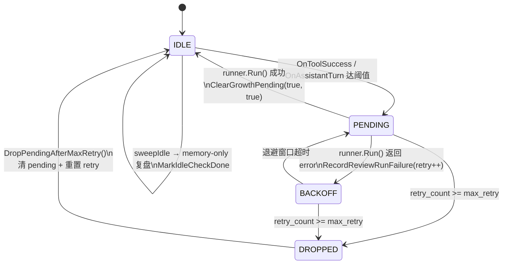

# Growth 游标状态机（O1）

**关联**：phase2 计划 [`../plans/2026-05-10-growth-system-phase2.md`](../plans/2026-05-10-growth-system-phase2.md) §1.4 O1 · 一期设计 [`2026-05-10-growth-system-design.md`](./2026-05-10-growth-system-design.md) §4/§7  
**日期**：2026-05-18

本文档把分散在 `portal/internal/biz/growth.go` 与 `portal/internal/service/growth_worker.go` 的"游标 + pending + last_* + retry"组合状态写到一处，作为单测与排障的权威参照。

---

## 1. 字段语义

| 字段 | 类型 | 触发写入 | 用途 |
|------|------|----------|------|
| `tool_iters_since_review` | int | `OnToolSuccess` 递增；置 pending_skill 时清零 | 技能环计数器 |
| `turns_since_memory_review` | int | `OnAssistantTurn` 递增；置 pending_memory 时清零 | 记忆环计数器 |
| `pending_skill_review` | bool | 计数达 `SkillToolInterval` 触发 true；复盘成功后清 false | 技能复盘待办 |
| `pending_memory_review` | bool | 同上（`MemoryTurnInterval`） | 记忆复盘待办 |
| `last_skill_error` / `last_memory_error` | string | `RecordReviewRunFailure` 写最近一条错误（截断 2KiB） | 排障 |
| `review_failed_at` | *time | `RecordReviewRunFailure` 置 now；两端 pending 全清时清空 | 退避窗口锚点 |
| `review_retry_count` | int | `RecordReviewRunFailure` +1；`ClearGrowthPending` 双清时归零；`DropPendingAfterMaxRetry` 归零 | A5 重试上限 |
| `last_idle_check_at` | *time | `MarkIdleCheckDone` 置 now | 空闲扫描节流 |

---

## 2. 状态枚举

将"游标行"抽象为 4 个状态（按 worker 视角）：

| 状态 | 判定 | 行为 |
|------|------|------|
| **IDLE** | `!pending_skill && !pending_memory` | 不进入 `pollOnce` 视野；可被 `sweepIdle` 选中做 memory-only 复盘 |
| **PENDING** | `pending_*` 任一为 true，且 `retry_count < max_retry`，且不在退避窗口 | `pollOnce` 会抢租约 → 调用 runner |
| **BACKOFF** | `pending_*` 任一为 true，且最近一次失败在退避窗口内 | `pollOnce` 跳过该行（不抢租约） |
| **DROPPED** | `retry_count >= max_retry` 且 `pending_*` 任一为 true | `pollOnce` 进入时立刻 `DropPendingAfterMaxRetry`，行回到 IDLE 并触发 `pending_dropped` 指标 |

退避窗口公式（`growth_worker.shouldBackoff`）：

```
window = clamp(30s << (retry_count - 1), 30s, 10m)
跳过条件：time.Since(failed_at) < window
```

---

## 3. 状态转移图



---

## 4. 关键转移用例（单测对照）

| 触发动作 | 入参 | 期望 | 单测 |
|----------|------|------|------|
| 技能环触发 | `tool_iters_since_review` 增至 `SkillToolInterval` | pending_skill=true, 计数清零, `growthwake.Wake()` | `TestGrowthUsecase_OnToolSuccess_setsPendingAndResetsCounter` |
| 复盘成功（仅技能） | `ClearGrowthPending(true,false)` | pending_skill=false, last_skill_error="", retry **保留**，review_failed_at **保留** | `TestStateMachine_ClearGrowthPending_partialKeepsRetry` |
| 复盘成功（双清） | `ClearGrowthPending(true,true)` | 全清 + retry=0 + review_failed_at=nil | `TestStateMachine_ClearGrowthPending_resetsRetry` |
| 复盘失败（技能） | `RecordReviewRunFailure(skill=true)` | pending_skill 保留, last_skill_error 覆写, retry++, review_failed_at=now | `TestStateMachine_failureDoesNotClearPending` / `TestStateMachine_ReviewRetryCount_increments` |
| 失败超阈值 | retry≥max_retry | DropPendingAfterMaxRetry: 双 pending=false, retry=0, review_failed_at=nil | `TestStateMachine_DropPendingAfterMaxRetry` |
| max_retry=0 | 关闭重试上限 | 永不 drop | `TestStateMachine_DropPendingAfterMaxRetry_DisabledByZero` |
| 空闲扫描 | `MarkIdleCheckDone` | last_idle_check_at=now, 不动 pending/retry | `TestGrowthUsecase_MarkIdleCheckDone_NoOp` |

---

## 5. 不变量

- **safety**：失败回写永远不清 pending；只有成功 (`ClearGrowthPending`) 或 `DropPendingAfterMaxRetry` 可清 pending。
- **monotonic retry**：`review_retry_count` 仅在 `ClearGrowthPending` 双清或 `DropPendingAfterMaxRetry` 时归零；其余路径只增不减。
- **退避锚点**：`review_failed_at` 必须与 `retry_count>0` 同进同出；任何令 retry=0 的路径同时把 `review_failed_at=nil`。
- **租约独立**：状态机不持有锁；同一行可在多副本被竞争抢占，但 CAS 在 `growth_workspace_leases` 表面完成（spec §6）。

---

## 6. 排障 cheatsheet

| 症状 | 看哪几个字段 | 可能原因 |
|------|-------------|----------|
| Worker 不跑某会话 | `pending_*` 全为 false → IDLE；或 `retry_count` 高、`review_failed_at` 近 → BACKOFF | 计数未达阈值 / 处于退避窗口 |
| 行卡在 PENDING 永不清 | `last_*_error` + `review_failed_at` + `retry_count` | runner 持续失败；查 `growth_review_failed` 事件 |
| `pending_dropped` 指标递增 | 同时 `review_retry_count` 跳到 0 | A5 自动清理生效 |
| 多副本只有一个执行 | `growth_workspace_leases` 行 + `lease_contention` 指标递增 | 正常，单写者语义 |

---

## 7. 修订记录

| 日期 | 变更 |
|------|------|
| 2026-05-18 | 初版：抽象 IDLE/PENDING/BACKOFF/DROPPED 四态 + mermaid 图 + 单测映射。 |
