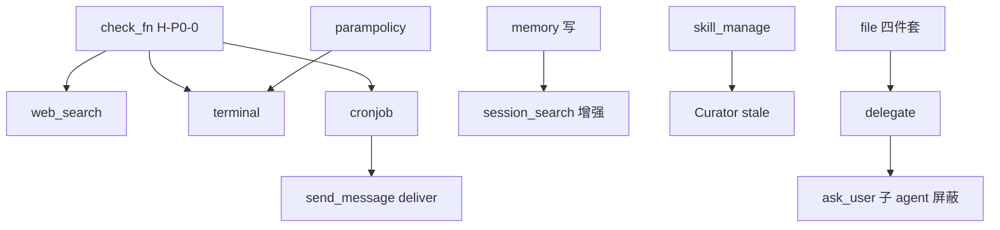

# Hermes Agent 能力差距 — 开发需求规格

**版本**: 0.4  
**状态**: 评审修订稿（Q7 已关闭；Web 搜索默认博查）  
**日期**: 2026-05-25  
**参照**: [Hermes hermes-tool.md](../../../../hermes-tool.md)、[hermes-growth-architecture.md](../../../../hermes-growth-architecture.md)  
**关联**: [toolsets-hermes-mapping.md](../../toolsets-hermes-mapping.md)、[design-agent-runtime-hermes-inspired.md](../../design-agent-runtime-hermes-inspired.md)、[dev-plan-memory-tools-hermes-parity.md](../../dev-plan-memory-tools-hermes-parity.md)、[2026-05-10-growth-system-design.md](./2026-05-10-growth-system-design.md)、[2026-05-23-human-in-the-loop-ask-user.md](./2026-05-23-human-in-the-loop-ask-user.md)、[self-improving-agent-support.md](../../self-improving-agent-support.md)、**开发计划** [Master Plan](../plans/2026-05-25-hermes-capability-gap-development-plan.md) / [P0 详计划](../plans/2026-05-25-hermes-capability-gap-p0.md)

> **关联文档状态**：`ask_user` v0.1 **已实现**（代码为准）；[human-in-the-loop-ask-user](./2026-05-23-human-in-the-loop-ask-user.md) 设计稿部分条目滞后于实现。工作区文件能力以本 spec §5.4 **Hermes 命名**（`read_file` 等）为准，**取代** [self-improving-agent-support.md](../../self-improving-agent-support.md) 中的 `read_workspace_file` 规划。

---

## 1. 文档目的

将 Sixath 与 Hermes Agent 的能力对照结论，转写为**可排期、可验收、可追溯**的开发需求，供产品、框架（`framework`）、Portal（`portal`）、Web（`web`）分工实施。

**读者**: 技术负责人、后端/前端工程师、测试。

---

## 2. 基线（已具备，本需求不重复建设）

以下能力**已落地或 MVP 可用**，后续 epic 应与其兼容，不得破坏默认路径：

| 域 | 已有能力 | 代码/文档锚点 |
|----|---------|--------------|
| 编排核心 | ReActAgent、流式 SSE、工具串行执行 | `framework/agent/react_agent.go` |
| 记忆读 | `memory_search` / `memory_get`、Orchestrator prefetch | `framework/tool/memory_search.go`、`framework/memory/` |
| 跨会话检索 | `session_search` FTS MVP（无 LLM 摘要） | `framework/sessionsearch/`、[session-search-r1](./2026-05-19-session-search-r1.md) |
| 技能读 | `load_skill` / `read_skill_file` / `execute_skill_script` | `framework/tool/skill_tools.go` |
| 成长后台 | GrowthWorker、SkillReviewRunner、记忆脏标记、CuratorWorker、cron 技能引用反写 | `framework/growth/`、`portal/internal/service/growth_worker.go` |
| 人机输入 | `ask_user` + `input_required` SSE + Web InputCard（v0.1） | `framework/tool/ask_user.go`、`portal/internal/chat/ask_user_wiring.go` |
| 写确认 | `execute_write` 两阶段 + `confirm_required` | `framework/tool/execute_write.go` |
| 远程 Shell | `ssh_exec` | `framework/tool/ssh_exec.go` |
| 数据面 | `execute_read/write`、`list_tables`、`describe_table` | `framework/tool/` |
| 上下文 | L0/L1/L2 压缩、工具护栏、TraceSink | [dev-plan-memory-tools-hermes-parity.md](../../dev-plan-memory-tools-hermes-parity.md) |
| MCP 基础 | 动态注册 + CallTool | `framework/tool/mcp.go` |
| Cron 后台 | Portal `agent_turn` / `skill_execute` + Executor | `portal/internal/cron/` |
| 学习沉淀 | `append_learning` → Growth 消费 | `framework/tool/learnings_tools.go` |

**Sixath 独有（不要求 Hermes 对齐）**: 数据源查询 Agent、Kratos Portal 多 Agent 管理、企业 Web 控制台、`append_learning`、`ask_user`（Hermes 用 `clarify`）。

---

## 3. 总体目标与非目标

### 3.1 目标

| ID | 目标 |
|----|------|
| G-H1 | Agent **运行时**可自给自足：记记忆、管技能、列任务、读写工作区文件、搜 Web、跑本地 Shell |
| G-H2 | 成长闭环从「仅后台 Worker」升级为「运行时工具 + 后台 Curator」双轨 |
| G-H3 | 运行时工程化对齐 Hermes：`check_fn` 门控、Hook 矩阵、可选并行工具 |
| G-H4 | 调度与消息能力可按阶段扩展（Agent cron 工具 → Gateway → IM） |

### 3.2 非目标（本规格全集不纳入首期）

- 替换 Portal 为 Hermes 式单进程 Gateway（OpenClaw 协议全文复刻）
- 浏览器 12 工具 + CDP 全栈（单独 epic，P3）
- Kanban 7 工具、RL 训练 10 工具（独立产品线）
- 17 个 IM 平台一次到位（按渠道逐个 epic）
- 覆盖 Sixath 数据查询垂直能力

---

## 4. 需求分层与优先级

| 阶段 | 代号 | 周期（估） | 主题 |
|------|------|-----------|------|
| **P0** | H-P0 | 4–6 周 | **含 H-P0-0（check_fn）** + 运行时元工具 + 文件/Web/Terminal + Agent cron |
| **P1** | H-P1 | 4–6 周 | Hook/编排 + 成长补全 + session_search 增强 + 引擎未落地项 |
| **P2** | H-P2 | 按需 | Gateway/消息 + 浏览器 + 多模态 + MCP 进阶 |
| **P3** | H-P3 | 远期 | 平台原生工具 + Skills Hub + Trajectory/RL |

### 4.1 P0 发布范围（写死）

**P0 Release = H-P0-0 ~ H-P0-G**，其中：

| 子阶段 | Epic | 说明 |
|--------|------|------|
| **P0a**（第 1–2 周） | H-P0-0、H-P0-A、H-P0-B、H-P0-C、H-P0-D | check_fn 骨架 + 元工具 + 工作区文件 |
| **P0b**（第 3–4 周） | H-P0-E、H-P0-F1、H-P0-G | Web + 本地 terminal 前景 + cronjob |
| **P0 可选延后** | H-P0-F2/F3/F4、H-P0-G3 | 后台 process、危险命令审批、cron deliver 扩展 |

H-P1-A 在文档中保留为 **§6.1 索引**，实现归属 **§5.0 H-P0-0**（避免「P1 章节、P0 优先级」歧义）。

---

## 5. P0 — Agent 运行时基础工具（H-P0）

> **成功标准**: 典型「记偏好 → 读文件 → 改代码 → 搜资料 → 跑命令 → 设提醒」全流程**不依赖** Growth 后台或 Portal 管理面即可完成。

### 5.0 Epic H-P0-0 — 工具运行时门控（P0 前置）

| 需求 ID | 描述 | 优先级 | 触点 |
|---------|------|--------|------|
| H-P0-0A | `Tool.CheckFn func(ctx) error` 或等价 | P0 | `framework/tool/tool.go` |
| H-P0-0B | `Registry.ListForAPI(ctx, toolsets)`：合并 toolset + CheckFn | P0 | `framework/tool/registry_api.go`（新建） |
| H-P0-0C | ReActAgent 构建 tools 时调用 ListForAPI | P0 | `framework/agent/react_agent.go` |
| H-P0-0D | 单测：CheckFn 失败时 schema 不含该工具 | P0 | `tool/*_test.go` |

**验收**:

- 缺 API key / 不可达后端时，`web_search`、`terminal`、`cronjob` **不出 schema**
- 同一 Registry，不同 enabled toolsets → 不同工具名集合

**Hermes 对照**: `tools/registry.py` check_fn  
**详细设计**: [design-agent-runtime-hermes-inspired.md](../../design-agent-runtime-hermes-inspired.md) §6.2–6.6

---

### 5.1 Epic H-P0-A — 记忆写工具 `memory`

| 需求 ID | 描述 | 优先级 | 触点 |
|---------|------|--------|------|
| H-P0-A1 | 实现 `memory` 工具：`action` ∈ add/replace/remove；`target` ∈ memory/user | P0 | `framework/tool/memory_tool.go`（新建） |
| H-P0-A2 | 写入 `MEMORY.md` / `USER.md`（workspace 根）；临时文件 + 原子 rename | P0 | 同上 |
| H-P0-A3 | 跨平台文件锁（Windows/POSIX）；单文件容量上限可配 | P0 | 同上 |
| H-P0-A4 | 写前 prompt-injection 扫描（与 Growth patch 规则对齐） | P0 | `framework/growth/security.go`（新建，memory/skill_manage 共用） |
| H-P0-A5 | 注册 `ToolsetMemory`；Portal `RegisterMemoryTools` 扩展 | P0 | `portal/internal/chat/agent_builder.go` |
| H-P0-A6 | 写后触发 `memory_search` 索引同步（见 Q6 默认策略） | P0 | `framework/memorysearch/` |

**索引同步策略（Q6 默认）**:

1. `memory` 工具 Execute 成功后调用 `MemorySearchManager.Sync(ctx, {Reason: "memory_tool", Force: false})`；
2. 若 workspace 已启用 fsnotify watcher（`Sync.Watch=true`），仍保留 watcher 作为兜底，但**不依赖** debounce 满足 P0 验收。

**验收**:

- Agent 调用 `memory` add 后，**同 session 下一轮** `memory_search` 可命中新内容（无需手动重建索引）
- replace/remove 定位失败返回明确错误，不破坏文件
- password/敏感内容**不得**经 memory 工具写入（由 ask_user 通道承担）

**Hermes 对照**: `tools/memory_tool.py`

---

### 5.2 Epic H-P0-B — 技能运行时管理

| 需求 ID | 描述 | 优先级 | 触点 |
|---------|------|--------|------|
| H-P0-B1 | 实现 `skills_list`：name + description + category 过滤 | P0 | `framework/tool/skills_tool.go` |
| H-P0-B2 | 实现 `skill_view`：SKILL.md + linked_files 字典；可选 `file_path` | P0 | 同上（可复用 `skills.Index`） |
| H-P0-B3 | 实现 `skill_manage`：create/patch/edit/delete/write_file/remove_file | P0 | `framework/tool/skill_manager_tool.go` |
| H-P0-B4 | pinned skill 拒写；错误提示指向 unpin 流程 | P0 | 同上 |
| H-P0-B5 | 写盘原子提交 + 安全扫描；成功后 bump skills 索引 generation | P0 | 见 §5.2.1 |
| H-P0-B6 | `skill_view` 成功时记录 view/use 计数（供 Curator stale 决策） | P1 | `framework/skills/usage.go` |
| H-P0-B7 | 保留 `load_skill` 等旧名 alias 或迁移期双注册（breaking 需 ADR） | P1 | `toolset.go` |
| H-P0-B8 | 与 GrowthWorker workspace 租约并发语义 | P0 | 见 §5.2.2 |
| H-P0-B9 | `create` / `delete` 两阶段用户确认（§5.2.3）；`patch` / `edit` / `write_file` / `remove_file` 无需确认 | P0 | `skill_manager_tool.go`、Portal `confirm_required` |

#### 5.2.1 写盘与 ApplyPatchBatch 边界

- **共用层**：`framework/growth/applier.go` 的 tmp+rename、`ValidatePatchBatch` 路径沙箱、`framework/growth/security.go` injection 扫描。
- **适配层**：`skill_manage` action → 内部转换为 `[]Patch`（create→OpCreate，patch→OpPatch，delete→OpDelete 等）；**不**要求 Agent 直接调用 Patch API。
- **索引**：写成功后调用 `skills.Index` generation bump（与 Growth `DefaultSkillsIndexTracker.Bump` 对齐）。

#### 5.2.2 并发与租约

| 场景 | 行为 | 返回 JSON |
|------|------|-----------|
| GrowthWorker 已持有 workspace lease | `skill_manage` 写 action 失败 | `{ "error": "workspace_busy", "retry_after_sec": N }` |
| pinned skill 写 action | 拒绝，不改磁盘 | `{ "error": "skill_pinned", "hint": "unpin via curator" }` |
| 无 lease 冲突 | 正常写盘 | 成功 payload |

租约复用 Growth `TryAcquireLease` 语义（`framework/growth/`）；runtime 写路径**短租约**（建议 TTL ≤ 30s），避免阻塞 Growth 长复盘。

#### 5.2.3 create/delete 两阶段确认（Q7）

**决议**：对齐 Hermes「create/delete 前须 confirm」；**不**要求 patch 类操作确认（任务中即时修正，Hermes 亦鼓励用过即 patch）。

| action | P0 是否须用户确认 | 说明 |
|--------|------------------|------|
| `create` | **是** | 新建技能影响 workspace 长期结构 |
| `delete` | **是** | 不可逆删除 |
| `patch` / `edit` / `write_file` / `remove_file` | **否** | 迭代修正；仍受 pinned / 租约 / injection 扫描约束 |

**流程**（复用 `execute_write` pending + `confirm_required` SSE，**不**改 ReActAgent 主循环）：

```
Turn N — Agent 调用 skill_manage({ action: "create", name, content, ... })
  Tool  → { status: "pending", token, action, name, preview, expires_in }
  Run   → 正常结束
  Portal→ SSE confirm_required { confirmation: { kind: "skill_manage", ... } }
  UI    → 确认卡片（展示 skill 名 + content 摘要）

Turn N+1 — 用户确认
  POST .../messages 带 confirm_response { token, approved: true }
  Portal→ 执行落盘（或注入 fulfilled tool result 后由 Agent 带 confirm_token 重调）
  Tool  → { status: "ok", name, path }
```

**实现要点**：

- `SkillManagePendingStore`：session 级 pending（可与 `WritePendingStore` 同包或共用接口）
- 参数：`confirm_token`（可选）——带有效 token 且已 approved 时跳过 pending，直接写盘
- `confirm_required` payload 新增 `kind: "skill_manage"`；Web 复用现有 ConfirmCard 或扩展字段
- Feature flag：`skill_manage_confirm_create_delete`（默认 **true**）；关闭时 create/delete 与 patch 同路径直写（仅 dev/自动化）

**验收**:

- 复杂任务成功后 Agent 可 create 新 skill；**未经确认不落盘**
- delete 同理；用户拒绝后 pending 过期，磁盘无变化
- patch 无需 confirm，用过发现遗漏可即时 patch
- pinned skill 上 patch 返回拒绝 JSON，不修改磁盘
- 与 GrowthWorker 并发写同一 workspace 时租约/冲突行为有单测

**Hermes 对照**: `skills_list` / `skill_view` / `skill_manage`

---

### 5.3 Epic H-P0-C — 会话任务表 `todo`

| 需求 ID | 描述 | 优先级 | 触点 |
|---------|------|--------|------|
| H-P0-C1 | 实现 `todo` 工具：todos[] + merge 参数 | P0 | `framework/tool/todo_tool.go` |
| H-P0-C2 | 内存 `TodoStore`（按 session/run 隔离）；仅 pending/in_progress 注入上下文 | P0 | 同上 |
| H-P0-C3 | 约束：同时仅一个 in_progress | P0 | 同上 |
| H-P0-C4 | L2 压缩后 `format_for_injection()` 仍保留未完成任务 | P1 | 与 `model/l2_runtime.go` 协作 |
| H-P0-C5 | 新增 `ToolsetTodo`；更新 `PresetHermesCoreTags` 与 mapping 文档 | P0 | `framework/tool/toolset.go` |

**验收**:

- 无参调用返回当前列表；merge=true 按 id 更新
- 会话结束（新 session）不持久化 todo（与 Hermes 一致）

**Hermes 对照**: `tools/todo_tool.py`

---

### 5.4 Epic H-P0-D — 工作区文件四件套

> **取代** [self-improving-agent-support.md](../../self-improving-agent-support.md) 中的 `read_workspace_file` / `write_file`（旧规划命名）；Hermes 对齐优先。

| 需求 ID | 描述 | 优先级 | 触点 |
|---------|------|--------|------|
| H-P0-D1 | `read_file`：行号 + offset/limit；~100K 字符上限 | P0 | `framework/tool/file_tools.go` |
| H-P0-D2 | `write_file`：全量覆写 + 自动 mkdir | P0 | 同上 |
| H-P0-D3 | `patch`：replace 模式（old/new/replace_all）；至少 3 种模糊匹配 | P0 | 同上 |
| H-P0-D4 | `search_files`：内容 regex + glob 文件查找（优先 ripgrep） | P0 | 同上 |
| H-P0-D5 | 路径沙箱：限制在 workspace_root 内；拒绝 `..` 逃逸 | P0 | 复用 `growth.ValidatePatchBatch` 的 `resolvedPath` 逻辑（抽取至 `framework/tool/pathguard.go`） |
| H-P0-D6 | 与 `execute_read/write`（数据源）职责分离；toolset 均为 `file` 但 schema 描述区分 | P0 | `toolset.go`、系统 prompt |
| H-P0-D7 | patch 后可选语法检查（Go/JSON/YAML） | P2 | 同上 |

**schema 引导（Q5）**：file 类工具 description 须含显式句——「**工作区文件**用 read_file/write_file/patch/search_files；**数据源/SQL** 用 execute_read/execute_write/list_tables/describe_table」。

**验收**:

- Agent 不再需要通过 ssh_exec cat/sed 完成工作区读写
- 越界路径返回 permission 类错误，不读盘

**Hermes 对照**: `read_file` / `write_file` / `patch` / `search_files`

---

### 5.5 Epic H-P0-E — Web 搜索与提取

> **后端策略**：优先继承成熟 **[博查 AI（Bocha）](https://open.bochaai.com/)** Web Search API 作为 P0 默认实现；通过 `WebSearchBackend` 接口保留 Tavily / Exa 等可插拔扩展。博查面向 AI Agent 场景，返回 title/url/snippet/**summary**（可选），Response 兼容 Bing Search API 形态，国内可用性与中文检索质量优于通用海外 API。

| 需求 ID | 描述 | 优先级 | 触点 |
|---------|------|--------|------|
| H-P0-E1 | `web_search`：`WebSearchBackend` 接口；**P0 默认实现 Bocha Web Search** | P0 | `framework/tool/web_tools.go`、`framework/tool/web/bocha.go` |
| H-P0-E1a | Bocha 参数映射：`query`、`freshness`、`summary`、`count`（1–50）、`include`/`exclude` | P0 | 同上 |
| H-P0-E1b | 可选后端：Tavily / Exa（配置切换）；`check_fn` 按当前 backend 校验对应 API key | P0 | `framework/tool/web/tavily.go` 等 |
| H-P0-E2 | `web_extract`：URL→markdown；PDF 直链支持；**可优先使用 Bocha 结果中的 `summary` 字段，减少二次抓取** | P0 | `framework/tool/web_tools.go` |
| H-P0-E3 | SSRF 防护（内网 IP 黑名单）；`web_*` 与后续 `http_request` 共用 guard | P0 | `framework/tool/ssrf.go`（新建） |
| H-P0-E4 | 大页（>5K）辅助 LLM 摘要；≤5 URL 并发 | P1 | 复用 L2 auxiliary 或独立 cheap model 配置 |
| H-P0-E5 | `http_request` 保留为低级逃生舱，schema 引导优先 web_*；P1 起同步 SSRF guard | P1 | `http_tool.go` |
| H-P0-E6 | **P1 可选**：Bocha AI Search API（垂直模态卡：天气、百科、汇率等） | P1 | `framework/tool/web/bocha_ai_search.go` |

#### 5.5.1 WebSearchBackend 与博查集成

**接口**（`framework/tool/web/backend.go`）：

```go
type WebSearchBackend interface {
    Name() string
    Check(ctx context.Context) error          // check_fn 调用
    Search(ctx context.Context, req SearchRequest) (*SearchResponse, error)
}

type SearchRequest struct {
    Query     string
    Count     int    // 默认 8，最大 50
    Freshness string // noLimit | oneDay | oneWeek | oneMonth | oneYear | YYYY-MM-DD | range
    Summary   bool   // Bocha：请求服务端生成摘要
}
```

**博查 Web Search（P0 默认）**：

| 项 | 值 |
|----|-----|
| Endpoint | `POST https://api.bochaai.com/v1/web-search` |
| 鉴权 | `Authorization: Bearer {BOCHA_API_KEY}` |
| 环境变量 | `BOCHA_API_KEY`；`WEB_SEARCH_BACKEND=bocha`（默认） |
| 官方参考 | [博查开放平台](https://open.bochaai.com/)、[bocha-search-mcp](https://github.com/BochaAI/bocha-search-mcp) |
| 归一化输出 | `{ title, url, snippet, summary?, site_name, published_at? }[]` — 供 Agent JSON 消费，与 Hermes `web_search` 工具描述对齐 |

**`web_search` 工具参数**（对模型暴露，内部映射到 backend）：

| 工具参数 | Bocha 字段 | 默认 |
|----------|-----------|------|
| `query` | `query` | 必填 |
| `count` | `count` | 8 |
| `freshness` | `freshness` | `noLimit` |
| `include_summary` | `summary` | `true`（博查后端默认开启，降低对 web_extract 依赖） |

**与 `web_extract` 分工**：

- 列表型检索、需要多源对比 → `web_search`（博查 summary 通常足够）
- 单 URL 全文、代码仓库 README、PDF → `web_extract`（HTTP 抓取 + markdown 转换）
- P1 结构化事实（天气、汇率等）→ 可选 Bocha AI Search（H-P0-E6），不替代通用 `web_search`

**配置示例**（Portal `agent_extra.yaml` 或环境变量）：

```yaml
web:
  search_backend: bocha          # bocha | tavily | exa
  bocha_api_key: ${BOCHA_API_KEY}
  default_count: 8
  default_summary: true
  tavily_api_key: ${TAVILY_API_KEY}   # backend=tavily 时
```

**验收**:

- 配置 `BOCHA_API_KEY` + `WEB_SEARCH_BACKEND=bocha` 时，`web_search` 返回 ≥1 条含 title/url/snippet 的结果
- 无 API key 时 `check_fn` 失败，工具不出 schema（H-P0-0）
- backend 切换为 tavily 且 key 有效时，同一 `web_search` schema 可正常工作（证明接口抽象）
- 单 URL 提取失败返回可操作建议（试 browser，P2）

**Hermes 对照**: `web_search` / `web_extract`

---

### 5.6 Epic H-P0-F — 本地 Terminal 栈

| 需求 ID | 描述 | 优先级 | 触点 |
|---------|------|--------|------|
| H-P0-F0 | P0 命令 denylist（如 `rm -rf /`、盘符根删除、明显 fork bomb 模式） | P0 | `framework/tool/terminal_tool.go` |
| H-P0-F1 | `terminal`：foreground 命令；timeout/workdir；输出截断 + ANSI 剥离；**Windows 本地 shell 为一等公民** | P0 | 同上 |
| H-P0-F2 | `background=true` + `session_id`；`notify_on_complete` | P1 | **已落地**：background→ProcessRegistry；**notify 唤醒 Agent**（Portal `SendMessage` 合成消息；`SATH_PROCESS_NOTIFY_WAKE=0` 可关） |
| H-P0-F3 | `process`：list/poll/log/wait/kill/write/submit/close | P1 | **已落地**：list/poll/log/wait/kill/**write/submit/close**；notify 唤醒；**真 pty** |
| H-P0-F4 | 危险命令审批 hook（与 execute_write 心智一致） | P1 | **已落地**：`DangerPatterns` + `confirm_token` + Portal SSE `kind=terminal`（见 harness S1 plan） |
| H-P0-F5 | `pty=true` 交互模式 | P2 | **已落地**（Unix pty / Windows ConPTY，`aymanbagabas/go-pty`） |
| H-P0-F6 | 后端扩展点：local 首期；docker/ssh 与现有 ssh_exec 整合 | P2 | 配置 `terminal.backend` |

**验收**:

- 本地 build/test/git 场景不依赖 ssh_exec
- denylist 命中返回结构化拒绝，不执行命令
- 后台任务 poll 可增量取日志；kill 后状态一致（F2/F3 落地后）

**Hermes 对照**: `terminal` / `process`（6 后端为 P2 扩展）

---

### 5.7 Epic H-P0-G — Agent 可调 Cron

| 需求 ID | 描述 | 优先级 | 触点 |
|---------|------|--------|------|
| H-P0-G1 | `cronjob` 工具：action ∈ create/list/update/pause/resume/remove/run | P0 | `framework/tool/cronjob_tool.go` |
| H-P0-G2 | 对接 Portal Cron API / biz 层；prompt 自包含校验 | P0 | `portal/internal/biz/cron_usecase.go` |
| H-P0-G3 | create 支持 skills[]、schedule 字符串、deliver 目标 | P1 | 同上 |
| H-P0-G4 | cron 运行会话 `skip_memory` / 不触发 Growth 用户画像污染 | P0 | `portal/internal/cron/executor.go` |
| H-P0-G5 | Agent 在 cron 会话内禁止递归 create cron（安全） | P0 | metadata 标志 + 工具 check |
| H-P0-G6 | cron 会话 metadata 字段约定 | P0 | 见 §5.7.1 |

#### 5.7.1 Cron 会话 metadata（Q4）

| 键 | 普通 Chat | Cron 执行会话 |
|----|-----------|---------------|
| `run_kind` | 省略或 `chat` | `cron` |
| `allow_cron_create` | `true`（默认） | `false` |
| `skip_memory` | `false` | `true` |
| `skip_growth_review` | `false` | `true`（可选，与 G4 对齐） |

#### 5.7.2 Portal API ↔ cronjob 工具 action 映射

| 工具 action | Portal 层 | 说明 |
|-------------|-----------|------|
| `create` | `CronUsecase.Create` | 必填 schedule、agent_id、payload_kind |
| `list` | `CronUsecase.List` | 分页；schema 引导先 list 再 remove |
| `update` | `CronUsecase.Update` | 部分字段 |
| `pause` / `resume` | `Update` + `enabled=false/true` | |
| `remove` | `CronUsecase.Delete` | |
| `run` | Executor 触发一次 ad-hoc（若 biz 无则 P0 仅 stub + P1 补全） | |

**验收**:

- 对话「每天 9 点摘要」→ Agent create job → Portal 列表可见
- list 先于 remove（schema 强制引导）
- cron 会话内 `create` 返回 `{ "error": "cron_nested_forbidden" }`

**Hermes 对照**: `tools/cronjob_tools.py`

---

## 6. P1 — 运行时引擎与成长补全（H-P1）

### 6.1 Epic H-P1-A — 工具运行时门控（索引）

**实现归属 §5.0 H-P0-0**（P0 已交付）。本节仅保留 Hermes 对照索引；P1 无额外 check_fn 条目。

**Hermes 对照**: `tools/registry.py` check_fn

---

### 6.2 Epic H-P1-B — Tool 生命周期 Hook

| 需求 ID | 描述 | 优先级 | 触点 |
|---------|------|--------|------|
| H-P1-B1 | 定义 Hook 集合：pre/post_tool_call、pre/post_llm_call、on_session_end（最小集） | P1 | `framework/agent/hooks.go` |
| H-P1-B2 | Hook 可 block 工具并返回 message | P1 | 同上 |
| H-P1-B3 | compile-time plugin 注册 Hook（与现有 `plugin` 包衔接） | P2 | `framework/plugin/` |
| H-P1-B4 | Shell Hook（stdin JSON / stdout block） | P3 | 独立 epic |

**详细设计**: [design-agent-runtime-hermes-inspired.md](../../design-agent-runtime-hermes-inspired.md) §6.3、§6.5

**Hermes 对照**: `VALID_HOOKS` 13 点（分阶段）

---

### 6.3 Epic H-P1-C — 编排与子 Agent

| 需求 ID | 描述 | 优先级 | 触点 |
|---------|------|--------|------|
| H-P1-C1 | `delegate_task`：单 goal + context + toolsets | P1 | `framework/tool/delegate_tool.go` |
| H-P1-C2 | batch tasks[] 并行（默认 max 3 可配） | P2 | 同上 |
| H-P1-C3 | 子 agent 屏蔽：delegate/clarify/ask_user/memory/send_message/execute_code/cronjob | P1 | 常量表 |
| H-P1-C4 | 子 agent 独立 max_iterations + 超时 | P1 | `agent/react_agent.go` |
| H-P1-C5 | `execute_code` 沙盒 Python + 工具白名单 RPC | P2 | `framework/tool/code_execution_tool.go` |
| H-P1-C6 | `mixture_of_agents` | P3 | 可选 |

---

### 6.4 Epic H-P1-D — session_search 增强（R1 续）

| 需求 ID | 描述 | 优先级 | 触点 |
|---------|------|--------|------|
| H-P1-D1 | trigram FTS 第二表（CJK） | P1 | `framework/sessionsearch/index.go` |
| H-P1-D2 | 命中会话辅助 LLM 摘要（Semaphore 限流，默认 max 3） | P1 | `framework/tool/session_search.go` |
| H-P1-D3 | R1c 向量混合检索 | P2 | 新 spec |
| H-P1-D4 | 流式路径 user 消息持久化并索引 | P1 | `portal/internal/service/chat_stream.go` |

**关联**: [session-search-r1](./2026-05-19-session-search-r1.md) §后续

---

### 6.5 Epic H-P1-E — Curator 与成长补全（R2 续）

| 需求 ID | 描述 | 优先级 | 触点 |
|---------|------|--------|------|
| H-P1-E1 | 技能 30d stale / 90d archived 自动迁移 | P1 | `framework/growth/curator.go` |
| H-P1-E2 | 使用计数（view/use bump）驱动 stale | P1 | `framework/skills/usage.go` |
| H-P1-E3 | archived 移入 `.archive/`，可恢复 | P2 | CuratorRunner |
| H-P1-E4 | cron 引用反写（**已有 R2c**，补全测试与生产验证） | P1 | `portal/internal/biz/cron_ref_rewrite.go` |
| H-P1-E5 | MemoryProvider 插件接口（单 external 约束） | P2 | `framework/memory/provider.go` |
| H-P1-E6 | Skills Hub：search/fetch/install + quarantine | P3 | 新 epic |

---

### 6.6 Epic H-P1-F — 运行时引擎（design-agent-runtime 未落地项）

| 需求 ID | 描述 | 优先级 | 触点 |
|---------|------|--------|------|
| H-P1-F1 | Epic D：`tool/parampolicy` + ssh_exec host 迁移 | P1 | [dev-plan §2.5](../../dev-plan-memory-tools-hermes-parity.md) |
| H-P1-F2 | `PromptBuilder` Stable/Ephemeral + trace hash | P2 | [design-agent-runtime §5](../../design-agent-runtime-hermes-inspired.md) |
| H-P1-F3 | `ConversationRunner` 接口；Cron/HTTP 统一入口 | P2 | [design-agent-runtime §4](../../design-agent-runtime-hermes-inspired.md) |
| H-P1-F4 | 并行 tool_calls（D2，默认 off） | P2 | [design-agent-runtime §7.2](../../design-agent-runtime-hermes-inspired.md) |
| H-P1-F5 | ask_user Layer 3：Run checkpoint / ResumeRun | P2 | [human-in-the-loop §8](./2026-05-23-human-in-the-loop-ask-user.md) |

---

### 6.7 Epic H-P1-G — 人机协同补全

| 需求 ID | 描述 | 优先级 | 触点 |
|---------|------|--------|------|
| H-P1-G1 | `clarify` 与 `ask_user` 语义统一（≤4 choices + Other） | P1 | `ask_user.go` 或 alias |
| H-P1-G2 | 子 agent 禁用 ask_user/clarify | P1 | delegate 屏蔽表 |
| H-P1-G3 | IM 网关 input_required 适配 | P3 | Gateway epic |

---

## 7. P2 — 通道、浏览器、多模态、MCP 进阶（H-P2）

### 7.1 Epic H-P2-A — Gateway 与消息

| 需求 ID | 描述 | 优先级 |
|---------|------|--------|
| H-P2-A1 | Gateway WS 控制面 MVP（单实例、connect 握手） | P2 |
| H-P2-A2 | `send_message` 工具：send/list + MEDIA token | P2 |
| H-P2-A3 | 首渠道：Telegram 或 WxPusher 扩展为双向 | P2 |
| H-P2-A4 | cron deliver 多目的地与 send_message 统一寻址 | P2 |

**参照**: [gateway_requirement.md](../../gateway_requirement.md)

---

### 7.2 Epic H-P2-B — 浏览器栈

| 需求 ID | 描述 | 优先级 |
|---------|------|--------|
| H-P2-B1 | browser_navigate + snapshot + click/type（最小 4 工具） | P2 |
| H-P2-B2 | 完整 10 工具 + SSRF + 会话隔离 | P3 |
| H-P2-B3 | browser_cdp + browser_dialog | P3 |

---

### 7.3 Epic H-P2-C — 多模态

| 需求 ID | 描述 | 优先级 |
|---------|------|--------|
| H-P2-C1 | `vision_analyze` | P2 | **已落地**（+ `browser_vision` LLM；`SATH_VISION_*`） |
| H-P2-C2 | `image_generate` | P3 |
| H-P2-C3 | `text_to_speech` + MEDIA 交付 | P3 |

---

### 7.4 Epic H-P2-D — MCP 进阶

| 需求 ID | 描述 | 优先级 |
|---------|------|--------|
| H-P2-D1 | list_resources / read_resource | P2 |
| H-P2-D2 | list_prompts / get_prompt | P2 |
| H-P2-D3 | OAuth 2.1 + 熔断重连 | P2 |
| H-P2-D4 | stdio OSV 检查 | P2 |
| H-P2-D5 | tools/list_changed 动态更新 | P3 |

---

## 8. P3 — 远期（H-P3）

| Epic | 内容 |
|------|------|
| H-P3-A | 平台原生：Discord、飞书、元宝、Home Assistant、Spotify 等 |
| H-P3-B | Kanban 7 工具 + 多 worker 调度 |
| H-P3-C | Trajectory ShareGPT 导出 + batch_runner + Atropos RL |
| H-P3-D | CLI/TUI（hermes 级命令面）、Profile 隔离、OpenAI 兼容 API Server |
| H-P3-E | Toolset 场景 preset：debugging、safe、hermes-acp |

---

## 9. 跨 Epic 依赖



**建议实施顺序（P0 内）**: H-P0-0 → H-P0-A/B/C → H-P0-D → H-P0-E → H-P0-F1 → H-P0-G

---

## 10. 非功能需求（NFR）

| ID | 要求 |
|----|------|
| NFR-1 | 所有新能力默认 **opt-in** 或 feature flag；关闭时与现网行为一致 |
| NFR-2 | 工具输出统一 JSON 字符串；大结果截断阈值可配 |
| NFR-3 | 用户/外部内容写入路径须过 injection 扫描（memory、skill_manage、MCP description）；实现集中于 `framework/growth/security.go` |
| NFR-4 | workspace 路径操作必须沙箱化；**单一** path guard 实现（`pathguard.go` + `ValidatePatchBatch`） |
| NFR-5 | 每个 Epic 至少：单元测试 + 1 条集成测试（fake model 或 golden） |
| NFR-6 | Portal 新 SSE 事件或 `confirm_required` 新 kind 须更新 `web/src/api/chatStream.ts`（或 `client.ts`）与文档 |
| NFR-7 | 多租户：session_search / cron / memory 须 agent_id 隔离 |
| NFR-8 | 新工具须在 Portal wiring 注册（见 §14）；未注册视为未交付 |

---

## 11. 验收闸门（Release Gate）

### P0 发布最小集

- [ ] H-P0-0 ~ H-P0-G 各至少 1 个 happy path E2E（Portal Chat 或 `go test` 集成）
- [ ] H-P0-0：check_fn 对 web/terminal/cron 生效；无 key 时 schema 不含对应工具
- [ ] H-P0-A：`memory` 写后同 session 下轮 `memory_search` 可命中（H-P0-A6）
- [ ] Growth 与 runtime `skill_manage` 并发写无数据损坏（租约单测，H-P0-B8）
- [ ] H-P0-B9：`skill_manage` create/delete 须 confirm 后才落盘；patch 直写；拒绝 confirm 后磁盘无变化
- [ ] H-P0-E：Bocha 后端 `web_search` happy path；backend 切换 tavily 单测（H-P0-E1）
- [ ] 文档：`toolsets-hermes-mapping.md` 更新映射表（含 `todo`、`memory` 写、web 后端配置）

### P1 发布最小集

- [ ] delegate_task 单 goal 可用；子 agent 屏蔽验证
- [ ] session_search LLM 摘要 + trigram 单测
- [ ] Curator stale 迁移 + usage bump 单测
- [ ] Epic D parampolicy 落地

---

## 12. 需求追溯矩阵（Hermes → Sixath 需求 ID）

| Hermes 工具/能力 | 需求 ID |
|-----------------|---------|
| memory | H-P0-A* |
| todo | H-P0-C* |
| skills_list / skill_view / skill_manage | H-P0-B* |
| clarify | H-P1-G*（`ask_user` 已实现，Sixath 扩展） |
| session_search（增强） | H-P1-D* |
| read/write/patch/search_files | H-P0-D* |
| terminal / process | H-P0-F* |
| web_search / web_extract | H-P0-E* |
| cronjob | H-P0-G* |
| delegate_task / execute_code / moa | H-P1-C* |
| check_fn / hooks | H-P0-0* / H-P1-B* |
| send_message / Gateway | H-P2-A* |
| browser_* | H-P2-B* |
| vision / image_gen / tts | H-P2-C* |
| MCP resources/prompts/OAuth | H-P2-D* |
| Kanban / RL / 平台原生 | H-P3-* |
| Curator / Skills Hub / Trajectory | H-P1-E* / H-P3-* |

### Sixath 独有（不要求 Hermes 对齐）

| 能力 | 需求 ID / 基线 |
|------|----------------|
| `append_learning` | §2 基线 |
| `execute_read` / `execute_write` / 表元数据 | §2 基线；与 H-P0-D 职责分离（Q5） |
| `ask_user` + `input_required` | §2 基线；H-P1-G* |
| `ssh_exec` | §2 基线；H-P0-F 本地 terminal 互补 |

---

## 13. 开放决策

| # | 问题 | 决议（v0.2 默认） | 影响 |
|---|------|-------------------|------|
| Q1 | `load_skill` 与 `skill_view` 是否长期双注册 | **采纳**：双注册 2 版本；deprecate 前统计调用比 | H-P0-B7 |
| Q2 | terminal 首期仅 local 是否可接受 | **采纳**：是；Windows 本地一等；ssh 继续用 ssh_exec 直至 F6 | H-P0-F |
| Q3 | web 后端首选哪家 | **采纳（v0.4 修订）**：**博查 Bocha Web Search** 为 P0 默认 + `WebSearchBackend` 抽象；Tavily/Exa 为可配置备选。P1 可选 Bocha AI Search（垂直模态卡） | H-P0-E* |
| Q4 | cronjob 工具是否允许普通 Chat 会话创建 | **采纳**：是；cron 会话 metadata 见 §5.7.1 | H-P0-G5/G6 |
| Q5 | file 与 execute_* 是否合并为同一工具名 | **采纳**：否；schema + 系统 prompt 引导 | H-P0-D6 |
| Q6 | `memory` 写入后索引同步策略 | **采纳**：写后显式 `Sync` + watcher 兜底（§5.1） | H-P0-A6 |
| Q7 | `skill_manage` create/delete 是否需用户 confirm | **采纳**：**create + delete 须 confirm**；patch/edit/write_file/remove_file 直写。两阶段 pending + `confirm_required`（§5.2.3，H-P0-B9）；Growth 后台仍无 confirm | H-P0-B3/B9 |

---

## 14. Portal 工具注册清单（P0）

| 工具 | Framework 注册函数 | Portal wiring | Feature flag（建议） |
|------|-------------------|---------------|---------------------|
| `memory` | `RegisterMemoryWriteTool` | 扩展 `RegisterMemoryTools` | `memory_write_enabled` |
| `skills_list` / `skill_view` / `skill_manage` | `RegisterSkillRuntimeTools` | 扩展 `RegisterSkillTools` | `skill_runtime_manage_enabled`；`skill_manage_confirm_create_delete`（默认 true） |
| `todo` | `RegisterTodoTool` | `RegisterTodoTools`（新建） | `todo_enabled` |
| `read_file` 等 | `RegisterWorkspaceFileTools` | `RegisterWorkspaceFileTools`（新建） | `workspace_files_enabled` |
| `web_search` / `web_extract` | `RegisterWebTools` | `RegisterWebTools`（新建） | `web_tools_enabled`；`WEB_SEARCH_BACKEND`（默认 `bocha`） |
| `terminal` | `RegisterTerminalTool` | `RegisterTerminalTools`（新建） | `terminal_local_enabled` |
| `cronjob` | `RegisterCronjobTool` | `RegisterCronjobTools`（新建，注入 CronUsecase） | `cronjob_tool_enabled` |

所有 wiring 在 `portal/internal/chat/agent_builder.go` 的 `BuildRegistry`（或等价路径）中按 agent 配置 opt-in 调用。

---

## 15. 版本历史

| 版本 | 日期 | 说明 |
|------|------|------|
| 0.1 | 2026-05-25 | 初稿：基于 Hermes 对照整理 P0–P3 开发需求 |
| 0.2 | 2026-05-25 | 评审修订：P0 范围写死（含 H-P0-0 check_fn）；修复优先级/验收冲突；补租约、注册清单、cron 映射、Q6/Q7；supersede read_workspace_file |
| 0.3 | 2026-05-25 | 关闭 Q7：skill_manage create/delete 两阶段 confirm（H-P0-B9 §5.2.3） |
| 0.4 | 2026-05-25 | Web 搜索 P0 默认继承博查 Bocha Web Search API（§5.5.1）；修订 Q3 |
