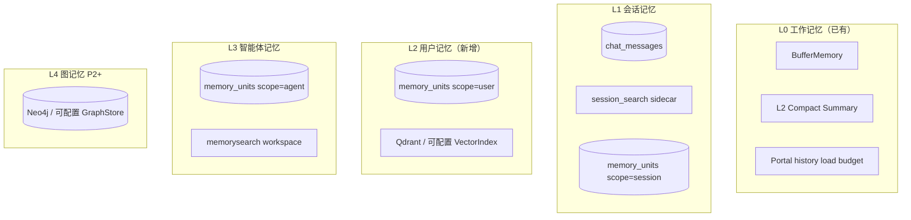
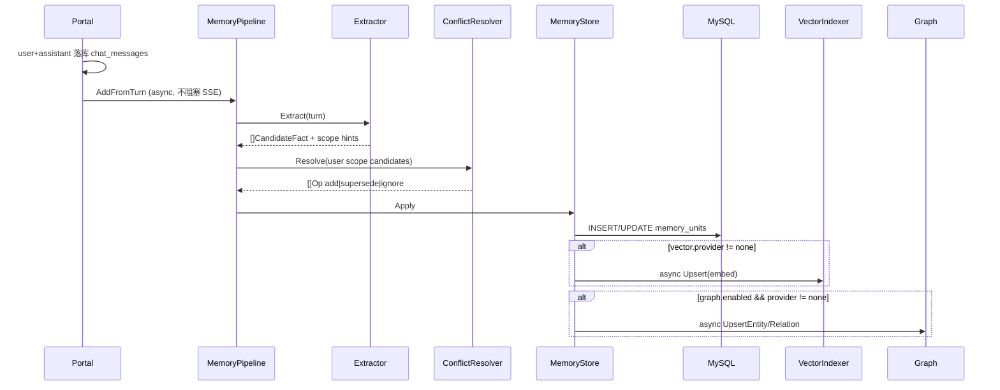

# 多层记忆管理 — 设计规格

**版本**: 0.3  
**状态**: 待评审  
**日期**: 2026-05-26  
**方案**: 方案 2 — `MemoryStore` 统一门面（Go 原生自研，参照 Mem0 架构）  
**关联**: [design-memory-tools-hermes-parity.md](../../design-memory-tools-hermes-parity.md) §4、[2026-05-26-session-context-compression-design.md](./2026-05-26-session-context-compression-design.md)、[2026-05-25-session-management-design.md](./2026-05-25-session-management-design.md)  
**参照**: [Mem0 深度解析](https://apframework.com/blog/essay/2025-06-22-mem0)（架构参照，**不引入 Mem0 Python SDK 或运行时依赖**）

---

## 1. 背景与目标

### 1.1 现状

| 层 | 状态 |
|----|------|
| L0 工作记忆 | `BufferMemory` + Portal `ListMessages`（rune 预算）+ L0/L2 压缩 |
| L1 会话存储 | MySQL `chat_messages` + `session_search` FTS sidecar |
| 读路径编排 | `memory.Orchestrator.PrefetchForTurn` ✅；`SearchPrefetchBackend` → `memorysearch` |
| 写路径 | 分散：`NotifyMemorySessionDirty`（工作区索引）、Growth、`memory_write` 工具；**无 LLM 结构化提取** |
| 用户主体 | `chat_sessions` **无** `user_id`；`identity` 回退 `session_id` |
| 长期向量 | `memory.Manager` + `InMemoryVectorStore`（未与 Portal 统一）；`memorysearch` 独立 |

**核心矛盾**：Sixath 已有「会话历史 + 工作区检索 + Prefetch 围栏」，但缺少 Mem0 式的 **结构化记忆单元**、**跨会话 User 记忆**、**冲突消解** 与 **统一 add/search API**。

### 1.2 已确认决策

| 维度 | 选择 |
|------|------|
| 总体档位 | **D** — 完整路线图（Mem0 式记忆 + 图记忆 + MCP 互通） |
| 实现策略 | **A** — Go 原生自研；Mem0 仅作架构参照 |
| 持久化 | **C** — MySQL 权威 + 向量 Sidecar 异步索引 |
| 用户主体 | **A** — 正式 `users` 表 + `chat_sessions.user_id` FK |
| **硬约束** | **零 Python 依赖** — 不引入 `mem0ai`、OpenMemory Python 服务或任何 Python 运行时；MCP Server 用 Go 实现 |

### 1.3 目标（可验收）

1. **G1 — 三层命名空间**：User / Session / Agent scope 下可写入、检索、列出、删除结构化记忆单元。  
2. **G2 — Mem0 式写入管线**：Turn 完成后 LLM 提取 → 冲突消解 → MySQL 落库 → 异步 **Qdrant** 索引 + **Neo4j** 图写入（P2）。  
3. **G3 — 统一读路径**：`Orchestrator` 分层 Prefetch（session + user + 可选 agent），围栏注入不变。  
4. **G4 — 可观测**：提取/冲突/索引状态可查询；`RunTrace` 含 prefetch 与 extraction 标记。  
5. **G5 — 路线图可扩展**：P2 **必交付 Qdrant + Neo4j provider**；P3 补本地 fallback 与增强；P4 Go MCP Server。

### 1.4 非目标

- 引入 Mem0 Python SDK、Qdrant 托管 Mem0 Platform 或 Dify Mem0 插件路径。  
- 替换 MySQL 会话权威存储或 `chat_messages` 全量历史。  
- 替换 `memorysearch`（工作区文件）或 `session_search`（会话 FTS）——职责互补，不合并。  
- P1 实现完整 OAuth；P1 仅预留 `users` 表与 `user_id` 关联，Web 可用 `default-user` 迁移。  
- P1 向量/图索引（P2 起）；MCP（P4）。

### 1.5 设计原则

1. **Go-only 技术栈** — Framework + Portal 全 Go；嵌入调用走现有 `model.Model`（OpenAI 兼容 API）。  
2. **MySQL 权威，Sidecar 索引** — 记忆单元内容与状态以 MySQL 为准；向量 Sidecar 可重建。  
3. **单写门面** — `MemoryStore.Add` / `Search` / `List` / `Delete` 为唯一业务 API；Portal 写、Orchestrator 读、Agent 工具共用。  
4. **内联 continuity 靠 summary，deep recall 靠 search** — 与 [session-context-compression](./2026-05-26-session-context-compression-design.md) 一致。  
5. **渐进增强** — feature flag 关闭时与现网行为等价。  
6. **fail-open** — 提取/索引失败不阻塞主对话（与 Orchestrator prefetch 策略一致）。  
7. **存储可配置** — 向量索引与图存储均通过 **provider 插件** 选型；MySQL `memory_units` 仍为权威，Sidecar/图库可独立开关或替换实现（对齐 `memorysearch` 的 `backend` / `store.path` 模式）。

---

## 2. 多层记忆模型

### 2.1 层级映射



| 层级 | Scope | 内容示例 | 写入 | 读取 |
|------|-------|----------|------|------|
| L0 | 当前 Run | 最近 N 轮、compact summary | 实时 / L2 | 直接进 context |
| L1 | `session_id` | 本会话任务、临时决策 | Turn 后提取 | Prefetch + `session_search` |
| L2 | `user_id` | 偏好、身份、长期目标 | Turn 后提取 + 冲突消解 | Prefetch 语义检索 |
| L3 | `agent_id` | Agent 规则、工作区衍生事实 | Growth / 工具 / 提取 | `memory_search` + Prefetch |
| L4 | `user_id` | 实体关系（人—物—事件） | P2 提取管线（`graph.enabled`） | Neo4j 遍历 + Qdrant RRF |

### 2.2 与 Mem0 概念对照

| Mem0 | Sixath |
|------|--------|
| `add(messages)` | `MemoryStore.AddFromTurn(ctx, TurnInput)` |
| `search(query)` | `MemoryStore.Search(ctx, SearchQuery)` |
| User memory | `scope_type=user`, `scope_id=user_id` |
| Session memory | `scope_type=session`, `scope_id=session_id` |
| Agent memory | `scope_type=agent`, `scope_id=agent_id` |
| 冲突消解 | `ConflictResolver`（LLM，Go 实现） |
| 向量 + 图双存储 | Qdrant + Neo4j（P2 必做 provider）；MySQL 仍为 `memory_units` 权威 |
| OpenMemory MCP | P4 Go MCP Server（非 Python OpenMemory） |

---

## 3. 架构与组件

### 3.1 组件边界

```
Portal                         Framework                         Data
──────────────────────────────────────────────────────────────────────────
ChatService (turn 完成)
  └─► MemoryPipeline.AddFromTurn ──► MemoryStore ──► MySQL memory_units
                                    └─ async ───────► Vector Sidecar

ReActAgent.Run
  └─► Orchestrator.PrefetchForTurn
        └─► MemoryStoreBackend.Search ──► MySQL + Sidecar
        └─► (optional) memorysearch — 不变

Agent tools
  └─► memory_recall ──► MemoryStore.Search
  └─► memory_search ──► memorysearch — 不变
```

### 3.2 方案选择

采用 **方案 2：`MemoryStore` 统一门面**（头脑风暴推荐）。

| 方案 | 结论 |
|------|------|
| 1. 扩展 `memory.Manager` | 职责过重，弃用 |
| 2. `MemoryStore` 门面 | **选用** |
| 3. 三个独立 Store | 冲突消解跨 Store 困难，弃用 |

### 3.3 包结构（建议）

```
framework/memory/
  store.go          # MemoryStore 接口
  store_mysql.go    # MySQL 实现
  extractor.go      # LLM 提取（Mem0 add 第一步）
  resolver.go       # 冲突消解（Mem0 add 第二步）
  pipeline.go       # Turn 完成编排
  index/            # VectorIndex：sqlite（本地/CI）+ qdrant（P2 必做）
  graph/            # GraphStore：neo4j（P2 必做）+ mysql（P3 fallback）
  orchestrator.go   # 已有；新增 MemoryStoreBackend
  mcp/              # P4 Go MCP Server
```

`memory.Manager`（Buffer + Vector + Summary）在 P1 **不删除**；新路径经 `MemoryStore`，二期评估 deprecate 或适配为 Backend。

### 3.4 Go 接口草案

```go
type ScopeType string

const (
    ScopeUser    ScopeType = "user"
    ScopeSession ScopeType = "session"
    ScopeAgent   ScopeType = "agent"
)

type MemoryUnit struct {
    ID              string
    ScopeType       ScopeType
    ScopeID         string
    UserID          string
    AgentID         string
    Content         string
    ContentHash     string
    Status          string // active | superseded | deleted
    SupersedesID    string
    SourceSessionID string
    Metadata        map[string]any
    CreatedAt       time.Time
    UpdatedAt       time.Time
}

type TurnInput struct {
    UserID, AgentID, SessionID string
    Messages                   []model.Message // 本 turn user+assistant
}

type SearchQuery struct {
    Query     string
    UserID    string
    Scopes    []ScopeFilter // 默认 session+user
    AgentID   string
    Limit     int
    MinScore  float64
}

type MemoryStore interface {
    AddFromTurn(ctx context.Context, in TurnInput) ([]MemoryUnit, error)
    Search(ctx context.Context, q SearchQuery) ([]ScoredUnit, error)
    List(ctx context.Context, filter ListFilter) ([]MemoryUnit, error)
    Delete(ctx context.Context, id string) error
    Supersede(ctx context.Context, oldID, newUnit MemoryUnit) error
}
```

---

## 4. 数据模型（MySQL 权威）

### 4.1 用户体系

**迁移 `009_users_and_session_user.sql`：**

```sql
CREATE TABLE users (
    id         VARCHAR(36)  NOT NULL PRIMARY KEY,
    email      VARCHAR(256) UNIQUE,
    name       VARCHAR(128) NOT NULL DEFAULT '',
    created_at DATETIME(3)  NOT NULL DEFAULT CURRENT_TIMESTAMP(3),
    updated_at DATETIME(3)  NOT NULL DEFAULT CURRENT_TIMESTAMP(3) ON UPDATE CURRENT_TIMESTAMP(3)
);

INSERT INTO users (id, name) VALUES ('default-user', 'Default User');

ALTER TABLE chat_sessions
    ADD COLUMN user_id VARCHAR(36) NOT NULL DEFAULT 'default-user' AFTER agent_id,
    ADD INDEX idx_chat_sessions_user_id (user_id),
    ADD CONSTRAINT fk_chat_sessions_user FOREIGN KEY (user_id) REFERENCES users(id);

UPDATE chat_sessions SET user_id = 'default-user' WHERE user_id = '' OR user_id IS NULL;
```

Portal 请求上下文：`ChatService` 从 JWT / session / 配置解析 `user_id`；未登录 Web 使用 `default-user` 直至 auth 就绪。

### 4.2 记忆单元

**迁移 `010_memory_units.sql`：**

```sql
CREATE TABLE memory_units (
    id                VARCHAR(36)  NOT NULL PRIMARY KEY,
    scope_type        ENUM('user','session','agent') NOT NULL,
    scope_id          VARCHAR(36)  NOT NULL,
    user_id           VARCHAR(36)  NOT NULL,
    agent_id          VARCHAR(36),
    content           TEXT         NOT NULL,
    content_hash      CHAR(64)     NOT NULL,
    status            ENUM('active','superseded','deleted') NOT NULL DEFAULT 'active',
    supersedes_id     VARCHAR(36),
    source_session_id VARCHAR(36),
    source_message_id VARCHAR(36),
    metadata          JSON,
    created_at        DATETIME(3)  NOT NULL DEFAULT CURRENT_TIMESTAMP(3),
    updated_at        DATETIME(3)  NOT NULL DEFAULT CURRENT_TIMESTAMP(3) ON UPDATE CURRENT_TIMESTAMP(3),
    INDEX idx_mu_scope (scope_type, scope_id, status),
    INDEX idx_mu_user_active (user_id, status),
    INDEX idx_mu_hash (content_hash),
    INDEX idx_mu_session (source_session_id),
    CONSTRAINT fk_mu_user FOREIGN KEY (user_id) REFERENCES users(id)
) ENGINE=InnoDB DEFAULT CHARSET=utf8mb4 COLLATE=utf8mb4_unicode_ci;
```

### 4.3 向量索引（可配置，非 MySQL 权威）

向量库通过 **`VectorIndex` 接口 + `provider` 配置** 选型；与 `memorysearch` 的 `memory.defaults.store.path` 模式对齐，但索引对象为 **`memory_units`**，非工作区文件 chunk。

#### 4.3.1 支持的 provider

| provider | 阶段 | 说明 | 典型场景 |
|----------|------|------|----------|
| `none` | P1 默认 | 不写向量；Search 回退 MySQL | 提取/冲突验证 |
| `sqlite` | P2 | `{store_dir}/{user_id}.db`，brute-force cosine | **本地开发 / CI**（无 Docker 外部服务） |
| `sqlite-vec` | P3 | sqlite + vec 扩展 | 大 Sidecar ANN |
| **`qdrant`** | **P2 必做** | Go client → Qdrant collection | **生产默认**；多 Portal 实例共享 |

P2 DoD 要求 **`qdrant` provider 实现 + 集成测试**（Testcontainers 或 compose）；`sqlite` 同期交付供离线开发。

**嵌入模型**（与 `memorysearch` 共用配置形态，可覆盖）：

```yaml
memory_store:
  vector:
    provider: sqlite          # none | sqlite | sqlite-vec | qdrant
    embedder:
      provider: openai        # openai | ollama
      model: text-embedding-3-small
    store_dir: data/memory_index   # sqlite* 时；按 user_id 分库
    qdrant:                        # provider=qdrant 时
      url: http://localhost:6333
      collection: sixath_memory_units
      api_key: "${QDRANT_API_KEY}"
    scopes: [user, session, agent] # 哪些 scope 写入向量；可仅 [user]
    async: true
    reindex_on_start: false        # 启动时从 MySQL 全量重建 Sidecar
```

#### 4.3.2 Go 接口

```go
// memory/index/vector.go
type VectorIndex interface {
    Upsert(ctx context.Context, unit MemoryUnit, embedding []float32) error
    Delete(ctx context.Context, memoryUnitID string) error
    Search(ctx context.Context, q VectorSearchQuery) ([]ScoredUnitID, error)
    ReindexAll(ctx context.Context, units []MemoryUnit, embed EmbedFunc) error
    Close() error
}

func NewVectorIndex(cfg ResolvedVectorConfig) (VectorIndex, error)
```

#### 4.3.3 写入时机（取决于 `vector.provider`）

| 事件 | `provider != none` | `provider == none` |
|------|-------------------|-------------------|
| MySQL `memory_units` 新增 active | 异步 `Upsert` embed | 跳过 |
| `supersede` | 删旧向量 + 写新向量 | 仅 MySQL |
| `delete` / `superseded` | `Delete` | 仅 MySQL |
| 冲突消解「相似检索」 | Sidecar `Search` top-5 | MySQL `LIKE` + 同 user 最近 N 条 |

MySQL 权威不变；Sidecar 丢失时可 `reindex_on_start` 或管理命令从 MySQL 重建。

### 4.4 图存储（可配置，P2 起）

图记忆通过 **`GraphStore` 接口 + `provider` 配置** 选型；**P2 必做 Neo4j provider**；MySQL 图表作 P3 无 Neo4j 环境的 fallback。

#### 4.4.1 支持的 provider

| provider | 阶段 | 说明 | 典型场景 |
|----------|------|------|----------|
| `none` | P1 默认 | 不写图 | 仅 MySQL facts |
| **`neo4j`** | **P2 必做** | Go neo4j driver（**无 Python**） | **生产默认**；实体关系遍历 |
| `mysql` | P3 | §4.4.2 同库表 | 无 Neo4j 单机 / 集成测试降级 |

```yaml
memory_store:
  graph:
    enabled: true                # P2 生产建议 true
    provider: neo4j              # P2 必做：neo4j | none；P3 增 mysql
    extract_with_facts: true
    min_relation_confidence: 0.7
    neo4j:
      uri: bolt://localhost:7687
      username: neo4j
      password: "${NEO4J_PASSWORD}"
      database: sixath
    search:
      max_hops: 1
      rrf_k: 60
```

#### 4.4.2 MySQL 表（`provider=mysql`，P3 fallback）

> P2 生产路径使用 Neo4j；以下表在 P3 实现，供无法部署 Neo4j 的环境。

```sql
CREATE TABLE memory_graph_entities (
    id         VARCHAR(36) NOT NULL PRIMARY KEY,
    user_id    VARCHAR(36) NOT NULL,
    name       VARCHAR(512) NOT NULL,
    entity_type VARCHAR(64),
    source_memory_id VARCHAR(36),
    created_at DATETIME(3) NOT NULL,
    INDEX idx_mge_user (user_id, name(128))
);

CREATE TABLE memory_graph_relations (
    id          VARCHAR(36) NOT NULL PRIMARY KEY,
    user_id     VARCHAR(36) NOT NULL,
    subject_id  VARCHAR(36) NOT NULL,
    predicate   VARCHAR(128) NOT NULL,
    object_id   VARCHAR(36) NOT NULL,
    source_memory_id VARCHAR(36),
    created_at  DATETIME(3) NOT NULL,
    INDEX idx_mgr_subject (user_id, subject_id),
    INDEX idx_mgr_object (user_id, object_id)
);
```

#### 4.4.3 Go 接口

```go
// memory/graph/store.go
type GraphStore interface {
    UpsertEntity(ctx context.Context, e Entity) error
    UpsertRelation(ctx context.Context, r Relation) error
    InvalidateByMemoryID(ctx context.Context, memoryUnitID string) error
    Expand(ctx context.Context, seedEntityIDs []string, hops int) ([]GraphHit, error)
    Close() error
}

func NewGraphStore(cfg ResolvedGraphConfig) (GraphStore, error)
```

#### 4.4.4 写入时机（取决于 `graph.enabled` + `provider`）

| 条件 | 行为 |
|------|------|
| `graph.enabled=false` 或 `provider=none` | **不写图**；仅 MySQL + 可选向量 |
| `enabled=true` 且 Extractor 输出 entities/relations | MySQL unit 成功后 **异步** 写 GraphStore |
| 纯偏好、无实体边（如「喜欢科幻」） | 不进图 |
| `supersede` | `InvalidateByMemoryID(old)` + 新 unit 重新提取图 |

检索：`vector.provider != none` 时向量 top-K → 可选 `graph.Expand` → RRF；向量关闭时图单独按实体名/关键词扩展（能力降级，须在配置文档说明）。

### 4.5 统一配置入口

Portal `conf.proto` / `config.yaml` 新增 **`memory_store`** 节（与现有 `memory` 工作区检索、`memory_extraction` 提取并列）：

```yaml
memory_extraction:
  enabled: false
  auxiliary: { provider: openai, model: gpt-4o-mini }
  every_n_turns: 1
  max_facts_per_turn: 5
  async: true
  fail_open: true

memory_store:
  vector:
    provider: qdrant           # P2 生产默认；本地 dev 可改 sqlite
    embedder: { provider: openai, model: text-embedding-3-small }
    store_dir: data/memory_index   # sqlite 时
    qdrant:
      url: http://localhost:6333
      collection: sixath_memory_units
    scopes: [user, session, agent]
    async: true
  graph:
    enabled: true              # P2 起建议开启
    provider: neo4j            # P2 必做
    neo4j:
      uri: bolt://localhost:7687
      username: neo4j
      password: "${NEO4J_PASSWORD}"
    search: { max_hops: 1, rrf_k: 60 }
```

**P2 生产 compose 最小依赖**（文档与 `deploy/` 示例须包含）：

```yaml
# docker-compose.memory.yaml（示意）
services:
  qdrant:
    image: qdrant/qdrant
    ports: ["6333:6333"]
  neo4j:
    image: neo4j:5
    ports: ["7687:7687"]
    environment:
      NEO4J_AUTH: neo4j/${NEO4J_PASSWORD}
```

**本地开发 profile**：`vector.provider=sqlite` + `graph.enabled=false` 或 Testcontainers 按需启 Neo4j/Qdrant。

环境变量覆盖：`SATH_MEMORY_VECTOR_PROVIDER=qdrant`、`SATH_MEMORY_GRAPH_PROVIDER=neo4j` 等。

**Factory**：`memory.NewStore(cfg)` 根据配置组装 `MySQLStore` + 可选 `VectorIndex` + 可选 `GraphStore`；单元测试注入 fake/memory-only。

---

## 5. 写入路径（Mem0 `add` 对标）

### 5.1 流程



### 5.2 Scope 路由

| 提取内容类型 | scope | 示例 |
|--------------|-------|------|
| 用户偏好、身份、长期目标 | `user` | 「我喜欢科幻电影」 |
| 本会话任务、临时上下文 | `session` | 「本次在修 portal 迁移 bug」 |
| Agent / 工作区规则 | `agent` | 「该项目 Go module 为 github.com/sixath/...」 |

路由由 Extractor prompt 输出 `scope_type`；Portal 可配置默认策略。

### 5.3 冲突消解

对 `scope_type=user` 的 candidate：

1. 按 `content_hash` 精确去重 → `ignore`  
2. **相似检索**（按 `memory_store.vector.provider`）：  
   - `!= none` → `VectorIndex.Search` top-5 已有 active 单元  
   - `== none` → MySQL 同 `user_id` 最近 N 条 + 可选 `content LIKE`  
3. LLM `ConflictResolver` 判定：`add` | `supersede` | `merge` | `ignore`  
4. `supersede`：旧单元 `status=superseded`，新单元 `supersedes_id=old.id`；向量/图按 §4.3.3 / §4.4.4 同步

**Session scope**：P1 不做跨 session 冲突，仅同 session 去重。

### 5.4 触发与配置

```yaml
memory_extraction:
  enabled: false          # P1 默认关
  auxiliary:              # 提取/冲突用便宜模型
    provider: openai
    model: gpt-4o-mini
  every_n_turns: 1
  max_facts_per_turn: 5
  async: true
  fail_open: true

# 向量/图选型见 §4.5 memory_store
```

**挂钩点**：`ChatService` 在 assistant 流式 `onDone` 后调用（与 `NotifyMemorySessionDirty` 并列 goroutine）。

### 5.5 与 `memory_write` 工具

现有 `memory_write`（Hermes 工作区文件写）**保留**。结构化记忆走 `MemoryStore`；文件记忆走 `memorysearch`。Extractor 不应把大段代码块写入 `memory_units`（prompt 约束 + 长度上限 2KB/条）。

---

## 6. 读取路径（Mem0 `search` + Orchestrator）

### 6.1 分层 Prefetch

`MemoryStoreBackend` 实现 `memory.Backend`：

1. **Session**：`Search(scope=session, …)` — 向量开启则语义检索，否则 MySQL 最近 + 关键词  
2. **User**：`VectorIndex.Search`（`provider!=none`）或 MySQL 回退  
3. **Agent**（可选）：同上 + 与 `memorysearch` 去重  
4. **Graph**（P2+，`graph.enabled` + `provider=neo4j`）：Qdrant 命中 → Neo4j `Expand(max_hops)` → RRF 融合  

合并 → 现有围栏格式（`sixath-memory-context` + `Metadata[sixath.origin]=memory_fence`）。

### 6.2 PrefetchQuery 扩展

```go
type PrefetchQuery struct {
    // 已有字段
    UserID string // 新增：来自 Portal metadata，替代 identity=session 回退
}
```

Portal `chat.go` metadata 传入 `user_id`；`identity` 优先 `user_id`，其次 `session_id`。

### 6.3 Agent 工具

| 工具 | 行为 |
|------|------|
| `memory_recall`（新，P2） | 显式 `MemoryStore.Search`，返回 citation 列表 |
| `memory_search` | 不变，工作区文件 |
| `session_search` | 不变，会话 FTS |

### 6.4 与上下文压缩顺序

与 [session-context-compression-design §2](./2026-05-26-session-context-compression-design.md) 一致：

1. system prompt  
2. compact summary（L2 handoff）  
3. boundary 后 DB 消息  
4. **memory prefetch 围栏**  
5. 当前 user 消息  

Prefetch 块参与 L0 rune 预算；超长时优先截断 prefetch 内容（配置 `prefetch_max_runes`）。

---

## 7. Portal API（P2 可选）

| RPC | HTTP | 说明 |
|-----|------|------|
| `ListMemories` | `GET /api/v1/users/{user_id}/memories` | 分页，filter scope |
| `SearchMemories` | `GET /api/v1/users/{user_id}/memories/search` | 语义检索 |
| `DeleteMemory` | `DELETE /api/v1/memories/{id}` | 软删 `status=deleted` |

P1 可仅 Biz 层 + 单测，无 Web UI。

---

## 8. Phase 4 — Go Memory MCP Server

**零 Python**：在 `framework/memory/mcp/` 实现 MCP 协议（stdio 或 HTTP），暴露：

| 工具 | 对标 OpenMemory |
|------|-----------------|
| `add_memories` | `MemoryStore.AddFromTurn` / 批量 add |
| `search_memory` | `MemoryStore.Search` |
| `list_memories` | `MemoryStore.List` |
| `delete_all_memories` | 按 `user_id` 软删 |

存储仍走 Portal MySQL + Sidecar（MCP 为客户端适配层，非独立 Python 服务）。

---

## 9. 分阶段路线图

| 阶段 | 交付 | 生产默认配置 | 估时 |
|------|------|--------------|------|
| **P1** | `users` + `memory_units`；`MemoryStore` MySQL；Extractor + Resolver | `vector.provider=none`，`graph.enabled=false` | 2–3w |
| **P2** | **`qdrant` VectorIndex（必做）** + **`neo4j` GraphStore（必做）** + `sqlite` 本地 provider；GraphExtractor；Qdrant↔Neo4j RRF；Orchestrator Prefetch；`memory_recall`；compose 文档 | `vector.provider=qdrant`，`graph.provider=neo4j` | **2–3w** |
| **P3** | `mysql` Graph fallback；`sqlite-vec`；Portal List/Search API；实体可视化（可选） | 无 Neo4j 时 `graph.provider=mysql` | 1–2w |
| **P4** | Go MCP Server | 继承 `memory_store` | 1–2w |

**依赖**：P1 → P2（Qdrant + Neo4j 为 P2 硬门槛）→ P3/P4。

### 9.1 P2 必做清单（DoD 摘要）

- [ ] `framework/memory/index/qdrant.go` — Upsert / Delete / Search / ReindexAll  
- [ ] `framework/memory/graph/neo4j.go` — UpsertEntity / UpsertRelation / Expand / InvalidateByMemoryID  
- [ ] `framework/memory/index/sqlite.go` — 本地 dev（与 qdrant 同接口）  
- [ ] Portal `memory_store` 配置节 + 启动校验（qdrant/neo4j 连通性可配置 `fail_open`）  
- [ ] 集成测试：`go test -tags=integration` + Testcontainers（qdrant + neo4j）或 CI compose job  
- [ ] Prefetch 端到端：写入带实体关系 fact → 下轮提问 RRF 命中  
- [ ] 无 Python 依赖（仅 Go client：`github.com/qdrant/go-client`、`github.com/neo4j/neo4j-go-driver/v5` 或等价）

---

## 10. 测试与验收

### 10.1 Framework 单测

| 用例 | 说明 |
|------|------|
| Extractor | mock LLM 返回 facts + scope |
| Resolver | supersede 链、hash 去重 |
| MemoryStore | CRUD + status 流转 |
| Orchestrator | 分层 prefetch + Neo4j RRF |
| QdrantIndex | Testcontainers qdrant：upsert/search/delete |
| Neo4jGraph | Testcontainers neo4j：entity/relation/expand/invalidate |

### 10.2 Portal 集成

| 用例 | 说明 |
|------|------|
| 迁移 | 现有 session 关联 `default-user` |
| Turn 写入 | 两轮对话后 user scope 可 list |
| 冲突 | 「喜欢羽毛球」→「讨厌羽毛球」supersede |
| Prefetch | 第二轮提问命中 user 记忆围栏 |
| fail-open | Extractor 失败不影响 SendMessage |

### 10.3 DoD（P1）

- [ ] `memory_extraction.enabled=false` 时零行为变化  
- [ ] enabled 时 turn 后 MySQL 有 `memory_units`  
- [ ] 同一 user 跨 session 可 list 到 user scope 记忆  
- [ ] 无 Python 依赖新增（`go.mod` / Docker 镜像无 python）  
- [ ] `go test ./framework/memory/...` 与 Portal 相关测试全绿  

---

## 11. 风险与缓解

| 风险 | 缓解 |
|------|------|
| LLM 提取噪声 | 置信度阈值；每 turn 上限；用户可 delete |
| 提取延迟/成本 | async；便宜 auxiliary 模型 |
| Sidecar 与 MySQL 不一致 | MySQL 权威；Qdrant `ReindexAll` 从 MySQL 重建 |
| Qdrant / Neo4j 不可用 | 启动探测 + `fail_open`（跳过索引/Prefetch）；本地 dev 可降 `sqlite` / `graph.enabled=false` |
| P2 集成测试 flaky | Testcontainers 固定版本 pin；CI 独立 job + 超时 |
| `user_id` 未登录 | `default-user` 迁移；文档说明单用户限制 |
| 与 `memory.Manager` 重复 | P1 并存；文档标明新路径为主 |
| 围栏膨胀 | `prefetch_max_runes`；L0 裁剪 |

---

## 12. 修订记录

| 版本 | 日期 | 说明 |
|------|------|------|
| 0.1 | 2026-05-26 | 初稿：头脑风暴确认 D/A/C/A；**硬约束零 Python 依赖** |
| 0.2 | 2026-05-26 | 向量/图存储改为可配置 provider（§4.3–§4.5）；写入/检索时机与配置联动 |
| 0.3 | 2026-05-26 | **Qdrant + Neo4j 提前至 P2 必做**；MySQL 图表降为 P3 fallback；P2 估时 2–3w |
