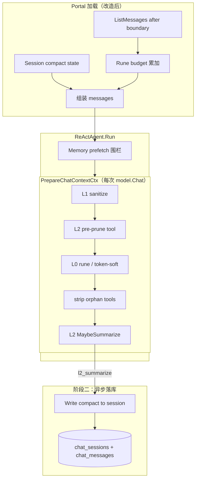

# Session 上下文压缩 — 设计规格

**版本**: 0.1  
**状态**: 已批准 · 阶段一+阶段二已实施（2026-05-26）  
**日期**: 2026-05-26  
**方案**: P3 分阶段 — 阶段一接线 L2 + 统一触发；阶段二 compact boundary 落库  
**关联**: [design-memory-tools-hermes-parity.md](../../design-memory-tools-hermes-parity.md) §5、[dev-plan-memory-tools-hermes-parity.md](../../dev-plan-memory-tools-hermes-parity.md) C1

---

## 1. 背景与目标

### 1.1 现状

| 层 | 状态 |
|----|------|
| Framework L0 | 已启用：`CompressMessagesByRunesBudget`，默认 `MaxContextRunes=200_000` |
| Framework L2 | 已实现：`PrepareChatContextCtx` → `L2Runtime.MaybeSummarize`；**Portal 未接线** |
| Portal 加载 | `ListMessages(limit=maxHistory*2=40)`，固定条数 |
| Portal 压缩 | 仅 L0 rune 预算；无 `context_compression` 配置节 |
| 持久化 | MySQL 存全量原始消息；**无 compact boundary** |
| 补偿 | memory prefetch、`memory_search`、`session_search` 已落地 |

**核心矛盾**：加载策略（40 条）与压缩策略（200K rune）脱节；L2 摘要不落库，无法提供 Claude Code 式 session continuity。

### 1.2 目标

| 阶段 | 目标 |
|------|------|
| **阶段一** | Portal 启用 L2 + tool 预剪枝 + token-soft 触发；历史加载改为 rune 预算驱动；可观测 `ContextOps` |
| **阶段二** | L2 摘要成功后写入 session compact state；加载时 `[summary + boundary 后消息]`；DB 仍保留全量历史 |

### 1.3 非目标（本期不做）

- Anthropic `compact_20260112` API 原生集成（sixath 走 OpenAI 兼容栈 + 自研 L2）
- snipCompact 语义级僵尸消息清理（阶段三可选）
- 用户 `/compact` 手动指令与 focus steer（阶段三可选）
- 替换 MySQL 权威存储；UI 隐藏 boundary 前消息
- Growth transcript 行为变更（仍读全量 DB；boundary 仅影响 Agent 运行时加载）

### 1.4 设计原则

1. **内联 continuity 靠 summary，deep recall 靠 search** — 摘要进 context，细节靠 `session_search` / `memory_search`。
2. **原始数据不丢** — boundary 前消息仍在 `chat_messages`，供历史页、FTS、Growth。
3. **feature flag 可回滚** — `l2_enabled=false` 且 `compact_persist_enabled=false` 时与现网行为等价（除加载策略改为 budget 时仍兼容）。
4. **tool 链原子单元** — 沿用 §5.3.1，裁剪/摘要不得拆散 `assistant(tool_calls)+tool` 链。

---

## 2. 架构总览



**消息组装顺序（运行时）**：

1. `effective system prompt`（含 skills、tools、learnings — **不参与 L2 中段摘要**）
2. `[compact summary]`（阶段二；`sixath.origin=l2_handoff`）
3. `boundary 之后的 DB 消息`（user/assistant/tool，不含 runtime-only system）
4. `memory prefetch` 围栏（`sixath.origin=memory_fence`，每 turn 注入）
5. 当前 user 消息（已在 history 或 incoming）

**压缩流水线顺序**（已实现，不变）：L1 → L2 预剪枝 → L0 rune → L0 token-soft → strip → L2 摘要。

---

## 3. 阶段一：接线 L2 + 统一触发

### 3.1 配置

#### 3.1.1 Portal `conf.proto` 新增

```protobuf
message ContextCompression {
  bool l2_enabled = 1;
  // auxiliary 模型；为空时 l2_enabled 视为 false
  GrowthLLM auxiliary = 2;
  int32 soft_token_estimate = 3;       // <=0 默认 96000
  int32 max_consecutive_failures = 4; // <=0 默认 3
  int32 cooldown_sec = 5;            // <=0 默认 600
  double estimate_alpha = 6;         // <=0 默认 1.5（CJK 保守）
  int32 tool_content_pre_prune_runes = 7; // <=0 默认 8000；0 显式关闭
  int32 l0_max_runes = 8;            // <=0 默认 200000
  int32 history_load_max_runes = 9;  // DB 加载预算；<=0 默认 120000
  int32 history_load_max_messages = 10; // 条数护栏；<=0 默认 200
}

message Bootstrap {
  // ...existing...
  ContextCompression context_compression = 6;
}
```

#### 3.1.2 `config.yaml` 示例

```yaml
context_compression:
  l2_enabled: true
  auxiliary:
    provider: openai
    model: gpt-4o-mini
    api_key: "${OPENAI_API_KEY}"   # 或 env 注入
  soft_token_estimate: 96000       # 128K 窗口 ~75%
  estimate_alpha: 1.5
  tool_content_pre_prune_runes: 8000
  l0_max_runes: 200000
  history_load_max_runes: 120000
  history_load_max_messages: 200
  max_consecutive_failures: 3
  cooldown_sec: 600
```

环境变量覆盖（可选，与 Growth 模式一致）：`SATH_CONTEXT_L2_ENABLED`、`SATH_CONTEXT_L2_MODEL` 等。

### 3.2 Portal 接线

**文件**: `portal/internal/chat/agent_builder.go`

新增 `BuildContextCompressionOptions(cfg *conf.ContextCompression) []agent.ReActOption`：

1. 若 `!l2_enabled` 或 auxiliary 未配置 → 返回空（与现网等价）。
2. `model.NewModelFromConfig(auxiliary)` 创建 auxiliary。
3. 返回：
   - `agent.WithReActContextCompression(&agent.ContextCompressionConfig{...})`
   - `agent.WithReActMaxContextRunes(l0_max_runes)`
4. `BuildReActAgent` 调用方（`chat.go` service）传入上述 options。

**文件**: `portal/internal/service/chat.go`（SendMessage / Stream 共用 helper）

- 从 Bootstrap 读取 `context_compression` 传给 `BuildReActAgent`。
- 替换固定 `maxHistory*2` 加载为 **budget 驱动加载**（§3.3）。

### 3.3 历史加载：rune 预算驱动

**问题**：固定 40 条常达不到 200K rune，L0/L2 不触发；少数超大 tool 输出却可撑爆 context。

**新增**: `biz.ChatMessageRepo.ListBySessionBudget(ctx, sessionID, opts ListBudgetOpts) ([]*ChatMessage, error)`

```go
type ListBudgetOpts struct {
    MaxRunes    int  // 从最新消息倒序累加 content rune，达到则停止
    MaxMessages int  // 条数硬上限
    AfterTime   *time.Time // 阶段二：仅加载 boundary 之后；nil 表示不限
}
```

**算法**：

1. SQL：`WHERE session_id=? [AND created_at > ?] ORDER BY created_at DESC LIMIT maxMessages`。
2. 从最新向最旧累加 `utf8.RuneCountInString(content)`。
3. 超过 `MaxRunes` 时截断并 **保留时间正序** 返回。
4. 跳过 `role=system` 且 `metadata` 含 `sixath.origin` 为 runtime-only 的消息（若已落库；阶段一通常无）。

**与 maxHistory 关系**：

- `BufferMemory(maxHistory)` 仍保留，仅约束 Run 内 assistant buffer。
- DB 加载改用 budget；`maxHistory` 可保留默认 20 或配置化，二者职责分离。

### 3.4 触发阈值策略

| 阈值 | 用途 | 建议默认 |
|------|------|----------|
| `history_load_max_runes` | DB 加载上限 | 120_000 |
| `l0_max_runes` | L0 硬裁剪 | 200_000 |
| `soft_token_estimate` | L2 摘要触发（`EstimateTokensConservative`） | 96_000 |
| `estimate_alpha` | CJK 保守系数 | 1.5 |

**漏斗**：加载 ≤120K rune → 组装后可能 + system/prefetch → L0 压到 budget → 仍超 soft token → L2 摘要。

**预留余量**（对齐 Claude Code 33K reserve 思想）：`soft_token_estimate` 应 ≤ 主模型 context 的 **75%**，为 L2 auxiliary 调用与 tool 输出峰值留空间。

### 3.5 可观测性

- 已有 `RunTrace.ContextOps`：记录 `l0_compress`、`l2_summarize`、`summary_hash` 等。
- Portal 增加结构化日志：`session_id`、`l2_enabled`、`context_ops` 摘要。
- 可选 metrics（二期）：`sixath_context_l2_total`、`sixath_context_l0_total`。

### 3.6 阶段一验收

| # | 用例 | 期望 |
|---|------|------|
| A1 | `l2_enabled=false` | 行为与现网回归一致（除 budget 加载） |
| A2 | 构造 200 轮 + 大 tool 输出 | `ContextOps` 出现 `l2_summarize`；无 OpenAI 400 |
| A3 | auxiliary 连续失败 3 次 | 进入 cooldown，`l2_cooldown_skip`；主对话继续 |
| A4 | CJK 长文本 | `estimate_alpha=1.5` 下 L2 在 soft 前触发，不死锁 |
| A5 | `tool_content_pre_prune_runes=8000` | trace 含 `l2_pre_prune_tool` |

---

## 4. 阶段二：compact boundary 持久化

### 4.1 数据模型

#### 4.1.1 `chat_sessions` 扩展（migration `008_session_compact.sql`）

| 列 | 类型 | 说明 |
|----|------|------|
| `compact_summary` | TEXT NULL | 最新 L2 摘要正文（不含 `[记忆中段摘要 / L2]` 前缀） |
| `compact_summary_hash` | VARCHAR(64) NULL | SHA256 hex，与 L2 trace 对齐 |
| `compact_boundary_at` | DATETIME(3) NULL | boundary 时间戳：此时间 **之后** 的消息进入运行时 context |
| `compact_message_count` | INT NOT NULL DEFAULT 0 | 累计被压缩进 summary 的消息条数（可观测） |

**语义**：每次 L2 成功且决定持久化时 **覆盖** 上述字段（与 Claude Code「最新 boundary」一致）。boundary 前消息 **不删除**。

#### 4.1.2 可选 boundary 标记消息

L2 持久化成功后，**异步**插入一条 system 消息（供 UI 展示「此处上下文已压缩」）：

- `role=system`
- `content`: `[会话已压缩 · {ISO8601}]\n摘要已写入会话状态，完整历史仍可查看。`
- `metadata`（JSON 扩展 `ChatMessageMetadata` 或 generic map）：
  - `sixath.origin`: `compact_boundary`（新增常量）
  - `compact_summary_hash`: string

**UI**：历史页对该消息渲染为折叠提示，不当作 assistant 回复。

#### 4.1.3 Metadata 常量

`framework/model/metadata_sixath.go` 新增：

```go
OriginCompactBoundary = "compact_boundary"
```

### 4.2 写入时机

**触发条件**（同时满足）：

1. `PrepareChatContextCtx` 内 `L2Runtime.MaybeSummarize` 成功（trace `l2_summarize`）。
2. `context_compression.compact_persist_enabled=true`（阶段二 flag，默认 false 直至阶段二上线）。
3. `middle_removed >= compact_persist_min_messages`（默认 10，避免频繁写）。

**流程**：

1. ReAct Run 结束后（或 L2 回调 hook），Portal service 读取 `RunTrace.ContextOps` 最后一次 `l2_summarize`。
2. 异步 goroutine（带 timeout）：
   - `sessionRepo.Update(sessionID, {compact_summary, hash, boundary_at=now, count+=middle_removed})`
   - 可选 `messageRepo.Create` boundary 标记消息。
3. **失败不影响** 当轮用户响应；下次请求仍用运行时 L2（直至落库成功）。

**Framework 扩展**（最小侵入）：

- `ContextTraceFunc` 的 `l2_summarize` detail 增加 `summary_text`（仅 Portal 持久化用，不进 model 网关）或
- `RunTrace` 新增 `LastL2Summary string` 字段供 Portal 读取。

推荐后者，避免 trace 回调携带大文本污染 model 层。

### 4.3 加载策略（阶段二）

`ListBySessionBudget` 增加 `AfterTime: session.CompactBoundaryAt`：

```
messages = [
  system prompt,
  {role: system, content: "[记忆中段摘要 / L2]\n" + session.CompactSummary, metadata: l2_handoff},
  ...ListBySessionBudget(after=CompactBoundaryAt)...,
]
```

**关键**：若 session 已有 `compact_summary`，**运行时不再对 middle 段重复 L2**（避免双摘要）。

实现方式：

- Portal 组装时已注入 summary → `MaybeSummarize` 的 `middle` 段变短 → token 低于 soft → 自然跳过。
- 或 L2Runtime 增加 `SkipIfCompactSummaryPresent bool`（显式，推荐）。

### 4.4 与 memory / search 协同

| 场景 | 行为 |
|------|------|
| L2 触发前 | 可选 hook：将 `middle` 段关键词写入 `memory` backend（阶段二 P1 可只做设计预留接口 `OnPreCompact(ctx, transcript)`） |
| L2 后 agent 需旧细节 | 依赖已有 `session_search` / `memory_search` 工具 |
| prefetch 围栏 | 仍在 incoming 前注入；**不参与** compact summary 输入（已在 system 之后单独处理） |

### 4.5 阶段二验收

| # | 用例 | 期望 |
|---|------|------|
| B1 | 长会话触发 L2 并 persist | `chat_sessions.compact_summary` 非空；hash 与 trace 一致 |
| B2 | 同 session 连续 10 轮 | auxiliary **仅在新 middle 超阈值时再调用**；非每轮 |
| B3 | `ListMessages` API（UI 全量） | 仍返回 boundary 前所有消息 + boundary 标记 |
| B4 | Agent 运行时 | 不含 boundary 前原始 middle（仅 summary） |
| B5 | `session_search` FTS | boundary 前内容仍可搜到 |

---

## 5. 错误处理与回滚

| 场景 | 处理 |
|------|------|
| L2 auxiliary 超时/4xx | 记录失败计数；回退 L0-only；主对话继续 |
| L2 进入 cooldown | 600s 内跳过 L2；trace `l2_cooldown_skip` |
| compact 落库失败 | 日志告警；下轮仍可用运行时 L2 |
| 配置关闭 L2 | `l2_enabled=false`；不清除已有 compact state（加载仍可用 summary） |
| 清除 compact | 管理 API / 未来 `ClearCompact(sessionID)`：置 NULL boundary 字段（消息不删） |

---

## 6. 测试计划

### 6.1 Framework（已有 + 增量）

- `context_pipeline_test.go`：L2 与 L0 顺序回归。
- 新增：Portal 集成测试 fake auxiliary，断言 `ContextOps`。
- 新增：`ListBySessionBudget` 单测（rune 累加、AfterTime）。

### 6.2 Portal E2E

- 脚本或 `hermes_p0_e2e` 风格：长对话 fixture → 断言 response 无 400 + trace 含压缩标记。

---

## 7. 实施顺序

| 序号 | 任务 | 阶段 |
|------|------|------|
| 1 | `conf.proto` + config 加载 + yaml 示例 | 一 |
| 2 | `BuildContextCompressionOptions` + service 接线 | 一 |
| 3 | `ListBySessionBudget` + chat service 改造 | 一 |
| 4 | 日志/metrics + 验收 A1–A5 | 一 |
| 5 | migration 008 + session repo Update | 二 |
| 6 | RunTrace LastL2Summary + 异步 persist | 二 |
| 7 | 加载路径读 compact state + Skip 重复 L2 | 二 |
| 8 | UI boundary 标记（可选） + 验收 B1–B5 | 二 |

---

## 8. 风险与缓解

| 风险 | 缓解 |
|------|------|
| token 粗估偏乐观（CJK） | `estimate_alpha=1.5`；运维监控真实计费 token |
| L2 摘要质量差 | 阶段一先验证；阶段二才 persist；保留 search 补偿 |
| compact 死锁（context 已满才 L2） | soft 阈值 75% + history_load 120K，主动压 |
| 双写 summary 不一致 | hash 校验；persist 仅 trust RunTrace |
| Growth transcript 与 runtime 不一致 | 文档明确：Growth 读 DB 全量；runtime 读 compact |

---

## 9. 阶段三 backlog（不在本 spec 范围）

- snipCompact：按 tool 类型/引用关系清理僵尸消息
- 用户/API 手动 `CompactSession(focus string)`
- `OnPreCompact` → memory backend 自动写入
- 前端展示 `ContextOps` 压缩状态

---

## 10. 决策记录

| 决策 | 选择 | 理由 |
|------|------|------|
| 总体路线 | P3 分阶段 | L2 框架已就绪；boundary 落库需 schema，分开交付降风险 |
| compact 存储 | session 表字段 + 可选 boundary 消息 | 加载 O(1)；UI 可展示；DB 全量保留 |
| 加载策略 | rune budget 倒序 | 修复 40 条 vs 200K 脱节 |
| L2 模型 | 独立 auxiliary | 成本可控；不占用主模型 quota |
| 检索定位 | 补偿层非 primary | 与 Claude Code 差异点；保留 sixath 优势 |

---

**Spec 自检（2026-05-26）**

- [x] 无 TBD / 占位段落
- [x] 阶段一/二边界清晰；阶段三明确排除
- [x] 与 design-memory-tools-hermes-parity §5 顺序一致
- [x] 加载、压缩、持久化数据流无矛盾
- [x] 验收标准可执行
