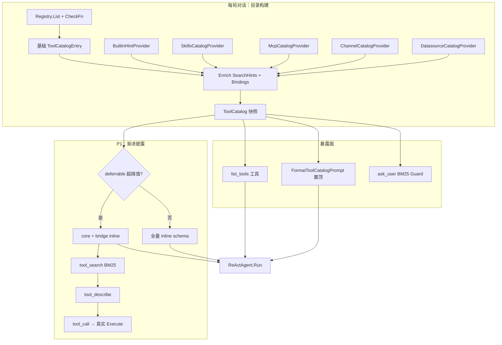

# 工具发现与渐进式披露设计

**版本**: 0.1  
**状态**: 已实现  
**日期**: 2026-06-05  
**参照**: [Claude Code ToolSearch](https://github.com/anthropics/claude-code)、[Hermes tool_search.py](https://github.com/NousResearch/hermes-agent/blob/main/tools/tool_search.py)  
**关联**: [toolsets-hermes-mapping.md](../../toolsets-hermes-mapping.md)、[2026-05-23-human-in-the-loop-ask-user.md](./2026-05-23-human-in-the-loop-ask-user.md)、[2026-06-04-wecom-bot-design.md](../../../../portal/docs/superpowers/specs/2026-06-04-wecom-bot-design.md)

---

## 1. 背景与问题

随着 Agent 绑定工具增多（内置工具、数据源、MCP 服务器、Channel、Skills 等），模型出现**工具发现失败**：

- 用户要求「查 MySQL 按 status 分组并推企微」，Agent 却通过 `ask_user` 向用户索取数据库连接信息与 Webhook URL；
- 实际上 Agent 已绑定数据源与企微 Channel，且运行时注册了 `execute_read`、`send_to_wecom` 等工具；
- 系统在 `datasource_prompt.go`、`wecom_bind.go` 中已有 prompt 约束，但模型仍可能忽略并走 `ask_user` 捷径。

**根因**（非「没有工具」）：

| 层级 | 问题 |
|------|------|
| 语义 | 工具名泛化（`execute_read`），与用户自然语言意图不匹配 |
| 暴露 | `ListForAPI` 全量 inline schema，工具多时注意力稀释 |
| 约束 | prompt 文字约束软，无执行层拦截 |
| 架构 | 绑定信息散落在各 wiring 模块，无统一目录 |

本设计引入 **ToolCatalog（统一工具目录）** + **渐进式披露（tool_search）**，泛化到**所有已注册工具**，而非仅 datasource / wecom。

---

## 2. 目标与非目标

### 2.1 目标

| ID | 目标 | 成功标准 |
|----|------|----------|
| G-TD1 | 任意已配置工具可被模型发现 | 用户自然语言意图可通过 `list_tools` / `tool_search` 命中正确工具 |
| G-TD2 | 禁止冗余 `ask_user` | 索取已由已绑定工具提供的凭据/配置时，执行层拒绝并引导正确工具 |
| G-TD3 | MCP 工具膨胀可控 | deferrable 工具超阈值时启用 `tool_search`，schema token 不随 MCP 线性增长 |
| G-TD4 | 扩展零改核心 | 新增工具/Channel/MCP 仅需实现 `CatalogProvider`，不改 catalog 核心 |

### 2.2 非目标（本期）

- Embedding 向量语义搜索（P2 预留）
- 按用户消息做意图路由预过滤 toolset（P2 预留）
- Anthropic 原生 `defer_loading` / `tool_reference`（多 provider 环境，采用 Hermes 桥接模式）
- 替换现有 `datasource_prompt` / `wecom` prompt 段落（保留为 deep-dive 补充）

---

## 3. 已确认决策

| 决策项 | 选择 |
|--------|------|
| 实施策略 | P0（目录 + ask_user 守卫）→ P1（tool_search 渐进披露）分阶段 |
| 泛化范围 | 所有已注册、CheckFn 通过的工具，非仅 datasource/wecom |
| ask_user 拦截 | BM25 意图路由（非关键词硬编码） |
| 目录工具名 | `list_tools`（非 `list_capabilities`） |
| P1 defer 策略 | `file` + `skills` toolset 默认 inline；`mcp` 始终 defer；其余 deferrable toolset 可配置 defer |
| P1 激活模式 | `auto`（deferrable schema ≥ 上下文 10% 时启用），可通过 `SATH_TOOL_SEARCH` 覆盖 |
| 桥接模式 | Hermes 三件套：`tool_search` / `tool_describe` / `tool_call` |

---

## 4. 架构总览



### 4.1 Prompt 组装新顺序

`portal/internal/service/chat.go` 中 `effectivePrompt` 顺序：

1. `FormatToolCatalogPrompt(catalog)` — **置顶**
2. `agentMeta.SystemPrompt`
3. skills 摘要（`BuildEffectiveSystemPromptForTurn`）
4. 各模块 deep-dive：`AppendDatasourcePrompt`、`appendWecomBoundSystemPrompt`、`AppendWebToolsPrompt`、`AppendAskUserToolPrompt`

---

## 5. 核心数据结构

### 5.1 Tool 元数据扩展

文件：`framework/tool/tool.go`

```go
type Tool struct {
    // ...existing fields...
    SearchHints []string          // 额外 BM25 检索词（中/英）
    AlwaysLoad  bool              // 强制 inline，忽略 defer 策略
    Bindings    map[string]string // 运行时绑定摘要（catalog enrich 后可见）
}
```

- `Register` 时若 `SearchHints` 为空，由 `BuiltinHintProvider` 按 toolset 补默认词；
- MCP 注册时自动填充 `Bindings["mcp_server"]` 与 server 名拆词 `SearchHints`。

### 5.2 ToolCatalogEntry

文件：`framework/tool/catalog.go`（新建）

```go
type ToolCatalogEntry struct {
    Name         string
    Toolset      string
    Description  string            // enriched 后描述
    SearchHints  []string
    Bindings     map[string]string
    Available    bool              // CheckFn 通过
    Deferred     bool              // ShouldDefer 结果
    RelatedTools []string          // 同能力组（可选）
}

type ToolCatalog struct {
    Entries     []ToolCatalogEntry
    GeneratedAt time.Time
}
```

### 5.3 CatalogProvider 接口

```go
type CatalogProvider interface {
    Enrich(ctx context.Context, entries []ToolCatalogEntry) []ToolCatalogEntry
}
```

| Provider | 文件 | 贡献 |
|----------|------|------|
| `DatasourceCatalogProvider` | `portal/internal/chat/datasource_catalog.go` | `datasource_id`, `type`, `db_name` |
| `ChannelCatalogProvider` | `portal/internal/chat/channel_catalog.go` | `channel_id`, `channel_type` |
| `McpCatalogProvider` | `framework/tool/mcp_catalog.go` | `mcp_server`, server 名拆词 |
| `SkillsCatalogProvider` | `portal/internal/chat/skills_catalog.go` | skill 名/描述 |
| `WebToolsCatalogProvider` | `portal/internal/chat/web_catalog.go` | 已配置 search backend |
| `BuiltinHintProvider` | `framework/tool/catalog_hints.go` | toolset 默认关键词 |

**原则**：Provider 只 enrich；零 Provider 时 catalog 仍能从 Registry 生成基础条目。

### 5.4 内置 toolset 默认 SearchHints

| Toolset | 默认关键词 |
|---------|-----------|
| `file` | 文件, 读写, SQL, 查询, 表, 数据库 |
| `web` | 搜索, 网页, 抓取, 联网 |
| `skills` | 技能, skill, 脚本 |
| `memory` | 记忆, 历史, 会话 |
| `session_search` | 跨会话, 搜索, 历史对话 |
| `terminal` | SSH, 终端, 远程, 命令 |
| `mcp` | 由 server 名 + 原始 description 拆词 |
| `cronjob` | 定时, 计划任务, cron |
| `todo` | 待办, 任务列表 |
| `core` | 用户输入, 确认, 工具目录 |

---

## 6. P0：统一工具目录

### 6.1 BuildToolCatalog

```go
func BuildToolCatalog(ctx context.Context, reg *Registry, providers ...CatalogProvider) ToolCatalog
```

步骤：

1. `reg.List()` → 对每个工具执行 `CheckFn` → `Available`
2. 复制为 `ToolCatalogEntry`（name, toolset, description, searchHints, bindings）
3. 依次调用 `providers` 做 `Enrich`
4. `BuiltinHintProvider` 补默认 hints
5. 标记 `Deferred = ShouldDefer(tool, cfg)`

### 6.2 list_tools 工具

文件：`framework/tool/list_tools.go`（新建）

```
list_tools(query?, toolset?, available_only=true)
```

| 参数 | 行为 |
|------|------|
| 无参 | 返回完整 catalog JSON，按 toolset 分组 |
| `query` | BM25 过滤（与 `tool_search` 共用索引逻辑） |
| `toolset` | 按组过滤 |
| `available_only` | 默认 true，仅 `Available=true` |

- Toolset：`core`
- **永不 defer**
- 注册：`portal/internal/chat/catalog_wiring.go`

### 6.3 FormatToolCatalogPrompt

文件：`portal/internal/chat/catalog_prompt.go`（新建）

生成置顶 system 块：

```markdown
## 可用工具目录（共 N 个，均已配置就绪，勿向用户索取已有凭据）
### 数据 [file]
- list_tables / describe_table / execute_read — 已绑定 prod_mysql (mysql/archive)
### 出站 [channel]
- send_to_wecom — 已绑定企微群 ops-alerts
### 外部 [mcp]
- mcp__jira__create_issue — 服务器 jira（延迟加载，先用 tool_search）
```

规则：

- 条目 ≤ 15：全量列出
- 条目 > 15：仅 toolset 摘要 + 「用 list_tools 或 tool_search 查询详情」
- 仅包含 `Available=true` 的条目

### 6.4 Context 传递

新增 context key：

```go
const ContextKeyToolCatalog = "tool_catalog"
```

在 `chat.go` 构建 `runCtx` 时注入 `ToolCatalog` 快照。

---

## 7. P0：ask_user 泛化守卫

### 7.1 Ask-Intent Router

文件：`framework/tool/catalog_search.go`（新建，BM25 实现）

当 `ask_user` 被调用时：

1. 从 context 读取 `ToolCatalog`
2. 对 `prompt` 文本跑 BM25，索引 = catalog 中 `Available=true` 的条目
3. 若 top-1 分数 ≥ `MinScore`（默认 2.0）且 top-1 不是 `ask_user` 自身 → **拒绝**
4. 返回引导消息，含工具名、Bindings、调用示例

示例：

| ask_user prompt | 命中工具 | 引导 |
|-----------------|----------|------|
| 请提供 MySQL host/port/密码 | `execute_read` | `datasource_id=prod_mysql` |
| 请提供企微 Webhook URL | `send_to_wecom` | 已绑定 channel |
| 请提供 SSH 主机和私钥 | `ssh_exec` | 已配置连接 |
| 请提供搜索 API Key | `web_search` | 服务端已配置 |
| 是否继续删除该文件？ | （无高分） | 正常执行 ask_user |

### 7.2 豁免规则

```go
type AskUserGuardConfig struct {
    MinScore       float64  // 默认 2.0
    ExemptKinds    []string // "confirm", "select" — 不拦截
    ExemptPatterns []string // 业务确认类短句
}
```

- `kind=confirm` / `kind=select`（选项由系统提供）→ 不拦截
- `kind=password` 且命中已配置工具 → 拦截

### 7.3 改动文件

- `framework/tool/ask_user.go` — 注入 `AskUserGuardConfig` + catalog resolver
- `portal/internal/chat/catalog_wiring.go` — 装配 guard 配置

---

## 8. P1：渐进式工具搜索

### 8.1 Defer 策略

文件：`framework/tool/defer.go`（新建）

```go
type DeferConfig struct {
    NeverDeferToolsets map[string]bool // 默认: core
    DeferToolsets      map[string]bool // 默认: mcp, memory, session_search, web, terminal, cronjob, todo
}

func ShouldDefer(t Tool, cfg DeferConfig) bool {
    if t.AlwaysLoad { return false }
    if cfg.NeverDeferToolsets[t.Toolset] { return false }
    if t.Toolset == ToolsetMCP { return true }
    return cfg.DeferToolsets[t.Toolset]
}
```

**默认 inline toolsets**：`file`、`skills`  
**默认 defer toolsets**：`mcp`、`memory`、`session_search`、`web`、`terminal`、`cronjob`、`todo`  
**始终 inline（core）**：`list_tools`、`ask_user`、`load_skill`、`tool_search`、`tool_describe`

可通过配置覆盖，不锁死工具名枚举。

### 8.2 激活条件

环境变量 / 配置：`SATH_TOOL_SEARCH=auto|on|off`

| 模式 | 行为 |
|------|------|
| `off` | 全量 inline（与现网一致） |
| `on` | 存在 deferrable 且 Available 工具即激活 |
| `auto`（默认） | deferrable schema 估算 token ≥ 模型上下文 10% 时激活；未知上下文时用 20K token 硬阈值 |

估算：`len(json_schema) / 4`（与 Hermes `CHARS_PER_TOKEN=4` 一致）。

### 8.3 桥接三件套

文件：`framework/tool/tool_search.go`（新建）

| 工具 | 职责 |
|------|------|
| `tool_search(query, limit?)` | BM25 搜索 deferred 子集；默认 limit=5，max=20 |
| `tool_describe(name)` | 返回完整 JSON schema |
| `tool_call(name, arguments)` | 解包调用真实工具 |

索引字段：`Name + Description + SearchHints + Bindings 值 + toolset`

**设计约束**（对齐 Hermes）：

- Catalog **无状态**：每轮从当前 Registry 重建，避免与 live registry 漂移
- `tool_call` 递归到真实工具，permission / guardrails / EventBus 对底层工具生效
- 桥接工具名保留，registry 拒绝同名用户工具注册

### 8.4 ListForAPI 改造

文件：`framework/tool/registry_api.go`

当 tool_search 激活时：

```
非 defer 工具     → 完整 schema inline
defer 工具         → 不出现在 schema（或仅 name 摘要，可配置）
桥接三件套 + list_tools → 完整 schema inline
```

新增：

```go
func (r *Registry) ListDeferred(ctx context.Context) []Tool
func (r *Registry) ListForAPIWithDefer(ctx context.Context, toolsets []string, deferActive bool) []Tool
```

### 8.5 ReAct 路由

文件：`framework/agent/react_agent.go`

- `tool_call` 执行时解包为 `reg.Get(name).Execute`
- 权限策略、护栏评估针对底层工具名

### 8.6 配置 wiring

文件：`portal/internal/chat/tool_search_wiring.go`（新建）

- 读取 `SATH_TOOL_SEARCH`、阈值配置
- 条件注册桥接工具
- 传入 `DeferConfig`

---

## 9. P2 预留（本期不实现）

| 能力 | 说明 |
|------|------|
| 意图路由 | 按用户消息关键词预过滤 enabled toolsets |
| Embedding 搜索 | BM25 不足时升级向量索引 |
| MCP `_meta.searchHint` | 注册 MCP 时读取 vendor 元数据 |
| Claude 式 delta attachment | 池变化时渐进公告，保护 prompt cache |

---

## 10. 可观测性

每次对话记录（结构化日志 / metrics）：

| 字段 | 说明 |
|------|------|
| `tool_catalog_count` | 可用工具数 |
| `tool_catalog_deferred_count` | defer 工具数 |
| `tool_search_active` | 是否启用渐进披露 |
| `ask_user_guard_blocked` | ask_user 被守卫拦截次数 |
| `tool_search_queries` | tool_search 调用次数 |

---

## 11. 测试计划

### 11.1 单元测试

| 文件 | 用例 |
|------|------|
| `catalog_test.go` | BuildToolCatalog 含多 provider enrich |
| `catalog_search_test.go` | BM25 命中 execute_read / send_to_wecom / web_search |
| `catalog_prompt_test.go` | 超 15 条时摘要模式 |
| `ask_user_guard_test.go` | 拦截凭证索取；confirm/select 豁免 |
| `defer_test.go` | toolset 策略；AlwaysLoad 覆盖 |
| `tool_search_test.go` | 搜索 / describe / call 解包 |

### 11.2 集成测试

| 场景 | 期望 |
|------|------|
| Agent 绑定 mysql + wecom，用户说「查 status 分布推企微」 | `execute_read` + `send_to_wecom`，无 ask_user 索取凭据 |
| Agent 绑定 MCP jira，用户说「建个 issue」 | P1：`tool_search` → `mcp__jira__create_issue` |
| `SATH_TOOL_SEARCH=off` | 行为与现网全量 inline 一致 |
| MCP 50+ 工具 | `tool_search_active=true`，schema token 低于全量阈值 |

---

## 12. 实施排期

| 阶段 | 工期 | 交付物 |
|------|------|--------|
| **P0** | 3–4 天 | `ToolCatalog` + `list_tools` + `FormatToolCatalogPrompt` + ask_user BM25 guard + CatalogProviders |
| **P1** | 5–7 天 | `defer.go` + `tool_search`/`tool_describe`/`tool_call` + `ListForAPI` 改造 + ReAct 解包 |
| **P2** | 按需 | 意图路由、embedding |

### P0 文件清单

| 操作 | 路径 |
|------|------|
| 新建 | `framework/tool/catalog.go` |
| 新建 | `framework/tool/catalog_hints.go` |
| 新建 | `framework/tool/catalog_search.go` |
| 新建 | `framework/tool/list_tools.go` |
| 新建 | `portal/internal/chat/catalog_prompt.go` |
| 新建 | `portal/internal/chat/catalog_wiring.go` |
| 新建 | `portal/internal/chat/datasource_catalog.go` |
| 新建 | `portal/internal/chat/channel_catalog.go` |
| 新建 | `portal/internal/chat/skills_catalog.go` |
| 新建 | `portal/internal/chat/web_catalog.go` |
| 新建 | `framework/tool/mcp_catalog.go` |
| 修改 | `framework/tool/tool.go`（SearchHints, AlwaysLoad, Bindings） |
| 修改 | `framework/tool/ask_user.go` |
| 修改 | `portal/internal/service/chat.go`（prompt 顺序 + runCtx） |
| 新建 | `*_test.go`（对应测试） |

### P1 文件清单

| 操作 | 路径 |
|------|------|
| 新建 | `framework/tool/defer.go` |
| 新建 | `framework/tool/tool_search.go` |
| 修改 | `framework/tool/registry_api.go` |
| 修改 | `framework/model/openai_tools.go` |
| 修改 | `framework/agent/react_agent.go` |
| 新建 | `portal/internal/chat/tool_search_wiring.go` |

---

## 13. 与现有模块关系

| 现有模块 | 本设计中的角色 |
|----------|---------------|
| `datasource_prompt.go` | 保留，降级为 execute_read 使用细节 |
| `wecom_bind.go` prompt 段 | 保留，降级为 send_to_wecom 细节 |
| `ListForAPI` + `CheckFn` | 保留，catalog 构建依赖 |
| `toolset.go` | defer 策略与默认 hints 的数据源 |
| Hermes P0 flags | 不影响；catalog 仅反映实际注册结果 |

---

## 14. 开放问题（评审后关闭）

| ID | 问题 | 默认决策 |
|----|------|----------|
| Q1 | `web`/`memory` 是否改为默认 inline？ | **否**，默认 defer；可通过 `AlwaysLoad` 或配置覆盖 |
| Q2 | defer 工具是否在 schema 中保留 name 摘要？ | P1 先**完全不出现**，仅靠 catalog prompt + tool_search |
| Q3 | `tool_call` 是否合并进 ReAct 直接 tool_calls？ | **是**，模型也可在发现 schema 后直接调用真实工具名 |

---

## 15. 验收标准

- [ ] 任意已注册且 Available 的工具出现在 `list_tools` 输出中
- [ ] System prompt 置顶块自动反映当前 Agent 工具面，无需手写
- [ ] ask_user 索取已绑定凭据时被拦截并返回正确工具引导
- [ ] `SATH_TOOL_SEARCH=off` 时零行为回归
- [ ] `SATH_TOOL_SEARCH=auto` 且 MCP 工具 > 阈值时，`tool_search` 可定位目标 MCP 工具
- [ ] 新增 Channel 类型仅需新增 `CatalogProvider`，不改 catalog 核心
