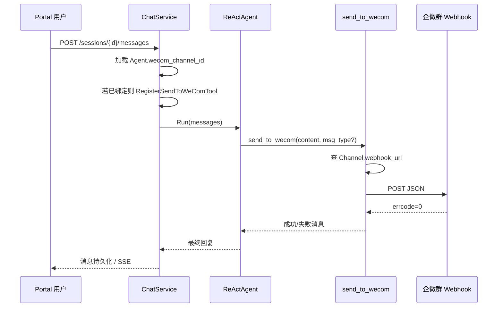

# 企业微信群机器人集成设计

## 背景与目标

Portal 用户在与 Agent 对话时，希望 Agent 能在合适时机将结论同步到企业微信群。采用**群机器人 Webhook**（只出站、配置简单），由 Agent 通过 `send_to_wecom` 工具主动推送，每个 Agent 绑定**一个**企微群 Channel。

## 需求决策（已确认）

| 决策项 | 选择 |
|--------|------|
| 企微接入类型 | 群机器人 Webhook（A） |
| 触发方式 | Agent 工具 `send_to_wecom`（D） |
| 绑定范围 | 每个 Agent 绑定 1 个群（A） |
| 实现方案 | 扩展 Channel 类型 + Agent 绑定 Channel（方案 2） |
| V1 UI | Channel 表单 + Agent 表单下拉选择 |

## 非目标（V1）

- 企业微信自建应用（双向对话、@ 回复）
- 手动/自动每轮推送（无工具参与的 UI 按钮）
- 一个 Agent 绑定多个群
- Cron 投递到企微（可后续复用 Channel 扩展）

## 现有上下文

- `portal` 已有 Channel 抽象：`web` / `api` / `webhook` / `wxpusher`
- Cron 已支持 `delivery_mode=channel`，当前仅 `wxpusher`
- 聊天流程：`ChatService.SendMessage` / `SendMessageStream` → 构建 `tool.Registry` → `ReActAgent.Run`
- 运行时工具注册模式参考：`RegisterAskUserTools`、`RegisterAgentRuntimeTools`（`portal/internal/chat/`）
- WxPusher 出站实现：`portal/internal/channel/wxpusher.go`

## 架构



## 数据模型

### Channel 扩展

`channels` 表新增列：

| 列 | 类型 | 说明 |
|----|------|------|
| `webhook_url` | VARCHAR(512) | 群机器人完整 Webhook URL（含 key）；`type=wecom` 时必填 |

校验规则：

- `type=wecom` 创建/更新时 `webhook_url` 非空且以 `https://qyapi.weixin.qq.com/cgi-bin/webhook/send` 为前缀
- API 响应不回显完整 URL（编辑时留空表示不修改；列表/详情可显示 `***` + 末 4 位 key）

### Agent 扩展

`agents` 表新增列：

| 列 | 类型 | 说明 |
|----|------|------|
| `wecom_channel_id` | VARCHAR(36) NULL | 指向 `channels.id`；关联 Channel 的 `type` 必须为 `wecom` |

校验规则：

- 绑定前校验 Channel 存在、已启用、`type=wecom`
- Channel 删除前检查是否有 Agent 引用（有则拒绝或要求先解绑）

## API 变更

### channel.v1

- `CreateChannelRequest` / `UpdateChannelRequest`：支持 `type=wecom`，字段 `webhook_url`
- `ChannelReply`：可选返回 `webhook_url_masked`（不回显明文）
- `SendChannel`：扩展支持 `type=wecom`（与 Cron 投递共用出站逻辑）

### agent.v1

- `CreateAgentRequest` / `UpdateAgentRequest` / `AgentReply`：字段 `wecom_channel_id`（optional，空字符串表示解绑）

### 可选（V1.1）

- `POST /api/v1/agents/{id}/wecom/test`：向绑定 Channel 发送测试消息

## 工具：`send_to_wecom`

### 注册条件

仅当 Agent 的 `wecom_channel_id` 指向有效且已启用的 `wecom` Channel 时，在 `SendMessage` / `SendMessageStream` / `Agent.Chat` 流程中自动注册。未绑定时工具**不出现**于 Registry。

### 参数 Schema

```json
{
  "name": "send_to_wecom",
  "description": "将消息发送到该 Agent 绑定的企业微信群。当用户要求同步到群、或结论需要团队可见时使用。",
  "parameters": {
    "type": "object",
    "properties": {
      "content": {
        "type": "string",
        "description": "要发送的正文（可摘要，不必逐字复制整段对话）"
      },
      "msg_type": {
        "type": "string",
        "enum": ["text", "markdown"],
        "description": "消息格式，默认 text"
      }
    },
    "required": ["content"]
  }
}
```

### 执行逻辑

1. 从注入的 `WebhookResolver` 解析 Webhook URL（基于当前 `agent_id` → `wecom_channel_id` → `webhook_url`）
2. 内容长度 > 4096 字节时截断并在工具返回中说明
3. 调用企微 API：

```json
{ "msgtype": "text", "text": { "content": "..." } }
```

或

```json
{ "msgtype": "markdown", "markdown": { "content": "..." } }
```

4. 解析响应 `{ "errcode": 0, "errmsg": "ok" }`；非 0 时将 `errmsg` 返回给模型
5. 简单频率限制：同一 session 内最短间隔 1 秒（进程内 map + TTL）

### System Prompt 提示（可选）

当 Agent 已绑定企微 Channel 时，在 `BuildEffectiveSystemPromptForTurn` 或等价位置追加一句：

> 你已绑定企业微信群，可使用 send_to_wecom 工具将结论推送到群。

## 出站客户端

新文件 `portal/internal/channel/wecom.go`：

```go
func PushToWeCom(ctx context.Context, webhookURL, content, msgType string) error
```

- HTTP POST，`Content-Type: application/json`
- 超时 10s
- 单元测试使用 `httptest.Server` mock

## 前端（V1 最小集）

| 页面 | 改动 |
|------|------|
| `ChannelForm.tsx` | 类型增加 `wecom`；显示 Webhook URL 输入框 |
| `ChannelList.tsx` | 筛选/徽章增加 `wecom` |
| `AgentForm.tsx` | 下拉选择 `type=wecom` 的 Channel（可留空） |
| `client.ts` | 类型与 API 字段同步 |
| `ChatPage.tsx` | **无改动** |

## 安全

- Webhook URL 视为密钥；日志不记录完整 URL 与消息正文
- 工具参数不包含 URL，避免泄露给模型上下文
- Channel 删除保护：有 Agent 引用时拒绝删除

## 错误处理

- Webhook 无效 / 网络失败：工具返回可读错误，**不中断** Agent 主流程
- Channel 已禁用：注册阶段跳过工具；若运行中 Channel 被禁用，工具返回「企微渠道未启用」

## 测试要点

- Channel CRUD：`wecom` 类型校验、URL 前缀校验
- Agent 绑定/解绑 `wecom_channel_id`、错误 type 拒绝
- `PushToWeCom`：text/markdown、errcode 非 0、超时
- `send_to_wecom` 工具：未绑定不出现；绑定后 mock HTTP 成功/失败
- 集成：`ChatService` 注册工具 smoke test

## 文件清单（预期）

| 操作 | 路径 |
|------|------|
| 新增 | `portal/internal/channel/wecom.go` |
| 新增 | `portal/internal/channel/wecom_test.go` |
| 新增 | `portal/internal/chat/wecom_wiring.go` |
| 新增 | `portal/internal/chat/wecom_wiring_test.go` |
| 修改 | `portal/api/channel/v1/channel.proto` |
| 修改 | `portal/api/agent/v1/agent.proto` |
| 修改 | `portal/internal/data/model/channel.go` |
| 修改 | `portal/internal/data/model/agent.go` |
| 修改 | `portal/internal/biz/channel.go` |
| 修改 | `portal/internal/biz/agent.go` |
| 修改 | `portal/internal/data/channel_mysql.go` |
| 修改 | `portal/internal/data/agent_mysql.go` |
| 修改 | `portal/internal/service/channel.go` |
| 修改 | `portal/internal/service/agent.go` |
| 修改 | `portal/internal/service/chat.go` |
| 修改 | `portal/internal/cron/executor.go`（可选：channel 投递支持 wecom） |
| 修改 | `web/src/api/client.ts` |
| 修改 | `web/src/pages/ChannelForm.tsx` |
| 修改 | `web/src/pages/ChannelList.tsx` |
| 修改 | `web/src/pages/AgentForm.tsx` |
